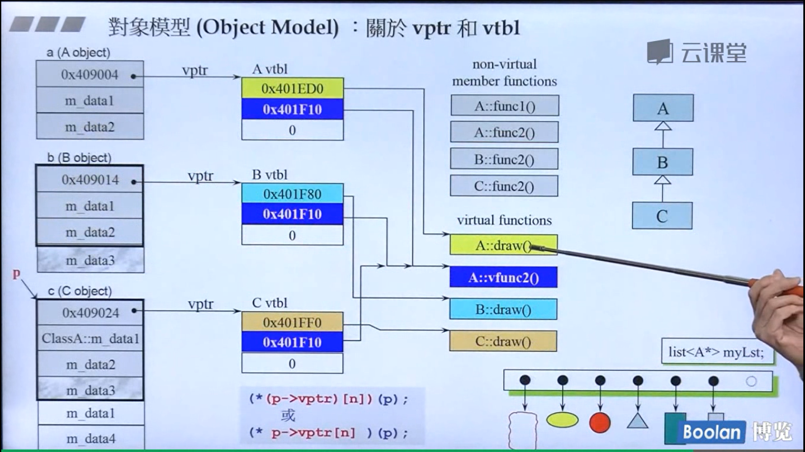

## 虚函数
### 虚函数
通俗来讲，虚函数是在编译时，并不能确定的类函数，而是在运行时确定的。
独特功能：**基类对象访问派生类的函数**。
步骤
1. 定义基类时，函数声明为虚（virtual）
2. 派生类中，重写基类中定义为虚的函数。
3. 声明基类指针指向派生类对象。调用虚函数

```c++
class A
{
  public:
      virtual void foo()
      {
          cout<<"A::foo() is called"<<endl;
      }
};

class B:public A
{
  public:
      void foo()
      {
          cout<<"B::foo() is called"<<endl;
      }
};

int main(void)
{
    A *a = new B();
    a->foo();   // 在这里，a虽然是指向A的指针，但是被调用的函数(foo)却是B的!
    return 0;
}
```

### 纯虚函数
纯虚函数可使当前类变成<strong style="color:red;">抽象类</strong>，<mark>禁止该类被实例化</mark>，并要求其非抽象类的派生类<mark>必须重写</mark>该纯虚函数。
```c++
virtual void func() = 0;
```

定义纯虚函数时，不需要定义函数的实现部分。「= 0」 表明程序员将不定义该函数，函数声明是为派生类保留一个位置。「= 0」 的本质是将指向函数体的指针定为$nullptr$
#### 特点
1. 类中一旦出现纯虚函数，就不可实例化了（抽象类）；
2. 纯虚函数有函数体，但最终还是要被派生类重写，在派生类的函数中可以调用基类中有函数体的纯虚函数；
3. 为使派生类能完全释放资源，基类析构函数必须声明为虚函数。否则，在用基类指针new一个派生类对象后，delete该指针就只能回收与基类相关的资源，造成内存泄漏；
4. 纯虚析构函数必须要有函数体。
### 抽象类
存在纯虚函数的类，叫抽象类。
1. 抽象类不能用作参数类型、函数返回类型或显式转换的类型。
2. 可以定义指向抽象类的指针和引用，此指针可以指向它的派生类，进而实现多态性。
3. 抽象类只能用作其他类的基类，不能建立抽象类对象。

### 虚函数表
对象创建时,编译器对`vptr`进行初始化，只有当对象构造完全结束后`vptr`的指向才最终确定。
使用虚函数时，对象会多出4字节的虚指针，指针指向类的虚函数表。**对象不包含虚函数表，只有虚指针，类才包含虚函数表。**
虚表中的指针顺序，取决于类中虚函数的<strong style="color:rgb(0, 191, 166);">声明顺序</strong>。
虚函数表在实例化对象创建时创建。

### 虚指针&虚表

vptr & vtbl。只要有虚函数，类内部就会有出现<mark>一个</mark>指针。虚指针用来指向虚表中的<mark>函数指针</mark>指向虚函数的地址。未重写的虚函数，基类和派生类共用。重写了的，各自虚表中指向重写后的地址。
下列代码中存在一些问题，可以不必纠结。（为了方便理解）。
通过指针，向上转型，指向虚函数。`(*p->vptr[n])(p)`



### 相关面试题
1. 动态分配堆上内存的时候，析构函数必须是虚函数。
动态的去分配堆区的空间时，无法在程序运行结束自动释放内存。若基类指针指向派生类，然后基类指针调用delete方法，只能释放基类的内存，进而导致内存泄露。
析构函数定义成虚函数，基类指针调用delete方法，会先调用派生类的析构函数，然后自动调用基类的析构函数。
2. 友元函数不能为虚函数
友元函数，<mark>不属于</mark>这个类的成员函数。而且虚函数的目的是通过基类对象访问派生类实现的函数，友元函数不是不是成员函数，更无继承关系。
3. 多继承
多继承下有多个虚表。多个基类之间（类内部按声明顺序）的虚函数，按照继承的顺序，存放虚函数指针。
虚函数表中，派生类<mark>重写</mark>的虚函数<strong style="color:orange;">替换了基类虚函数指针</strong>，并指向了派生类的函数实现。
4. 哪些函数不支持声明为虚函数
   非成员函数、静态成员函数、内联成员函数、构造函数、友元函数。
    * 非成员函数：非成员函数只能重载，不能重写。编译器会在编译时绑定函数。
    * 构造函数：构造函数用来创建一个新的对象,而虚函数的运行是建立在对象的基础上,在构造函数执行时,对象尚未形成,所以不能将构造函数定义为虚函数。
    * 内联函数：内联函数就是为了在代码中直接展开，减少函数调用花费的代价，虚函数是为了在继承后对象能够准确的执行自己的动作，这是不可能统一的。
    * 静态成员函数： 静态成员函数对于每个类来说只有一份代码，所有的对象都共享这一份代码，他也没有要动态绑定的必要性。
    * 友元函数： C++不支持友元函数的继承，对于没有继承特性的函数没有虚函数的说法。
5. 为什么构造函数调用虚函数不能实现多态？
子类构造函数要先调用父类构造函数，虚函数实现重载靠的是动态绑定。<br>如果构造函数中的虚函数为动态绑定(多态)，则子类在构造时，子类的构造函数先调用父类构造函数，而此时父类构造函数不能调用子类的重载函数（子类还未创建，没有虚表。）