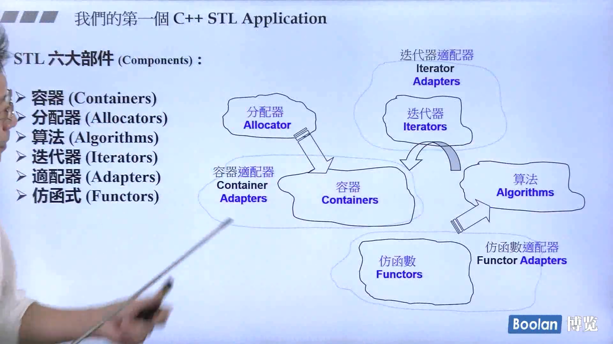
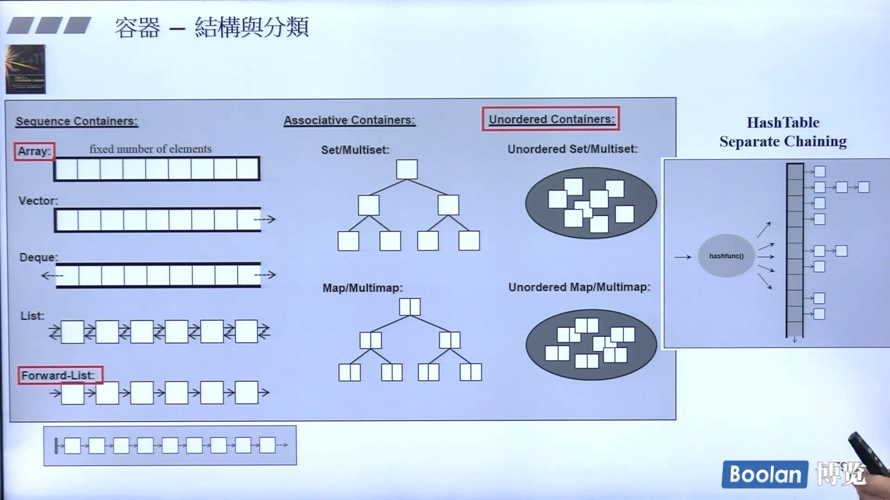
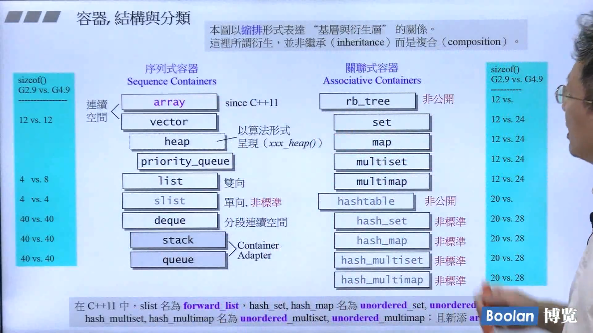
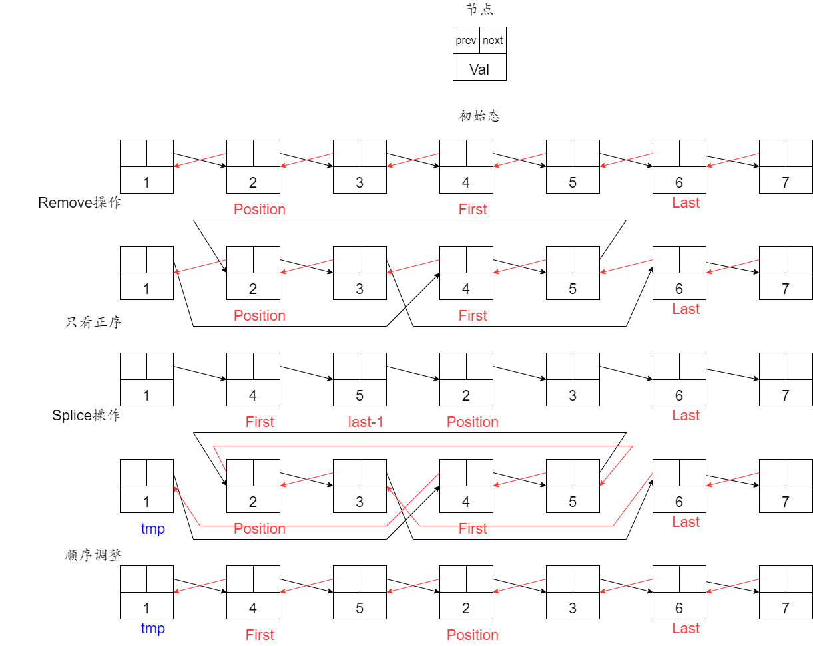
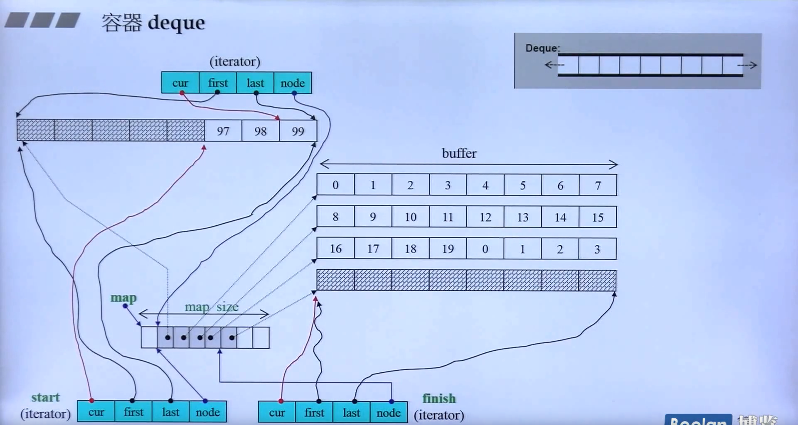

STL六大件：容器、算法、迭代器、仿函数、适配器、空间配置器。

## 容器简介

- 标准容器
  - 顺序容器
    - `vector`
    - `deque`
    - `list`
  - 关联容器(键允许重复则`multi`)
    - `set\multiset`
    - `map\multimap`
    - `unordered_set\unordered_multiset`
    - `unordered_map\unordered_multimap`
- 容器适配器
  - `stack`
  - `queue`
  - `priority_queue`

### 容器共性
缺省构造函数、拷贝构造函数、析构函数、`empty()`、`max_size()`、`size()`、赋值操作`=`、`swap()`

### 标准容器共性

`begin()`、`end()`、`rbegin()`、`rend()`、`erase()`、`clear()`

### 顺序容器

`vector`、`list`、`deque`元素之间**有序(ordered)但未排序(sorted)**。即，元素之间存在逻辑上的先后顺序，但并未按值进行排序。


### vector

#### 定义

vector，封装了动态大小的**顺序容器**。

iterator，向量的迭代器。类似于 **数组的指针**

reference，指针的扩展。但**并不占内存也不存数据**，仅仅是引用一个变量。

#### 基本函数

函数实现时类似于栈。

```cpp
//构造
vector();//创建一个空向量。
vector(int n);//创建一个有n个元素的向量。
vector(int n,const t& t);//创建一个含有n个元素，且值均为t的向量


//添加
void push_back(const T& x);//尾部追加元素x
iterator insert(iterator it,int n,const T& x);//向迭代器所指向的位置it前插入n个相同的元素x
	//n可缺省，缺省表示一个。


//删除
void pop_back();//删除尾部元素
iterator erase(iterator it);//删除迭代器所指向位置it的元素。
iterator erase(iterator first,iterator last);//删除迭代器first与last之间的元素
	//first删除，last不删。
void clear();//清空


//遍历
reference at(int pos);//返回位置pos的引用
reference front();//返回首部元素的引用
reference back();//返回尾部元素的引用
iterator begin();//返回头指针
iterator end();//返回尾指针，指向最后一个元素的下一位置


//其他
bool empty() const;//判断向量是否为空
int size() const;//返回向量中元素的个数
int capacity() const;//返回可容纳元素值的上限。
int max_size() const;//返回容器最大容纳量 

```

#### 二维vector

可以利用**二维vector模拟二维数组**：

##### 定义 

~~~cpp
vector< vector<int> > num;
vector<vector<int> > num(x,vector<int>(y,tmp)); 		//x个int向量，其中每个int向量含有y个值为tmp的元素
~~~

##### 函数

~~~cpp
num.size();					//行数
num[0].size();				//列数
~~~


#### 样例

```c++
vector<int>obj; 				//创建int型容器
vector<int>::iterator it;		//int型向量的迭代器
//此时容器为空
for(int i=0;i<10;i++)
{
    obj.push_back(i);			//依次尾部追加元素
}
//此时容器中依次存有0、1、2、3、4……9十个元素
for(int i=0;i<obj.size();i++)
{
    obj.pop_back();				//依次弹末尾元素
}
//8--11行另一种方式：
obj.clear();					//清空容器
//此刻容器为空
```

#### 模拟

~~~cpp
#include<iostream>
using namespace std;
template<typename Ty>
class MyVector
{
public:
    typedef Ty value;
    typedef Ty* viter;
    /* data */
public:
    MyVector(int nLen = 0):m_nLen(nLen),m_Date(nullptr),finish(0)
    {
        if(nLen>0)
        {
            m_Date = new Ty[nLen];
            star = m_Date;
            end_of_element = nLen;
        }
    }
    ~MyVector()
    {
        delete []m_Date;
    }
    void push_back(const value& x)
    {
        if(end_of_element != finish)
        {
            *(star+finish) = x;
            ++finish;
        }
        else
        {
            cout<<"越界"<<endl;
        }
    }
    inline value pop_back()
    {
        --finish;
        return *(star+finish);
    }
    value& operator[](int n)
    {
        if(n==finish||n<finish)
        {
            return *(star+n);
        }
        else cout<<"error"<<endl;
    }
protected:
    viter m_Date;
    int m_nLen;
    viter star;
    int finish;
    int end_of_element;
    
};
int main()
{
    int x;
    MyVector<int>v1(10);
    v1.push_back(100);
    v1.push_back(200);
    v1.push_back(300);
    x = v1.pop_back();
    cout<<x<<endl;
    cout<<v1[0]<<endl<<v1[1]<<endl<<v1[2]<<endl;
    return 0;
}
~~~


### deque

`deque`,double ended queue，**双端队列**。双端队列不论在尾部或头部插入元素，都十分迅速。

#### 声明

```c++
deque<type> deq;  // 声明一个元素类型为type的双端队列que
deque<type> deq(size);  // 声明一个类型为type、含有size个默认值初始化元素的的双端队列que
deque<type> deq(size, value);  // 声明一个元素类型为type、含有size个value元素的双端队列que
deque<type> deq(mydeque);  // deq是mydeque的一个副本
deque<type> deq(first, last);  // 使用迭代器first、last范围内的元素初始化deq
```

#### 函数

```c++
deque<int> deq;
deq[int x]; 						//访问第x个元素
deq.front();						//返回头部元素的引用
deq.back();							//返回尾部元素的引用
deq.push_front(int x);				 //把元素x插入到双向队列的头部
deq.push_back(int x);				 //把元素x插入到双向队列的尾部
deq.pop_front();					//弹出双端队列的头元素
deq.pop_back();						//弹出双端队列的尾部元素
//其余函数见vector，size\begin\end\empty……
```

### list

`list`双向链表，比vector拥有更快速的插入删除，随机访问较慢。

除与其他STL均常用的函数、创建等操作外还有如下操作：

~~~cpp
//插入，与push_front,push_back,insert用法相同，但拥有更高效率
emplace_front();					//头插元素
emplace_back();						//尾插元素
emplace();							//乱插
~~~

~~~cpp
//list的成员函数splice可应用于两个list的合并
void splice(iterator it, list& L, iterator fisrtL, iterator lastL );
//在位置it插入链表L的迭代器为firstL~lastL的元素
~~~


### priority_queue

优先队列。

~~~cpp
priority_queue< type, container, function >
~~~

三个参数：`type`:数据类型。`container`:容器。`function`:比较方式。其中**后两个可以省略**，默认为**最大堆**。

对于`container`，要求必须是**数组**形式实现的容器，例如`vector`、`deque`，而不能使`list`(链表)。
在`STL`中，**默认**情况下（不加后面两个参数）是以`vector`为容器，以 operator`<` 为比较方式，所以在只使用第一个参数时，优先队列默认是一个最大堆，每次输出的堆顶元素是此时堆中的最大元素。

`function`:`less<size_type>`递减，大顶堆。`greater<size_type>`递增，大顶堆。

### map/multimap

`pair`是一个成对出现的数据组合。

`map`和`multimap`都需要**#include<map>**，不同的是，**map的键值key不可重复**，而multimap可以，也正是由于这种区别，**map支持[ ]运算符**，multimap不支持[ ]运算符。在用法上没什么区别。

类似于python的**字典**。

- **哈希表**$map$查找的时间为常数时间，O(1)；可以用其来实现一些高效率的工作

#### 定义

```c++
template < class Key,                                     // 指定键（key）的类型
           class T,                                       // 指定值（value）的类型
           class Compare = less<Key>,                     // 指定排序规则
           class Alloc = allocator<pair<const Key,T> >    // 指定分配器对象的类型
           > class map;
```

#### 声明

```c++
map<string,int>Map1;								//直接声明键值对
map<string,int>Map2={ {"abc",1}, {"def",2} };		  //声明时赋值
map<string,int>Map3(Map1);							//拷贝构造
//访问
```

#### 插入

```c++
map<int, string> mapStudent;										//声明空map
mapStudent.insert(pair<int, string>(1, "student_one"));	   	   		  //直接插入键值对
mapStudent.insert(map<int, string>::value_type (2, "student_two"));    //插入map类型
mapStudent[3] = "student_three";									//用数组的方法插入
mapStudent.emplace(4,"student_four");								//与插入键值对类似，但效率更高
//对于某个元组pair  pair.first访问key，pair.second访问value
```

#### 其他

```c++
iterator find (const key_type& k);				//查找键为k的元素 返回对应的迭代器，没找到返回队尾
//删除
iterator erase(iterator pos);					// 删除迭代器指向位置的键值对，并返回一个指向下一元素的迭代器
iterator erase(const_iterator first, const_iterator last);// 删除一定范围内的元素，并返回一个指向下一元素的迭代器
size_t erase(const key_type& key);			// 根据Key来进行删除，返回删除的元素数量，在map里结果非0即1
void clear();							// 清空map，清空后的size为0
```

### set/multiset 

含有 `Key` 类型对象的已排序集。用比较函数$compare$进行排序。搜索、移除和插入拥有对数复杂度。 set 通常以红黑树实现。

set容器内的元素会被自动排序，$set$与map不同，set中的元素即是键值又是实值，set不允许两个元素有相同的键值。不能通过set的迭代器去修改set元素，原因是修改元素会破坏set组织。当对容器中的元素进行插入或者删除时，操作之前的所有迭代器在操作之后依然有效。

由于set元素是排好序的，且默认为升序，因此当set集合中的元素为结构体或自定义类时，该结构体或自定义类必须实现运算符`<`的重载。

## 候捷STL源码剖析

### 命名空间

所有新式header的组件，都封装于“std"命名空间下。

### STL六大件

容器(Container)、算法(Algorithm)、分配器(Allocator)、迭代器(Iterator)、适配器(Adapter)、仿函数(Functor)

#### 关系



```c++
int ia[6] = {2, 52, 365, 37, 587, 23};
vector<int, allocator<int>> vi(ia, ia + 6);
cout << count_if(vi.begin(), vi.end(), not1(bind2nd(less<int>(), 40)));
//寻找范围内所有大于等于40的元素
```

`vector`容器。`allocator<int>`分配器。`vi.begin()`迭代器。`count_if()`算法。`not1`仿函数适配器。`less<int>()`仿函数。`bind2nd(a,b)`适配器，绑定第二参数。`not1()`适配器，否定相应内容。
`not1(bind2nd(less<int>(), 40))`predicate，判断条件。
`x.begin(),x.end()`维持的是左闭右开区间，`x.end()`指向最后一个元素的<mark>下一位置</mark>。

#### 迭代器遍历

```c++
Container<T> c;
for(Container<T>::iterator iter = c.begin(); iter!=c.end(); ++iter)
```

### 容器分类

红色部分为C++11新特性。


#### 顺序型容器

##### array

只是将数组封装成class。
`size()、front()、back()`可用
声明

```cpp
    array<type,SIZE> arr;
    //必须声明类型及大小
    arr.data()    //起始地址
```

##### vector

变长数组（尾部可变）

##### deque

两端可扩。是分段连续的。
每段一个buffer，每个buffer可以存储一定的元素（满，进入下一个buffer），buffer两端可扩展。

##### list

双向链表。

##### forward-list

单链表。单链表没有`push_back()`,而是`push_front()`

```c++
forward_list<int> fl;
    fl.push_front(1);
    fl.pop_front();
```

#### 容器适配器

由deque封装而来。

##### queue

##### stack

#### 关联式容器

key-value。通过key找value。查找更方便。
`multi`key可重复。`unordered`迭代器易失效。

##### set/multiset

底层红黑树。每个节点key即为value。

##### map/multimap

底层红黑树。除key之外有value。

##### unordered set/multiset

底层链式防冲突哈希表。每个节点key即为value。

##### unordered map/multimap

底层链式防冲突哈希表。除key之外有value。

### 分配器

在定义时候，带有默认值。可以不声明。以vector为例。

```c++
template <typename _Tp, typename _Alloc = std::allocator<_Tp>>
class vector : protected_Vector_base<_Tp, _Alloc>{
    ...............
}
```

### OOP vs GP

面向对象编程(`OOP`)企图将数据(data)和方法(method)关联一起。
泛型编程(`GP`)企图将数据(data)和方法(method)分开。
GP可以将容器和算法各自分开开发，通过iterator连接即可。（操作符重载显得很重要）

```c++
  template<typename _Tp, typename _Compare>
    inline const _Tp&
    max(const _Tp& __a, const _Tp& __b, _Compare __comp)
    {
      //return __comp(__a, __b) ? __b : __a;
      if (__comp(__a, __b))
	return __b;
      return __a;
    }
```

### STL源码基础

#### 运算符重载

`:: . .* ?:`这四个运算符不能够重载

#### 模板

主要用到的是类模板、函数模板。除此之外，还用到了特化。
特化之前要有`template<>`

### 分配器

#### operator new & malloc

内存分配的底层都是调用`operator new` 然后调用`malloc`。通过`malloc`，调用操作系统的api。
malloc所申请的内存，除所申请的内存外还有一些附加的额外开销。(因为释放时只传入指针，通过这些附加属性可以找到需要释放的地址。)

### 容器

set里面复合红黑树，<mark>非继承</mark>。两侧表示相应的`sizeof`大小，至于容器中存的元素多少，与容器大小无关。
下图中缩进表示复合关系。


#### list

为了使迭代器更好的自增自减，一般均设计为类。

```c++
template<typename T>
struct list_node {
    typedef void *void_pointer;
    void_pointer prev;
    void_pointer next;
    T data;
};
template<typename T,class Alloc = alloc>
class list {
protected:
    typedef list_node<T> list_node;
public:
    typedef list_node *link_type;
    typedef list_iterator<T, T &, T *> iterator;
private:
    link_type node;
};
template<class T,class Ref,class Ptr>
struct list_iterator {
    typedef list_iterator<T,Ref,Ptr> self;
    typedef T value_type;
    typedef Ptr pointer;
    typedef Ref reference;
    typedef list_node<T> *link_type;
    //difference_type 和 iterator_category省略。
    link_type node;
    reference operator*() const {
        return (*node).data;
    }
    pointer operator->() const {
        return &(operator*());
    }
}
```

其中需要特别注意的是，很多运算符已经重载，在阅读过程中要注意其功能及调用次序。
根据运算符的性质，考虑其返回值类型。（前置++传回引用，后置++传值)。

`list`底层如下:

```c++
struct _List_node_base {
  _List_node_base* _M_next;
  _List_node_base* _M_prev;
};

struct _List_node : public _List_node_base {
  _Tp _M_data; 
}

struct _List_iterator_base {
  _List_node_base* _M_node;
};

class _List_base 
{
protected:
  _List_node<_Tp>* _M_node;
};
class list : protected _List_base<_Tp, _Alloc> {
    
}
```

#### iterator遵循的原则

trait,萃取。
algorithm要知道iterator的一些属性。 iterator共五种`associated type`。分别为(后面两种没有被使用过)

* iterator_category
* difference_type
* value_type
* reference
* pointer
  以链表为例

```c++
template<typename _Tp>
struct _List_iterator
{
    typedef _List_iterator<_Tp>                _Self;
    typedef _List_node<_Tp>                    _Node;

    typedef ptrdiff_t                          difference_type;
    typedef std::bidirectional_iterator_tag    iterator_category;
    typedef _Tp                                value_type;
    typedef _Tp*                               pointer;
    typedef _Tp&                               reference;
};
```

算法调用时，根据访问相应的类别，获取到相应的类型。

```c++
template <typename I>
algorithm(I first,I last) {
    I::iterator_category
    I::difference_type
    I::value_type
    I::pointer
    I::reference
}
```

如果传入的iterator不是class（比如指针），通过萃取机（中间件）获得相应的类型。

* 间接询问

```c++
  template<typename _Iterator>
    struct iterator_traits
    {
      typedef typename _Iterator::iterator_category iterator_category;
      typedef typename _Iterator::value_type        value_type;
      typedef typename _Iterator::difference_type   difference_type;
      typedef typename _Iterator::pointer           pointer;
      typedef typename _Iterator::reference         reference;
    };
```

* 偏特化

```c++
  template<typename _Tp>
    struct iterator_traits<_Tp*>
    {
      typedef random_access_iterator_tag iterator_category;
      typedef _Tp                         value_type;
      typedef ptrdiff_t                   difference_type;
      typedef _Tp*                        pointer;
      typedef _Tp&                        reference;
    };
      template<typename _Tp>
    struct iterator_traits<const _Tp*>
    {
      typedef random_access_iterator_tag iterator_category;
      typedef _Tp                         value_type; 
      //value_type主要用来声明变量
      //如果是const，声明一个无法被赋值的变量，没有用。

      typedef ptrdiff_t                   difference_type;
      typedef const _Tp*                  pointer;
      typedef const _Tp&                  reference;
    };
```

#### vector

vector 内部封装了三个迭代器`start`,`finish`,`end_of_storage`。
当容器填满时，在内存中分配另外一块两倍大小的空间。（造成迭代器失效）

#### deque

分段连续。内部有`start`、`finish`迭代器用来控制`map`（控制中心）首尾，`map`中的元素指向相应的`buffer`。`buffer`里存放具体的数据。为了维持**连续**这一假象，当触及到`buffer`边界时，会扩充。除此之外，内部还有`map_size`来判断大小。

`__deque_buf_size`存在默认值，每个缓冲区大小为512字节，然后根据参数类型改变缓冲区可以存储的元素个数。

```c++
inline size_t __deque_buf_size(size_t __size) {
  return __size < 512 ? size_t(512 / __size) : size_t(1);
}
```

`deque`的构成:

```cpp
class deque{
protected:
    iterator start;
    iterator finish;
    map_pointer map;
    size_type map_size;
};
```

##### 基本操作

```c++
reference front()
    {return *start;}
reference back()
{
    iterator tmp = finish;
    --tmp;
    return *tmp;
}
size_type size()const
    {return finish - start;}
bool empty() const
    {return finish == start;}
```

##### deque迭代器

```c++
class deque_iterator{
    Elt_pointer cur;
    Elt_pointer first;
    Elt_pointer last;
    Map_pointer node;
}
```

##### 模拟连续空间

模拟连续空间主要是由`deque_iterator`实现

```c++
reference operator*() const {
    return *cur;
}
pointer operator->() const {
    return &(operator*());
}
```

两个iterator之间距离:

```c++
difference_type operator-(const self& x) const {
    return difference_type(buffer_size()) *(node - x.node - 1) + (cur - first) + (x.last - x.cur);
    /*
    node - x.node - 1     map中的完整缓冲区个数
    cur - first 尾迭代器buffer元素个数
    x.last - x.cur 头迭代器buffer元素个数
    */
}
```

> ++/--

```c++
void set_node(map_pointer new_node) {
    node = new_node;
    first = *new_node;
    last = first +difference_type(buffer_size());
}

self & operator++() {
    ++cur;
    // 边界控制。跳下一个缓冲区
    if(cur == last) {
        set_node(node + 1);
        cur = first;
    }
    return *this;
}
self operator++(int) {
    self tmp = *this;
    ++*this;
    return tmp;
}
self & operator--() {
    // 边界控制 跳前一个缓冲区
    if(cur == first) {
        set_node(node - 1);
        cur = last;
    }
    --cur;
    return *this;
}
self operator--(int) {
    self tmp = *this;
    --*this;
    return tmp;
}
```

> +=/-=

首先判断移动后的位置会不会跨越缓冲区边界。跨越则寻找合适位置。

```c++
self& operator+=(difference_type n) {
    difference_type offset = n + (cur - first);
    // 不跨越缓冲区
    if (offset >= 0 && offset < difference_type(buffer_size())) {
        cur += n;
    } else { //跨区
        difference_type node_offset = offset > 0 ? offset / difference_type(buffer_size()) : -difference_type((-offset - 1) / buffer_size()) - 1;
        set_node(node + node_offset);
        cur = first + (offset - node_offset * difference_type(buffer_size()));
        /*
        三目运算符 
        true选项 offset / difference_type(buffer_size()) 正向 延伸 （+=）
        false选项 -difference_type((-offset - 1) / buffer_size()) - 1 反向延伸 (-=)
        */
    }
    return *this;
}
self operator+(difference_type n) const {
    self tmp = *this;
    return tmp += n;
}
self &operator-=(different_type n) {
    return *this += -n;
}
self operator-(different_type n) const {
    self tmp = *this;
    return tmp -= n;
}
reference operator[] (different_type n) const {
    return *(*this + n);
}
```

##### stack/queue

底层容器可以是deque/list。此外，stack还可以选择vector作底层容器。**默认**是`deque`，在此基础上封装，调用`deque`去实现。

stack/queue不提供iterator，==不允许遍历==。

#### RB_tree

- 自平衡二叉搜索树。数据排列规则有利于**插入**和**查找**；

- `rb_tree`提供遍历功能。使用++遍历得到的结果是有序的(`sorted`)
- 不推荐`rb_tree`的`iterator`改值。（破坏排序规则）
  - 但并非编程层面禁止。`rb_tree`服务于`map`/`set`，而`map`允许改`value`值。
- `rb_tree`提供两种插入`insert_unique()`和`insert_equal()`。表示是否允许key值重复。(multi)

以下 $value = key + data$

 ```c++
template <class Key,
          class Value,  //value = key + data
          class KeyOfValue, //在value中捕获key的方式
          class Compare,    //key比较方式
          class Alloc = alloc>  //底层分配器
class rb_tree {
protected:
    typedef rb_tree_node<Value> rb_tree_node;
public:
    typedef rb_tree_node *link_type;
protected:
    size_type node_count;   //rb_tree节点数量
    link_type header;       //不放值，指向根节点
    Compare key_compare;    //大小比较规则。是函数对象。
};
rb_tree<int, int, identity<int>, less<int>, alloc> TreeNode;
// 仿函数.将传入的东西返回.
// unary_function参数：元素类型、返回值类型
template<class T>
struct identity : public unary_function<T,T> {
    const T &operator()(const T &x) const { return x; }
};
// 比较方式
// unary_function参数：元素类型、元素类型、返回值类型
template<class T>
struct less :public binary_function<T,T,bool> {
    bool operator()(const T &x, const T &y) const {
        return x < y;
    }
};

 ```

一个红黑树节点包括`3ptr+1 enum =24 Bytes`

3ptr:`parent`、`right`、`left`

##### set/multiset

- `set/multiset`以`rb_tree`为底层，元素会自动排序(依据`key`)。
- **禁止**通过iterator改值。
- set所有操作都对底层红黑树进行操作。可以理解为**容器适配器**


```c++
template <class Key,
          class Compare = less<Key>,
          class Alloc = alloc>
class set {
public:
    // typedefs
    typedef Key key_type;
    typedef Key value_type;
    typedef Compare key_compare;
    typedef Compare value_compare;

private:
    typedef rb_tree<key_type, value_type, identity<value_type>, key_compare, Alloc> rep_type;
    rep_type t;

public:
    typedef typename rep_type::const_iterator iterator;
};
```

##### map/multimap

- 以`rb_tree`为底层，元素会自动排序(依据`key`)。
- **禁止**通过iterator改`key`值，但可以改`data`($data = value - key$)通过将`key_type`指定为`const`实现。
- map中可以用operator[]访问。存在，则修改`data`或访问。否则，创建节点。

```c++
template <class Key,
          class T,
          class Compare = less<Key>,
          class Alloc = alloc>
class map {
public:
    // typedefs
    typedef Key key_type;
    typedef T data_type;
    typedef T mapped_type;
    typedef pair<const Key, T> value_type;
    typedef Compare key_compare;

private:
    typedef rb_tree<key_type, value_type, select1st<value_type>, key_compare, Alloc> rep_type;
    rep_type t;

public:
    typedef typename rep_type::iterator iterator;
};
```

#### hashtable

- 哈希冲突时再哈希时间复杂度过高，采用==链式==存储解决此问题。

- 每个`Hash(x)`值为一个`bucket`。

- 当元素个数超过bucket个数时，`rehash`。`bucket`个数通常为**质数**，每次**扩充**约为**2倍**。

- 可以通过`iterator`改data，但**不能**改`key`。


```c++
template <class Value>
struct __hashtable_node {
    __hashtable_node *next;
    Value val;
};
template <class Value,
          class Key,
          class HashFcn,
          class EXtractKey,
          class EqualKey,
          class Alloc = alloc>
struct __hashtable_iterator {
    node *cur;
    hashtable *ht;
};
template <class Value,
          class Key,
          class HashFcn,    //哈希映射
          class EXtractKey, //在所存取的数据中取key
          class EqualKey,   //给定元素比对的原则
          class Alloc = alloc>
class hashtable {
public:
    typedef HashFcn hasher;
    typedef EqualKey key_equal;
    typedef size_t size_type;

private:
    hasher hash;
    key_equal equals;
    EXtractKey get_key;
    typedef __hashtable_node<Value> node;
    vector<node *, Alloc> buckets;
    size_type num_elements;

public:
    size_type bucket_count() const {
        return buckets.size();
    }
};
```

##### modulus运算

通过计算得出元素该存放在哪个`bucket`。

$hash(key) \mod(n)$

c++11开始，`hashtable_xxx`更名为`unordered_xxx`。

### 迭代器

迭代器共五种

```cpp
struct input_iterator_tag {};	//
struct output_iterator_tag {};	//
struct forward_iterator_tag: public input_iterator_tag{};	//单向
struct bidirectional_iterator_tag: public forward_iterator_tag{};	//双向
struct random_access_iterator_tag: public bidirectional_iterator_tag{};	//随机访问
```

调用时根据萃取机获取迭代器的类型(`iterator_category`)然后进行相应的调用。
不同类型的迭代器对元素访问的方式也不同，因此迭代器类型不同，可能会对算法有影响

样例如下

```c++
template<class InputIterator>
inline iterator_traits<InputIterator>::difference_type distance(InputIterator first,InputIterator last,input_iterator_tag) {
    typedef typename iterator_traits<InputIterator>::iterator_category category n = 0;
    while (first != last) {
        ++first;
        ++n;
    }
    return n;
}
template<class RandomAccessIterator>
inline iterator_traits<RandomAccessIterator>::difference_type _distance(RandomAccessIterator first,RandomAccessIterator last, random_access_iterator_tag) {
    return last - first;
}
template<class InputIterator>
inline iterator_traits<InputIterator>::difference_type distance(InputIterator first,InputIterator last) {
    typedef typename iterator_traits<InputIterator>::iterator_category category;
    return _distance(first, last, category());
}
```

由于上述算法只对`input_iterator` 和`random_access_iterator`进行了实现，当使用其他类型的迭代器(如`forward_iterator`)进行调用时，由于`forward_iterator`**继承**自`input_iterator`，故调用对`input_iterator`实现的函数。


### 算法

标准库中所有的`Algorithm`都看不见`Container`，而是通过`iterator`进行操作。

`Algorithm`一定需要传入首尾**两个迭代器**。

`xxx`,`xxx_if`,`xxx_copy`（如replace，replace_if）前一个是一个默认条件，`xxx_if`支持自己给出一个条件，`xxx_copy`不会改原值，而是返回一个新创建的序列。

### 仿函数

又叫函数对象，服务于算法。仿函数分类：

- 算术类：plus(+)、minus(-)
- 逻辑运算类：logical_and
- 相对关系类：equal_to、less

`GNU C++`（GCC）有一些独有的仿函数：identity、select1st、select2nd。（==非标准库==）

### Adapter

适配器、改造器。可分为容器适配器、迭代器适配器、仿函数适配器。修改一些对外的接口，使得相应的组件能够适配。

> 仿函数适配器


#### binder2nd

`bind2nd`为辅助函数，其底层仍为`binder2nd`。绑定第二实参。

```c++
template<typename _Operation>
    class binder2nd
    : public unary_function<typename _Operation::first_argument_type,
			    typename _Operation::result_type>
    {
    protected:
      _Operation op;
      typename _Operation::second_argument_type value;

    public:
      binder2nd(const _Operation& __x,
		const typename _Operation::second_argument_type& __y)
      : op(__x), value(__y) { }

      typename _Operation::result_type
      operator()(const typename _Operation::first_argument_type& __x) const
      { return op(__x, value); }

      // _GLIBCXX_RESOLVE_LIB_DEFECTS
      // 109.  Missing binders for non-const sequence elements
      typename _Operation::result_type
      operator()(typename _Operation::first_argument_type& __x) const
      { return op(__x, value); }
    } _GLIBCXX_DEPRECATED;
```

`typedef typename xxx xx`中的`typename`主要用于告诉编译器`xxx`的类型，以方便编译器能够更好的识别。

现版本的`binder2nd、binder1st`被`bind`替代。

#### not1

```c++
template< class Predicate >
constexpr std::unary_negate<Predicate> not1(const Predicate& pred);
```

用于创建函数对象的辅助函数，该函数对象返回所传递的**一元**(同理，not2创建的是二元)谓词函数的补码。

##### 一元、二元

元表示的是操作数的个数。一元(`unary`)如less（＜`xxx`）。二元(`binary`)

```c++
template<class _Arg,class _Result>
struct unary_function
{	// base class for unary functions
	typedef _Arg argument_type;
	typedef _Result result_type;
};
 
// TEMPLATE STRUCT binary_function
template<class _Arg1,class _Arg2,class _Result>
struct binary_function
{	// base class for binary functions
	typedef _Arg1 first_argument_type;
	typedef _Arg2 second_argument_type;
	typedef _Result result_type;
};
```

#### bind

取代了`bind1st,bind2nd`。可以绑定函数、仿函数、成员函数、成员变量。 返回值是仿函数。

以除法为例

```cpp
double divide(double x,double y) {
    return x/y;
}
auto x1 = bind(divide,a,b);
cout << x1(); //	a/b
auto x2 = bind(divide,_1,b);
cout << x2(x); //	x/b
auto x3 = bind(divide,_2,_1);
cout << x3(x,y); //		y/x
auto x4 = bind<int>(···)//指定返回值类型
```

bind()绑定成员变量时，有一个隐藏的参数`this指针`

> 迭代器适配器


#### reverse_iterator

```cpp
reverse_iterator rbegin(){return reverse_iterator(end());}
reverse_iterator rend(){return reverse_iterator(begin());}
```

在实现具体使用时，对**逆向后的迭代器**取值相当于把**正向迭代器退一格**取值。`reverse_iterator`的`++、--、+n、-n`也要逆序

#### inserter

以第三参数传入，调用相应的运算符重载，在数组中指定位置插入相应的新数据（后面的数据会后移）

#### ostream_iterator

可以简化输出过程。利用ostream_iterator。现有一个数组

```cpp
vector<int>arr{1,2,3,4,5,6,7};
ostream_iterator<int> temp(cout,",");
copy(arr.begin(),arr.end(),temp);
//输出1,2,3,4,5,6,7,
```

`cout`是输出流，`ostream_iterator`将指定内容写入流中。

#### istream_iterator

输入流。

```cpp
istream_iterator<double>eos;	//end-of-stream
istream_iterator<double>iit(cin);
if(iit!=eos)
    value1=*iit; //取第一个值
++iit;
if(iit!=eos)
    value2=*iit;//取第二个值
cout<<value1 <<"*"<<value2<<"="<<value1*value2;
```

### tuple

指定任意类型的任意元素。类似于一个临时创建的结构体。

```cpp
tuple<int,double,string>t1(41,6.3,"niko");
auto t2 = make_tuple(41,25,"zzz");
get<0>(t1);//取41
```

tuple可以赋值、比较(相同类型依次比较元素)、直接cout输出。

`tuple_size`可以知道元素的个数

`tuple_element`可以知道元素的类型

利用可变模板元来实现的tuple。

```cpp
template<typename... Values>class tuple;
template<>class tuple<>{};
template<typename Head,typename... Tail>
class typle<Head,Tail...>:private tuple<Tail...>{
    typedef tuple<Tail...>inherited;
public:
    tuple(){}
    tuple(Head v, Tail... vtail):m_head(v),inherited(vtail...){}
    typename Head::type head() {return m_head;}
    inherited& tail {return &this;}
protected:
    Head m_head;
};
```

每次分为$1+x$.当最终没有参数时，执行`tuple<>`结束.

### type traits

将功能相同而参数不同的函数进行抽象

通过traits将不同的参数的相同属性提取出来，在函数中利用这些用traits提取的属性，使得函数对不同的参数表现一致。故，可实现在编译期计算、判断、转换、查询等等功能。

`c++`为默认数据类型都提供了相应的类型萃取机制，如：

```cpp
template<> struct __type_traits<int>{
    typedef __true_type has_trivial_default_constructor;
    typedef __true_type has_trivial_copy_constructor;
    typedef __true_type has_trivial_assignment_operator;
    typedef __true_type has_trivial_destructor;
    typedef __true_type is_POD_type; // Plain Old Data
};
```

#### is_void

去除掉`const`和`volatile`之后返回类型。然后调用相应的辅助函数，如果有相应的参数（偏特化），则返回`true`，否则返回`false`。

进而扩展`is_class、is_union、is_enum、is_pod`，但并没有找到。

### cout

cout对`<<`运算符的**各种输入**进行重载，以实现可以随意输出。

## STL源码

### 容器

#### vector

##### \#pragma set woff XXX

- `#pragma set woff xxx`	----	关闭/抑制 名为`xxx`的编译器警告
- `#pragma reset woff xxx`	----	重置命令行中指定的状态的警告（取消set状态）

##### static_assert

C++11 静态断言static_assert，编译期断言。

> **static_assert**(常量表达式，提示信息)

与断言的区别是，静态断言如果为假，则编译不通过。

##### noexcept

`noexcept` 是C++11中的特性，既是一个说明符，也是一个运算符。`noexcept`指示函数**不会抛出异常**，编译器可以优化代码。

`noexcept` 用法：

1. `return_type function() noexcept`不会抛出异常
2. `return_type function() noexcept(常量表达式)`常量表达式为`true`，则不会抛出异常。

> 使用场景：移动构造函数、移动赋值、swap()、析构函数。

- ==默认==的构造函数、拷贝构造函数、赋值、移动构造、移动赋值均为`noexcept`。
- c++11仍保留throw()，实现和`noexcept`类似功能（但throw不会针对编译器优化），但在c++20已删除。

##### explicit

`explicit`关键字用于构造函数之前，默认关闭了隐式类型转换。

> 通过构造函数将相应的数据类型转换成为C++类的对象，给编码带来了方便，但并不是每次都正确，为了避免这种情况引入explicit。

explicit 关键字只能用于修饰<mark>只有一个参数的类构造函数</mark>

##### const_iterator

`const_iterator`可以改变`iterator`的值，但不能通过`iterator`修改指向元素内容的值。(指向常量的指针)

##### max_size()

`max_size()`函数如下：

```c++
  size_type max_size() const
    { return size_type(-1) / sizeof(_Tp); }
```

由源码可以知道，size_type为无符号整形。而`-1`我们知道其二进制补码为==全1==。`size_type(-1)`将其强制类型转换为无符号整形的最大值(==全1==)，即表示最大值$2^{32/64}$。然后对应的除以一个元素所占大小，即得出最大存放元素数量。

根据操作系统的位数自由推断所能存储的最大元素数量。

##### copy()

这里所写的`copy(iter it1,iter it2,iter it3)`函数是将`vector`的拷贝赋值`=`，目的地址所存在的元素数多于要插入的元素时的状况：

```cpp
vector<_Tp,_Alloc>::operator=(const vector<_Tp, _Alloc>& __x)
{
  if (&__x != this) {
    const size_type __xlen = __x.size();
    if (__xlen > capacity()) {
        ......
    }
    else if (size() >= __xlen) {
      iterator __i = copy(__x.begin(), __x.end(), begin());
      destroy(__i, _M_finish);
    }
    else {
        ......
    }
    _M_finish = _M_start + __xlen;
  }
  return *this;
}
```

该`copy()`函数最终调用的函数如下:

```cpp
template <class _RandomAccessIter, class _OutputIter, class _Distance>
inline _OutputIter
__copy(_RandomAccessIter __first, _RandomAccessIter __last,
       _OutputIter __result, random_access_iterator_tag, _Distance*)
{
  for (_Distance __n = __last - __first; __n > 0; --__n) {
    *__result = *__first;
    ++__first;
    ++__result;
  }
  return __result;
}
```

##### construct()

该函数存在于`stl_construct`头文件中，是分配器的一部分。源码如下：

```c++
template <class _T1, class _T2>
inline void construct(_T1* __p, const _T2& __value) {
  _Construct(__p, __value);
}

template <class _T1>
inline void construct(_T1* __p) {
  _Construct(__p);
}

template <class _T1, class _T2>
inline void _Construct(_T1* __p, const _T2& __value) {
  new ((void*) __p) _T1(__value);   // placement new，调用 _T1::_T1(__value);
}

template <class _T1>
inline void _Construct(_T1* __p) {
  new ((void*) __p) _T1();
}
```

- __p  ---- 指针
- __value ---- 初值
- 函数功能 ---- 将初值` __value` 设定到指针`__p`所指的空间上

函数的作用在于调用相应的构造函数，将地址进行类型转换。

##### copy_backward()

copy_backward(iter1 first,iter1 end, iter2 res)将元素$\left[first,end\right)$复制到以res为尾迭代器的位置$\left[res-\left(end -first\right),res\right)$。（当在中间插入元素时，后续部分移动`copy_backward(*__position*, _M_finish - 2, _M_finish - 1);`）样例：

```cpp
vector<int>v1{1,2,3,4,5};
copy_backward(v1.begin()+1,v1.begin()+3,v1.end());//1~3号元素的值赋给x~_finish。
for(auto iter=v1.begin();iter!=v1.end();++iter){
    cout<<*iter<<" ";
}	//1 2 3 2 3 
```

#### bit_vector

由于`bool`类型只用`1bit`就可以表示，不需要`1Bytes`，因此对`vector`提供相应的偏特化版本。虽然一个元素只占`1bit`，但地址空间是按照`unsigned int`进行分配。

我们知道，vector由`start,finish,end_of_storage`三个迭代器组成，大小为`12`字节。而bit_vector与`vector`存在着一定的差异：

```c++
//与大小无关的代码已省略
class _Bvector_base
{
  _Bit_iterator _M_start;
  _Bit_iterator _M_finish;
  unsigned int* _M_end_of_storage;  
};
struct _Bit_iterator : public _Bit_iterator_base
{
...
};
struct _Bit_iterator_base : public random_access_iterator<bool, ptrdiff_t> 
{
  unsigned int* _M_p;	//指向具体实体
  unsigned int _M_offset;	//偏移量(从0开始 用于找到具体bit位)
};

struct _Bit_reference {
  unsigned int* _M_p;	//指向具体实体
  unsigned int _M_mask;	//vaule(true or false)
};
```

- `__WORD_BIT` ---- 由于不同位数的操作系统下`unsigned int`大小并不固定，因此用来确认具体大小。

可以看出，每个`bit_vector`由一个`unsigned int*`和两个`iterator`组成，而一个`bit_iterator`由`unsigned int*`和`unsigned int`组成，占大小`20Bytes`

与`bit_iterator`相关联的两个函数`_M_bump_down`和`_M_bump_up`用来进行移位。基于这两个函数还重写了`++ --`运算符

##### flip()

所有元素取反。(`true->false`,`false->true`)


#### list

##### begin()/end()

双向链表底层存放的是虚拟头部(`_M_head`)，begin()函数返回的是`_M_head->_M_next`。而双向链表涉及的是==循环==结构，尾结点的next指针指向虚拟头部。end()函数返回尾结点的下一个元素，即`_M_head`。

##### transfer()

list中存在一个`transfer(iter postion,iter first,iter last)`函数。用于将$\left[first,last\right)$元素移动到`position`之前。

源码如下:

```c++
  void transfer(iterator __position, iterator __first, iterator __last) {
    if (__position != __last) {
      // Remove [first, last) from its old position.
        //改正序遍历指针
      __last._M_node->_M_prev->_M_next     = __position._M_node;
      __first._M_node->_M_prev->_M_next    = __last._M_node;
      __position._M_node->_M_prev->_M_next = __first._M_node; 

      // Splice [first, last) into its new position.
        //改逆序遍历指针
      _List_node_base* __tmp      = __position._M_node->_M_prev;
      __position._M_node->_M_prev = __last._M_node->_M_prev;
      __last._M_node->_M_prev     = __first._M_node->_M_prev; 
      __first._M_node->_M_prev    = __tmp;
    }
  }
```

> 以1~7节点中移动[4,6)为例



##### splice()

`splice()`底层是调用`transfer()`，将元素(结点、`list`、起止迭代器)插入到指定位置(`position`)之前。

##### unique()

删除==连续==的相同元素（保证唯一）。

##### merge()

- 将另一个链表`list2`合并到该链表上。
- 合并有序链表，合并后仍有序。

- 两个指针分别指向两个链表头。以调用函数的list为基准，比较大小决定`list2`结点插入的位置。


##### sort()

list::sort本质上是**归并排序**。依次从源链表中取值，放入`__counter`数组中。`__counter`数组第$i$层至多存放$2^i$个元素(共可以存放$2^{64}-1$个元素)。在递归过程中，先在第0层插入，然后该层元素满时，向上传递该层的数组，并找到恰当的位置。当一层的元素进入下一层是该层元素构成的数组是有序的，被插入的深层里的元素也是有序的（归并排序）。当所有元素都读取出之后`while(!empty())`跳出，然后递归遍历，每一层都向上传输并进行归并排序。最终将得到的结果回写给源链表。

```c++
template<class T, class Alloc>
void list<T, Alloc>::sort() {
    if (node->next == node || link_type(node->next)->next == node) return;
    list<T, Alloc> carry;       //辅助链表，相当与tmp
    list<T, Alloc> counter[64]; //保存当前递归层次的结果，第i链表保存的元素个数为2的i次方或0
    int fill = 0;
    while (!empty()) {
        carry.splice(carry.begin(), *this, begin());  //将链表的第一个元素移动至carry开头
        int i = 0;
        //从小到大不断合并非空归并层次直至遇到空层或者到达当前最大归并层次
        while (i < fill && !counter[i].empty()) {
            counter[i].merge(carry);  //合并链表，结果链表是有序的，必须保证合并前两链表有序
            carry.swap(counter[i++]); //链表元素互换
            //将某一层的元素换出到carry中，去和下一层比对
        }
        carry.swap(counter[i]);  //将carry元素放到counter[i]中，相当于将carry情况，带下一次循环使用
        //将carry中的数据换回最深层
        if (i == fill) ++fill;
    }
    //将所有归并层次的结果合并得到最终结果counter[fill-1]
    for (int i = 1; i < fill; ++i) counter[i].merge(counter[i-1]);
    swap(counter[fill-1]);
}
```

-  fill ---- counter数组中最深层的层数

#### slist

slist、forward_list。单向链表。仅有一个虚拟头部，指向实际链表头

##### __slist_splice_after()

_Slist_node_base == A

- `__slist_splice_after(A* pos,A* first,A*last)`将$\left(first,last\right]$中的数据移动到`pos`之后
- `__slist_splice_after(A* pos,A* node)`将$\left(node,\infty\right)$移动到`pos`之后。（node之后所有元素）

##### _M_erase_after()

- `_M_erase_after(A* pos)`删除`pos`位置后的第一个元素
- `_M_erase_after(A* pos, A* last)`删除$\left(post,last\right)$之间全部元素

##### begin()/end()

- 单向链表的底层仅存在一个虚拟头部(`_M_head`)指向真正链表的头，begin()函数返回的是`_M_head->_M_next`
- 由于end()应指向最后一个元素的下一个元素(`nullptr`)，而单链表只能单向访问，直接`return nullptr`

##### push/pop

单链表插入/删除元素是在==头部==进行操作。故，push/pop函数为`push_front()/pop_front()`，插入/弹出虚拟头部的后一个位置。

##### previous()

`previous(iterator pos)`返回`pos`位置的前一个元素。

#### deque

##### 结构



###### _Deque_iterator

```c++
template <class _Tp, class _Ref, class _Ptr>
struct _Deque_iterator {
    typedef _Tp** _Map_pointer;
  _Tp* _M_cur;   // 迭代器指向缓冲区的当前元素
  _Tp* _M_first; // 迭代器指向缓冲区的头部
  _Tp* _M_last;  // 迭代器指向缓冲区的尾部
  _Map_pointer _M_node;  // 迭代器指向 map 的 node
}
```

##### operator-

```c++
difference_type operator-(const self& x) const {
    return difference_type(buffer_size()) *(node - x.node - 1) + (cur - first) + (x.last - x.cur);
    /*
    node - x.node - 1     map中的完整缓冲区个数
    cur - first 尾迭代器buffer元素个数
    x.last - x.cur 头迭代器buffer元素个数
    */
}
```

> enum { _S_initial_map_size = 8 };		//默认map大小

##### _M_initialize_map()

```c++
template <class _Tp, class _Alloc>
void
_Deque_base<_Tp,_Alloc>::_M_initialize_map(size_t __num_elements)
{
  // 所需节点数
  size_t __num_nodes = 
    __num_elements / __deque_buf_size(sizeof(_Tp)) + 1;
    // __num_elements / __deque_buf_size(sizeof(_Tp))满结点个数 + 1未满（或空）
  // 一个 map 要管理几个节点，最少 8 个，最多是所需节点数加 2（首尾两个虚拟节点）
  _M_map_size = max((size_t) _S_initial_map_size, __num_nodes + 2);
  _M_map = _M_allocate_map(_M_map_size);

  // __nstart、__nfinish 指向 map 的中间位置。方便两端扩充（减少加结点的次数）
  _Tp** __nstart = _M_map + (_M_map_size - __num_nodes) / 2;
  _Tp** __nfinish = __nstart + __num_nodes;
    
  __STL_TRY {
    _M_create_nodes(__nstart, __nfinish);
  }
  __STL_UNWIND((_M_deallocate_map(_M_map, _M_map_size), 
                _M_map = 0, _M_map_size = 0));
  // 为 deque 内的两个迭代器 start 和 finish 指向正确位置
  _M_start._M_set_node(__nstart);
  _M_finish._M_set_node(__nfinish - 1);
  _M_start._M_cur = _M_start._M_first;
  _M_finish._M_cur = _M_finish._M_first +
               __num_elements % __deque_buf_size(sizeof(_Tp));
}
```

#####  erase(iterator __pos)

删除指定位置的元素。该函数的有趣之处在于，先判断距离哪一端更近，从近的一侧去移动元素。

> insert底层函数insert_aux函数亦然

```c++
  iterator erase(iterator __pos) {
    iterator __next = __pos;
    ++__next;
    difference_type __index = __pos - _M_start; 	//与头距离
    if (size_type(__index) < (this->size() >> 1)) {		//距离与总元素个数比较
      copy_backward(_M_start, __pos, __next);	
        //离头近，将头~pos元素整体向后赋值（覆盖pos），再弹出头
      pop_front();
    }
    else {
      copy(__next, _M_finish, __pos);
        //离尾部近，
      pop_back();
    }
    return _M_start + __index;
  }
```

##### _M_reserve_map_at_back()

共有两组函数：

- `_M_reserve_map_at_back()`和`_M_reserve_map_at_front()`。表示`map`的一端不够用时，扩充
- `_M_reserve_element_at_back()`和`_M_reserve_element_at_front()`表示<mark>结点</mark>不够用扩充结点。


```c++
  void _M_reserve_map_at_back (size_type __nodes_to_add = 1) {
    if (__nodes_to_add + 1 > _M_map_size - (_M_finish._M_node - _M_map))
      _M_reallocate_map(__nodes_to_add, false);
  }//map尾结点可用空间不足，换个更大空间
  void _M_reserve_map_at_front (size_type __nodes_to_add = 1) {
    if (__nodes_to_add > size_type(_M_start._M_node - _M_map))
      _M_reallocate_map(__nodes_to_add, true);
  }//map头结点可用空间不足，换个更大空间

template <class _Tp, class _Alloc>
void deque<_Tp,_Alloc>::_M_reallocate_map(size_type __nodes_to_add,
                                          bool __add_at_front)
{
  size_type __old_num_nodes = _M_finish._M_node - _M_start._M_node + 1;
  size_type __new_num_nodes = __old_num_nodes + __nodes_to_add;

  _Map_pointer __new_nstart;
  if (_M_map_size > 2 * __new_num_nodes) {	//总空间充足（元素偏向一侧）则调整位置
    __new_nstart = _M_map + (_M_map_size - __new_num_nodes) / 2 
                     + (__add_at_front ? __nodes_to_add : 0);
    if (__new_nstart < _M_start._M_node)
      copy(_M_start._M_node, _M_finish._M_node + 1, __new_nstart);
    else
      copy_backward(_M_start._M_node, _M_finish._M_node + 1, 
                    __new_nstart + __old_num_nodes);
  }
  else {	//空间不足 新申请一片空间
    size_type __new_map_size = 
      _M_map_size + max(_M_map_size, __nodes_to_add) + 2;
    _Map_pointer __new_map = _M_allocate_map(__new_map_size);	//配置新空间
    __new_nstart = __new_map + (__new_map_size - __new_num_nodes) / 2
                         + (__add_at_front ? __nodes_to_add : 0);	//寻找新头
    copy(_M_start._M_node, _M_finish._M_node + 1, __new_nstart);
    _M_deallocate_map(_M_map, _M_map_size);

    _M_map = __new_map;
    _M_map_size = __new_map_size;
  }

  _M_start._M_set_node(__new_nstart);
  _M_finish._M_set_node(__new_nstart + __old_num_nodes - 1);
}
```

##### _M_insert_aux()

`insert`函数底层调用`_M_insert_aux()`其中有两个重载版本的`_M_insert_aux`存在一些问题（非不能，个人认为传参有些冗余）：

```c++
void deque<_Tp,_Alloc>::_M_insert_aux(iterator __pos,
                                      const value_type* __first,
                                      const value_type* __last,
                                      size_type __n){
    ......
}
template <class _Tp, class _Alloc>
void deque<_Tp,_Alloc>::_M_insert_aux(iterator __pos,
                                      const_iterator __first,
                                      const_iterator __last,
                                      size_type __n){
    .......
}
```

这两个函数上层`insert()`函数重载时，传入的是三个参数（`Where`,`First`,`Last`）。而在调用底层`_M_insert_aux`时，添加第四参数`n = first - last`。（个人认为这里不传，底层去计算亦可）

#### stack/queue

> stack/queue无迭代器

底层容器可以是`vector  list  deque`。然后采用$Adapter$设计模式，改装成`stack/queue`。默认底层容器`deque`。做底层容器要求：拥有`empty()  size()  push_back()  pop_back()/pop_front()  back()/front()  operatot==`等函数。（改装时，调用底层容器的函数，能够成功调用。）

#### priority_queue

默认底层容器`vector`，默认规则`max-heap`。插入、删除、弹出元素时调用`make_heap()  push_heap()  pop_heap()`

#### heap

> heap无迭代器。

> heap不提供外部调用接口，仅供`priority_queue`使用

默认底层容器`vector`。根节点位于 vector 的头部；

当 heap 中的某个节点位于 vector 的 $i $处，左子节点位于  $2i+1 $，右子节点位于 $2i+2$ ；然后调整为 heap。

heap有四个主要函数:`push_heap  pop_heap  make_heap  sort_heap`

##### push_heap

push_heap所做的操作是：向根尾部插入一个元素，然后调整到正确的位置。源码如下：

```c++
template <class _RandomAccessIterator, class _Distance, class _Tp>
void 
__push_heap(_RandomAccessIterator __first,
            _Distance __holeIndex, _Distance __topIndex, _Tp __value)
{
  _Distance __parent = (__holeIndex - 1) / 2; // 找到插入节点的父节点位置
  while (__holeIndex > __topIndex && *(__first + __parent) < __value) { // 当插入值大于其父节点的值
    *(__first + __holeIndex) = *(__first + __parent);   // 将其插入节点的父节点的值赋给插入节点位置
    __holeIndex = __parent;  // 索引位置改变，插入值的索引为父节点索引
    __parent = (__holeIndex - 1) / 2; // 插入值的索引的父节点
  }    
  *(__first + __holeIndex) = __value; // 交换完后，找到插入值的真正位置，赋值
}
```

- __first	---	容器首部迭代器，用于定位元素的位置(下面的`*(__first + __holeIndex)`)

- __holeIndex	---	容器已使用的长度、也是新插入元素在数组中存放的角标

- __topIndex	---	允许上升的最大高度，用于控制循环退出条件(一般为根节点高度0)

- __value	---	新插入元素的值
- __comp	---	仿函数，用于传入自定义比较规则。（影响上述源码第7行循环中的比较标准）
  - `*(__first + __parent) < __value) `$\longrightarrow$`__comp(*(__first + __parent), __value))`

##### pop_heap

pop_heap调用`__pop_heap`实现弹堆顶元素。

```c++
template <class _RandomAccessIterator>
inline void pop_heap(_RandomAccessIterator __first,_RandomAccessIterator __last){
  __pop_heap_aux(__first, __last, __VALUE_TYPE(__first));   // pop_heap 调整函数，将 vector 头部元素放到 vector 的尾部
}
template <class _RandomAccessIterator, class _Tp>
inline void __pop_heap_aux(_RandomAccessIterator __first, _RandomAccessIterator __last,_Tp*){
  __pop_heap(__first, __last - 1, __last - 1, _Tp(*(__last - 1)), __DISTANCE_TYPE(__first)); 
    // 调整 heap 后，变为[first, last-1)
    //这里还要注意，第四个参数__value传的是_Tp(*(__last - 1))。也就是原来堆尾的值。
}
template <class _RandomAccessIterator, class _Tp, class _Distance>
inline void __pop_heap(_RandomAccessIterator __first, _RandomAccessIterator __last,
           _RandomAccessIterator __result, _Tp __value, _Distance*)
{
  *__result = *__first;  // 先保存 vector 头部元素，放到 vector 的尾端
  __adjust_heap(__first, _Distance(0), _Distance(__last - __first), __value); // 再做 shift down 操作调整
}
```

> __pop_heap参数如下

- __first	---	指向堆顶的迭代器。（要弹出元素的位置）
- __last	---	容器尾部迭代器（实际使用的最后一个元素位置）

- __result	---	结果保存的位置。由于底层容器为vector，当删除一个元素时，是将其移动到容器尾，然后再移动尾迭代器使其不可见，故默认值为`_Tp(*__last )`

- __value	---	堆中最小的元素值（堆尾部的值）

- __comp	---	仿函数，用于传入自定义比较规则。如果有会相应的传给`__adjust_heap`函数

###### __adjust_heap

pop_heap底层真正调用实现剩余元素维持堆序性的函数。这里以删除结点后的调整为例：

```c++
template <class _RandomAccessIterator, class _Distance, class _Tp>
void 
__adjust_heap(_RandomAccessIterator __first, _Distance __holeIndex,
              _Distance __len, _Tp __value)
{
  _Distance __topIndex = __holeIndex;  // __holeIndex = 0，为 heap 的根节点
  _Distance __secondChild = 2 * __holeIndex + 2; // 根节点的右节点的索引
  while (__secondChild < __len) {
      // __comp	传入时，用来修改此处的比较条件
    if (*(__first + __secondChild) < *(__first + (__secondChild - 1))) // 比较根节点的左右节点值
      __secondChild--;//__secondChild向下传递时，一定为较大值
    *(__first + __holeIndex) = *(__first + __secondChild);  // while 里做 shift down 操作
      //二者本来是兄弟节点，较大值升为父节点。
    __holeIndex = __secondChild;
    __secondChild = 2 * (__secondChild + 1);
  }
  if (__secondChild == __len) {  // 没有右子节点，只有左子节点
    *(__first + __holeIndex) = *(__first + (__secondChild - 1));
    __holeIndex = __secondChild - 1;
  }
   //循环退出时，__holeIndex移动到最后一层。
    // 此时。__holeIndex标志着最小值__value的位置
  __push_heap(__first, __holeIndex, __topIndex, __value);  // 向上寻找 找到真正的位置，插入
}
```

抛开<mark>删除元素移动最小值</mark>而言，当我们所操作的是任意一个元素时，所进行的操作是先将其<mark>下降到最深深度</mark>，然后将其<mark>上升至适当位置</mark>，**但是最终这个位置不能大于其原本的位置**。

##### make_heap

递归调用`__adjust_heap()`进行调整 。


```c++
// [first, last) 调整为 heap
template <class _RandomAccessIterator, class _Tp, class _Distance>
void 
__make_heap(_RandomAccessIterator __first,
            _RandomAccessIterator __last, _Tp*, _Distance*)
{
  if (__last - __first < 2) return; // 如果长度为 0 或 1，不排列
  _Distance __len = __last - __first; // 待排列的长度
  _Distance __parent = (__len - 2)/2; // 父节点i和右子节点2i+2
    
  while (true) { // 这里 __parent 就是待插入节点索引
    __adjust_heap(__first, __parent, __len, _Tp(*(__first + __parent)));
    if (__parent == 0) return;
    __parent--;
  }
}
```

##### sort_heap

重复调用`pop_heap`函数，将当前最大值丢到尾部。

```c++
template <class _RandomAccessIterator, class _Compare>
void 
sort_heap(_RandomAccessIterator __first,
          _RandomAccessIterator __last, _Compare __comp)
{
  __STL_REQUIRES(_RandomAccessIterator, _Mutable_RandomAccessIterator);
  while (__last - __first > 1)
    pop_heap(__first, __last--, __comp);
};
```

> 既然sort_heap已经可以实现排序，那make_heap作用？

首先，我们在`priority_queue`底层了解到其存在如下构造函数。

```c++
priority_queue(const value_type* __first, const value_type* __last) 
    : c(__first, __last) { make_heap(c.begin(), c.end(), comp); }
```

当我们为其传入一个`vector`的首尾指针时（测试`list`亦可），会先把相应的值赋给底层容器里，然后调用`make_heap`函数，将拷贝到底层容器里的值进行排序。

> 后话：暂时在该SGI STL中并未发现sort_heap的调用

#### RB-Tree

红黑树，是一个自平衡的<mark>二叉搜索树</mark>。

首先用`bool`类型定义结点的红黑色。

```c++
typedef bool _Rb_tree_Color_type;
const _Rb_tree_Color_type _S_rb_tree_red = false; // 红色为 0
const _Rb_tree_Color_type _S_rb_tree_black = true; // 黑色为 1
```

##### header

红黑树的虚拟头结点。

```c++
template <class _Tp, class _Alloc>
struct _Rb_tree_base
{
protected:
    _Rb_tree_node<_Tp>* _M_header;
};

class _Rb_tree : protected _Rb_tree_base<_Value, _Alloc> {
protected:
    size_type _M_node_count; // keeps track of size of tree 节点数量
    _Compare _M_key_compare; // 节点间的键值大小比较准则
};
_Link_type& _M_root() const 
{ return (_Link_type&) _M_header->_M_parent; }
_Link_type& _M_leftmost() const 
{ return (_Link_type&) _M_header->_M_left; }
_Link_type& _M_rightmost() const 
{ return (_Link_type&) _M_header->_M_right; }
```

- 对于一个空树而言。
  - `header`的`left  right`指针指向自己
  - `header->parent = nullptr`
- 红黑树非空
  - `root->parent = header` && `header->parent = root`
  - `header->left = leftmost(最小值结点)` && `header->right = rightmost(最大值结点)`


##### node

```c++
struct _Rb_tree_node_base
{
  typedef _Rb_tree_Color_type _Color_type;
  typedef _Rb_tree_node_base* _Base_ptr;
  _Color_type _M_color;   // 节点颜色，非红即黑
  _Base_ptr _M_parent;    // 父节点
  _Base_ptr _M_left;      // 左节点
  _Base_ptr _M_right;     // 右节点
    //此外，还有找最大值、最小值的函数，二叉搜索树最大值、最小值即为最右侧、最左侧结点。
};
template <class _Value>
struct _Rb_tree_node : public _Rb_tree_node_base
{
  typedef _Rb_tree_node<_Value>* _Link_type;
  _Value _M_value_field;  // 节点值
};
```

##### iterator

```c++
// RB-tree 的迭代器-基类
struct _Rb_tree_base_iterator
{
  typedef _Rb_tree_node_base::_Base_ptr _Base_ptr;
  _Base_ptr _M_node; // 它用来与容器之间产生一个连接关系
};
```

##### decrement/increment

迭代器`++/--`的底层，用于寻找前驱、后继节点（按值的大小序），但其中对虚拟header结点有着特殊处理。最左值的前一个和最右值的后一个结点均为header

##### end()

返回最右值的后一个元素(header)

##### equal_range

```c++
template <class _Key, class _Value, class _KeyOfValue,  class _Compare, class _Alloc>
inline pair<typename _Rb_tree<_Key,_Value,_KeyOfValue,_Compare,_Alloc>::iterator,
     		typename _Rb_tree<_Key,_Value,_KeyOfValue,_Compare,_Alloc>::iterator>
_Rb_tree<_Key,_Value,_KeyOfValue,_Compare,_Alloc>::equal_range(const _Key& __k)
{
  return pair<iterator, iterator>(lower_bound(__k), upper_bound(__k));
}// key == _k的结点迭代器所在的范围。
```

- lower_bound(const _Key& __k)  ---  **不小于k**的第一个节点的迭代器

- upper_bound(const _Key& __k)  ---  **大于k**的第一个节点的迭代器

##### __rb_verify()

判断红黑树<mark>是否合法</mark>。（满足红黑树的性质）

源码如下：

```c++
template <class _Key, class _Value, class _KeyOfValue,  class _Compare, class _Alloc>
bool _Rb_tree<_Key,_Value,_KeyOfValue,_Compare,_Alloc>::__rb_verify() const
{
    if (_M_node_count == 0 || begin() == end())
        return _M_node_count == 0 && begin() == end() &&
        _M_header->_M_left == _M_header && _M_header->_M_right == _M_header;
  //true代表此空树符合红黑树的性质
    int __len = __black_count(_M_leftmost(), _M_root());	//每个分支上黑节点个数
    for (const_iterator __it = begin(); __it != end(); ++__it) {
        _Link_type __x = (_Link_type) __it._M_node;
        _Link_type __L = _S_left(__x);
        _Link_type __R = _S_right(__x);

     //红黑树性质之 红节点的子节点均为黑
        if (__x->_M_color == _S_rb_tree_red)
            if ((__L && __L->_M_color == _S_rb_tree_red) ||
                (__R && __R->_M_color == _S_rb_tree_red))
                return false;
      //二叉搜素树结点间大小关系
        if (__L && _M_key_compare(_S_key(__x), _S_key(__L)))
            return false;
        if (__R && _M_key_compare(_S_key(__R), _S_key(__x)))
            return false;
	//统计一条分支上黑节点个数 与基准值不同  则不符合
        if (!__L && !__R && __black_count(__x, _M_root()) != __len)
            return false;
    }
//左节点不是最小值、右节点不是最大值
    if (_M_leftmost() != _Rb_tree_node_base::_S_minimum(_M_root()))
        return false;
    if (_M_rightmost() != _Rb_tree_node_base::_S_maximum(_M_root()))
        return false;

    return true;
}
```

#### set/multiset

底层容器为红黑树。函数实现为调用红黑树相应的函数。两个的区别在于`insert`函数

- set调用红黑树的`insert_unique`函数
- multiset调用红黑树的`insert_equal`函数


```cpp
template <class _Key, class _Compare, class _Alloc>
class set{
    typedef _Key     key_type;
    typedef _Key     value_type;
    typedef _Compare key_compare;
    typedef _Compare value_compare;
    typedef _Rb_tree<key_type, value_type, _Identity<value_type>, key_compare, _Alloc> _Rep_type;
    // set 的底层实现为 RB-tree
    _Rep_type _M_t;  // red-black tree representing set
};
```

#### map/multimap

除了下述基础结构和`set/mutiset`有细微差距外，整体与`set/mutiset`类似、

```c++
template <class _Key, class _Tp, class _Compare, class _Alloc>
class map {
    typedef _Key                  key_type; // 键值类型
    typedef _Tp                   data_type; // 实值类型
    typedef _Tp                   mapped_type;
    typedef pair<const _Key, _Tp> value_type;  // 元素类型(键值/实值)
    typedef _Compare              key_compare; // 键值比较函数
    _Compare comp;
    typedef _Rb_tree<key_type, value_type,  _Select1st<value_type>, key_compare, _Alloc> _Rep_type; 
    // map 的底层机制 RB-tree 
    _Rep_type _M_t;  // red-black tree representing map 以红黑树(RB-tree) 表现 map
};
```

#### pair

 map 的结构是键值对 `<Key, value>`，这种结构在底层以`pair`形式存储。基本结构如下：

```c++
template <class _T1, class _T2>
struct pair {
    typedef _T1 first_type;
    typedef _T2 second_type;
    _T1 first;  // 第一个参数
    _T2 second; // 第二个参数
};
```

##### opertor<

先比较第一参数大小关系，第一参数相等时，再比较第二参数。

```c++
template <class _T1, class _T2>
inline bool operator<(const pair<_T1, _T2>& __x, const pair<_T1, _T2>& __y)
{ 
    return __x.first < __y.first || (!(__y.first < __x.first) && __x.second < __y.second); 
}
```

##### make_pair

```c++
template <class _T1, class _T2>
inline pair<_T1, _T2> make_pair(const _T1& __x, const _T2& __y)
{
    return pair<_T1, _T2>(__x, __y);
}
```

#### bitset

整体实现上与`bit_vector`有些类似。

```c++
template<size_t _Nw>	//使用时传入的bitset中的位数
struct _Base_bitset {
    typedef unsigned long _WordT;

    _WordT _M_w[_Nw];
}:
```

##### __BITSET_WORDS

当我们声明一个`bitset`时，该宏定义用于计算出需要多少个`unsigned int`才能存储这些`bit`

```c++
#define __BITSET_WORDS(__n) ((__n) < 1 ? 1 : ((__n) + __BITS_PER_WORD - 1)/__BITS_PER_WORD)
```

由于操作系统位数不同，可能会带来歧义。该模块用于自动推导出`unsigned int`所占空间大小。

```c++
#define __BITS_PER_WORD (CHAR_BIT*sizeof(unsigned long))
```

##### _Bit_count

该数组提供一个对照表用于判断角标所代表元素的二进制标志中`1`的个数。

如 $7=111_{(2)}$,故`_Bit_count[7] = 3`

```c++
template<bool __dummy> 
struct _Bit_count {
    static unsigned char _S_bit_count[256];
};
```

##### _First_one

```c++
template<bool __dummy> 
struct _First_one {
    static unsigned char _S_first_one[256];
};
```

同样的，该数组也起到对照作用。该数组表示首个`1`开始，后面二进制值为`0`的个数。

如 $7 = 111_{(2)}$,故`_First_one[7] = 0`

##### _S_whichword

获取比特位`__pos`在数组中的下标。

```c++
static size_t _S_whichword( size_t __pos )
	{ return __pos / __BITS_PER_WORD; }
```

##### _S_whichbyte

获取在`word`中第几个char

```c++
static size_t _S_whichbyte( size_t __pos )
	{ return (__pos % __BITS_PER_WORD) / CHAR_BIT; }
```

##### _S_whichbit

获取在`word`中第几个`bit`

```c++
static size_t _S_whichbit( size_t __pos )
        { return __pos % __BITS_PER_WORD; }
```

##### _S_maskbit

```c++
typedef unsigned long _WordT;
static _WordT _S_maskbit( size_t __pos )
    { return (static_cast<_WordT>(1)) << _S_whichbit(__pos); }
```

移位，以供`set  reset  flip`等调用

为实现一些功能，封装了一些简单函数

|        函数         |          含义          |     调用      |
| :-----------------: | :--------------------: | :-----------: |
|     _M_do_and()     |  bitset之间逻辑**与**  |     &  &=     |
|     _M_do_or()      |  bitset之间逻辑**或**  |    \|  \|=    |
|     _M_do_xor()     | bitset之间逻辑**异或** |     ^  ^=     |
|    _M_do_flip()     |       逐元素取反       |   flip()  ~   |
| _M_do_left_shift()  |          左移          |    <<  <<=    |
| _M_do_right_shift() |          右移          |    >>  >>=    |
|     _M_do_set()     |         置为1          |     set()     |
|    _M_do_reset()    |         置为0          |    reset()    |
|    _M_is_equal()    |      判断是否相等      |    ==  !=     |
|     _M_is_any()     |   是否有值为`1`的位    | any()  none() |
|    _M_do_count()    |   值为`1`的位的个数    |    count()    |
|  _M_do_to_ulong()   |     01串转换成整数     |  to_ulong()   |
| _M_copy_to_string() |      赋值给string      |  to_string()  |

##### 重载cin/cout

```c++
template <size_t _Nb>
istream& operator>>(istream& __is, bitset<_Nb>& __x) {
    string __tmp;
    __tmp.reserve(_Nb);

    if (__is.flags() & ios::skipws) {
        char __c;
        do 
            __is.get(__c);
        while (__is && isspace(__c));
        if (__is)
            __is.putback(__c);
    }

    for (size_t __i = 0; __i < _Nb; ++__i) {
        char __c;
        __is.get(__c);

        if (!__is)
            break;
        else if (__c != '0' && __c != '1') {
            __is.putback(__c);
            break;
        }
        else
            __tmp.push_back(__c);
    }

    if (__tmp.empty()) 
        __is.clear(__is.rdstate() | ios::failbit);
    else
        __x._M_copy_from_string(__tmp, static_cast<size_t>(0), _Nb);

    return __is;
}
//输出 以字符串形式输出
template <size_t _Nb>
ostream& operator<<(ostream& __os, const bitset<_Nb>& __x) {
    string __tmp;
    __x._M_copy_to_string(__tmp);
    return __os << __tmp;
}
```

#### hashtable

哈希表的链式避免冲突法在成链时，新插入的元素在头部。（头插）

##### 结点

```c++
template <class _Val>
struct _Hashtable_node
{
  _Hashtable_node* _M_next;	//用于链式连接
  _Val _M_val;
};  
```

##### 迭代器

```c++
template <class _Val, class _Key, class _HashFcn,
          class _ExtractKey, class _EqualKey, class _Alloc>
struct _Hashtable_iterator {
    typedef hashtable<_Val,_Key,_HashFcn,_ExtractKey,_EqualKey,_Alloc> _Hashtable;
    typedef _Hashtable_node<_Val> _Node; // hash table 节点
    typedef forward_iterator_tag iterator_category; // 迭代器类型：前向迭代器

    _Node* _M_cur; // 迭代器目前所指的节点
    _Hashtable* _M_ht; // 保持对容器的连接关系，bucket
    ...
};
```

##### bucket

一共提供28个bucket大小。设置的原则为，2倍扩充附近的质数。分别如下:

```c++
enum { __stl_num_primes = 28 };
static const unsigned long __stl_prime_list[__stl_num_primes] =
{
  53ul,         97ul,         193ul,       389ul,       769ul,
  1543ul,       3079ul,       6151ul,      12289ul,     24593ul,
  49157ul,      98317ul,      196613ul,    393241ul,    786433ul,
  1572869ul,    3145739ul,    6291469ul,   12582917ul,  25165843ul,
  50331653ul,   100663319ul,  201326611ul, 402653189ul, 805306457ul, 
  1610612741ul, 3221225473ul, 4294967291ul
};
```

##### hashtable

```c++
template <class _Val, class _Key, class _HashFcn,
          class _ExtractKey, class _EqualKey, class _Alloc>
class hashtable {
public:
    typedef _Key key_type; // 节点的键值
    typedef _Val value_type; // 节点的实值
    typedef _HashFcn hasher; // 哈希函数
    typedef _EqualKey key_equal; // 判断键值是否相同
private:
    typedef _Hashtable_node<_Val> _Node; // 节点
    hasher                _M_hash;
    key_equal             _M_equals;
    _ExtractKey           _M_get_key;
    vector<_Node*,_Alloc> _M_buckets; // vector 容器
    size_type             _M_num_elements;
};
```

- _Val  ---  节点的实值类型

- _Key  ---  节点的键值类型

- _HashFcn  ---  哈希函数的类型

- _ExtractKey  ---  从节点中取出键值的方法

- _EqualKey  ---  判断键值是否相同的方法

- _Alloc  ---  空间配置器

##### bkt_num

我们知道可以通过`Key`来获取到元素相应的`bucket`、重复的个数等信息。利用该函数，可以通过`Value`获取到相应信息。

```c++
size_type _M_bkt_num(const value_type& __obj) const
{
    return _M_bkt_num_key(_M_get_key(__obj));
}
size_type _M_bkt_num(const value_type& __obj, size_t __n) const
{
    return _M_bkt_num_key(_M_get_key(__obj), __n);
}
//向上寻定义	_ExtractKey           _M_get_key;
```

##### __stl_hash_string

各种数字(`int`、`unsigned int`、`long`、`unsigned long`、`short`)以及字符`char`进行传入的是原值、除此之外字符串类型(`char*`)会进行转换:

```c++
inline size_t __stl_hash_string(const char* __s)
{
    unsigned long __h = 0; 
    for ( ; *__s; ++__s)
        __h = 5*__h + *__s;

    return size_t(__h);
}
```

##### hashmap/hashset

`hash_set/hash_map` 底层实现机制是` hash table`，所以 `hash_set/hash_map` 内部实现就是封装` hashtable `类。与map/set和`multimap/multiset`基于红黑树改装类似，再次不过多赘述。

### Allocator

从实现的角度来看，配置器是一个实现了动态空间配置、空间管理、空间释放的 class template。

#### defalloc.h

标准的空间分配器。只是实现了基层的分配、释放行为（`operator new` 和 `operator delete`封装），并没有进行优化

##### allocate/deallocate

基础的分配、释放函数，只是简单的封装了一下`operator new` 和 `operator delete`。

```c++
template <class T>
inline T* allocate(ptrdiff_t size, T*) {
    set_new_handler(0);   // 为了卸载目前的内存分配异常处理函数，强制C++在内存不够的时候抛出std:bad_alloc。
    // 申请size个T类型大小的空间
    T* tmp = (T*)(::operator new((size_t)(size * sizeof(T))));
    if (tmp == 0) {
        cerr << "out of memory" << endl; 
        exit(1);
    }
    return tmp;
}
template <class T>
inline void deallocate(T* buffer) {
    ::operator delete(buffer);
}
```

##### class allocator

```c++
pointer allocate(size_type n) { 
    return ::allocate((difference_type)n, (pointer)0);
}//分配空间，调用上面封装后的函数
void deallocate(pointer p) { ::deallocate(p); }
pointer address(reference x) { return (pointer)&x; }	//获取地址
const_pointer const_address(const_reference x) { 
    return (const_pointer)&x; 
}
size_type init_page_size() { 
    return max(size_type(1), size_type(4096/sizeof(T))); 
}
size_type max_size() const { 
    return max(size_type(1), size_type(UINT_MAX/sizeof(T))); 
}
```

#### stl_construct.h

在上述基础上，对对象的构造和析构进行了一定的封装。

##### construct

构造函数除基本的调用外无重要的点。基本调用的函数为`inline void _Construct(_T1* __p, const _T2& __value) { new ((void*) __p) _T1(__value); }`

##### destroy

首先调用萃取机判断是否有析构函数，然后根据反馈分别调用相应的函数。

```c++
typedef typename __type_traits<_Tp>::has_trivial_destructor _Trivial_destructor;
// 若是 __true_type，什么都不做；这是 trivial destructor。
template <class _ForwardIterator> 
inline void __destroy_aux(_ForwardIterator, _ForwardIterator, __true_type) {}

// 若是 __false_type，这才以循环的方式遍历整个范围，并在循环中每经历一个对象就调用其destory()。（内部调用析构函数）
// 这是 non-trivial destructor
template <class _ForwardIterator>
void __destroy_aux(_ForwardIterator __first, _ForwardIterator __last, __false_type)
{
    for ( ; __first != __last; ++__first)
        destroy(&*__first);
}
```

此外，还有一些特化版本（非类，无需过多特殊处理）：

```c++
inline void _Destroy(char*, char*) {}
inline void _Destroy(int*, int*) {}
inline void _Destroy(long*, long*) {}
inline void _Destroy(float*, float*) {}
inline void _Destroy(double*, double*) {}
```

#### stl_uninitialized.h

该部分用于copy、fill大块内存中存储的数据。同样的

##### uninitialized_copy

该函数实现`copy`功能，首先调用萃取机判断是否是POD（传统 旧 数据）数据类型` typedef typename __type_traits<_Tp>::is_POD_type _Is_POD;`，然后根据返回的结果调用不同的函数` return __uninitialized_copy_aux(__first, __last, __result, _Is_POD());`。传统旧数据无需过多操作，直接复制即可。否则，循环调用相应的函数进行构造。

```c++
template <class _InputIter, class _ForwardIter>
inline _ForwardIter __uninitialized_copy_aux(_InputIter __first, _InputIter __last,
                         _ForwardIter __result,
                         __true_type)
{
    return copy(__first, __last, __result);
}

template <class _InputIter, class _ForwardIter>
_ForwardIter  __uninitialized_copy_aux(_InputIter __first, _InputIter __last,
                         _ForwardIter __result,
                         __false_type)
{
    _ForwardIter __cur = __result;
    __STL_TRY {
        for ( ; __first != __last; ++__first, ++__cur)
            _Construct(&*__cur, *__first);
        return __cur;
    }
    __STL_UNWIND(_Destroy(__result, __cur));
}
```

##### uninitialized_fill

该函数与上述函数同理，所使用的`is_POS_type`及相关处理策略也相同，再此不赘述。

##### __uninitialized_copy_copy

该函数实现两个范围的拷贝，即为调用两次`uninitialized_copy`函数。函数源码如下：

```c++
template <class _InputIter1, class _InputIter2, class _ForwardIter>
    inline _ForwardIter
    __uninitialized_copy_copy(_InputIter1 __first1, _InputIter1 __last1,
                              _InputIter2 __first2, _InputIter2 __last2,
                              _ForwardIter __result)
{
    _ForwardIter __mid = uninitialized_copy(__first1, __last1, __result);
    __STL_TRY {
        return uninitialized_copy(__first2, __last2, __mid);
    }
    __STL_UNWIND(_Destroy(__result, __mid));
}
```

所实现的功能为拷贝两次。在`result`位置，先插入第一个范围，再在新的位置继续插第二个范围。即:

1. 首先将$\left[first1,last1\right)$数据拷贝到$\left[result,result+last1-first1\right)$
2. 然后，再将$\left[first2,last2\right)$数据拷贝到$\left[result+last1-first1,result+last1-first1+last2-first2\right)$

#### stl_alloc.h

定义了一、二级配置器，配置器名为 alloc。设计宗旨：

+ 向 system heap 要求空间
+ 考虑多线程(multi-threads)状态
+ 考虑内存不足时的应变措施
+ 考虑过多 “小型区块” 可能造成的内存碎片问题

##### class __malloc_alloc_template

第一级配置器，没有模板参数。

`allocate  deallocate  reallocate`直接调用`malloc free realloc`。当<mark>可用空间不足</mark>时，调用相应的函数处理。

```c++
template <int __inst>
class __malloc_alloc_template {

private:

    // 以下函数将用来处理内存不足的情况
    static void* _S_oom_malloc(size_t);
    static void* _S_oom_realloc(void*, size_t);
    
    static void (* __malloc_alloc_oom_handler)();

public:

    // 第一级配置器直接调用 malloc()
    static void* allocate(size_t __n)
    {
        void* __result = malloc(__n);
        // 以下无法满足需求时，改用 _S_oom_malloc()
        if (0 == __result) __result = _S_oom_malloc(__n);
        return __result;
    }
    // 第一级配置器直接调用 free()
    static void deallocate(void* __p, size_t /* __n */)
    {
        free(__p);
    }
    // 第一级配置器直接调用 realloc()
    static void* reallocate(void* __p, size_t /* old_sz */, size_t __new_sz)
    {
        void* __result = realloc(__p, __new_sz);
        // 以下无法满足需求时，改用 _S_oom_realloc()
        if (0 == __result) __result = _S_oom_realloc(__p, __new_sz);
        return __result;
    }
    // 以下仿真 C++ 的 set_new_handler()，可以通过它指定自己的 out-of-memory handler
    // 为什么不使用 C++ new-handler 机制，因为第一级配置器并没有 ::operator new 来配置内存
    static void (* __set_malloc_handler(void (*__f)()))()
    {
        void (* __old)() = __malloc_alloc_oom_handler;
        __malloc_alloc_oom_handler = __f;
        return(__old);
    }

};
```

###### _S_oom_malloc & _S_oom_realloc

这两个函数在一级分配器可用空间不足时调用。

```c++
template <int __inst>
void* __malloc_alloc_template<__inst>::_S_oom_malloc(size_t __n)
{
    void (* __my_malloc_handler)();
    void* __result;

    // 不断尝试释放、配置
    for (;;) {
        __my_malloc_handler = __malloc_alloc_oom_handler;
        if (0 == __my_malloc_handler) { __THROW_BAD_ALLOC; }
        (*__my_malloc_handler)();  // 调用处理例程，企图释放内存
        __result = malloc(__n);   // 再次尝试配置内存
        if (__result) return(__result);
    }
}

template <int __inst>
void* __malloc_alloc_template<__inst>::_S_oom_realloc(void* __p, size_t __n)
{
    void (* __my_malloc_handler)();
    void* __result;

    //  给一个已经分配了地址的指针重新分配空间，参数 __p 为原有的空间地址，__n 是重新申请的地址长度
    for (;;) {
        // 当 "内存不足处理例程" 并未被客户设定，便调用 __THROW_BAD_ALLOC，丢出 bad_alloc 异常信息
        __my_malloc_handler = __malloc_alloc_oom_handler;
        if (0 == __my_malloc_handler) { __THROW_BAD_ALLOC; }
        (*__my_malloc_handler)();   // 调用处理例程，企图释放内存
        __result = realloc(__p, __n);  // 再次尝试配置内存，扩大内存大小
        if (__result) return(__result);
    }
}
```

在代码中我们可以看出，当内存不足时抛出异常`__THROW_BAD_ALLOC`。

###### __malloc_alloc_oom_handler

```c++
template <int __inst>
void (* __malloc_alloc_template<__inst>::__malloc_alloc_oom_handler)() = 0;
```

##### simple_alloc

该类附加了`0  nullptr`的检查，主要是为上述实现的功能提供对外接口。

```c++
template<class _Tp, class _Alloc>
class simple_alloc {

public:
        // 配置 n 个元素
        static _Tp* allocate(size_t __n)
        { return 0 == __n ? 0 : (_Tp*) _Alloc::allocate(__n * sizeof (_Tp)); }
        static _Tp* allocate(void)
        { return (_Tp*) _Alloc::allocate(sizeof (_Tp)); }
        static void deallocate(_Tp* __p, size_t __n)
        { if (0 != __n) _Alloc::deallocate(__p, __n * sizeof (_Tp)); }
        static void deallocate(_Tp* __p)
        { _Alloc::deallocate(__p, sizeof (_Tp)); }
};
```

##### debug_alloc

为方便调试，每次分配多分配`8Bytes`空间，用来存储当前所分配的空间大小。

多分配的空间在头部存储，返回的是数据的首部，而非从`_S_extra`开始。故，需要注意的是，当调用`deallocate  reallocate`时，需要前移找到真正的头部。

```c++
enum {_S_extra = 8};
```

##### __default_alloc_template

第二级配置器，GCC 默认使用第二级配置器，其作用是避免太多小额区块造成内存的碎片。

第二级配置器使用 memory pool 内存池管理。

第二级配置器的原理：

- 当配置区块超过 128 bytes，就使用第一级配置器

* 当配置区块小于 128 bytes，使用内存池管理

```c++
enum {_ALIGN = 8};  // 小型区块的上调边界
enum {_MAX_BYTES = 128}; // 小区区块的上限
enum {_NFREELISTS = 16}; // _MAX_BYTES/_ALIGN  free-list 的个数
```

关于使用`enum`去定义一些常量，源码中给出的解释：

> Really we should use static const int x = N instead of enum { x = N }, but few compilers accept the former.

###### 内存对齐

将小额区块内存需求量调至8的倍数。

```c++
static size_t _S_round_up(size_t __bytes) 
{ return (((__bytes) + (size_t) _ALIGN-1) & ~((size_t) _ALIGN - 1)); }
```

- `& ~((size_t) _ALIGN - 1)`。实现取8的倍数  $8-1 = 0000\dots111_{2}$，取反为$11111...1000_{2}$，当与这个数字进行<mark>与操作</mark>时，原始数字的低三位全部丢弃（剩余位数均为8的整数倍，即为8的倍数。）
- `(__bytes) + (size_t) _ALIGN-1)`。为防止取整数倍时，不足以凑成8的部分会被省略，故采取+7后再进行与操作。

##### free-list结点

```c++
union _Obj {
    union _Obj* _M_free_list_link;  // 利用联合体特点
    char _M_client_data[1];    /* The client sees this.        */
};
static _Obj* __STL_VOLATILE _S_free_list[_NFREELISTS];
// 维护 16 个空闲链表(free list)，初始化为0，即每个链表中都没有空闲数据块
```

每个内存块分别去管理$8,16,24,32\dots,128 $Bytes

###### 寻找空闲链表

```c++
//根据申请数据块大小找到相应空闲链表的下标，n 从 0 起算
static  size_t _S_freelist_index(size_t __bytes) {
    return (((__bytes) + (size_t)_ALIGN-1)/(size_t)_ALIGN - 1);
}
```

##### allocate

申请内存时，首先判断所申请的内存空间是否超过`128 Bytes`（链表块中能存放的最大空间）。不超过则在内存池中分配，超过调用一级分配器去分配。

```c++
static void* allocate(size_t __n)
{
    void* __ret = 0;

    // 如果需求区块大于 128 bytes，就转调用第一级配置
    if (__n > (size_t) _MAX_BYTES) {
        __ret = malloc_alloc::allocate(__n);
    }
    else {
        // 根据申请空间的大小寻找相应的空闲链表（16个空闲链表中的一个）
        _Obj* __STL_VOLATILE* __my_free_list = _S_free_list + _S_freelist_index(__n);
        // Acquire the lock here with a constructor call.
        // This ensures that it is released in exit or during stack
        // unwinding.
##     ifndef _NOTHREADS
        /*REFERENCED*/
        _Lock __lock_instance;
##     endif
        _Obj* __RESTRICT __result = *__my_free_list;
        // 空闲链表没有可用数据块，就将区块大小先调整至 8 倍数边界，然后调用 _S_refill() 重新填充
        if (__result == 0)
            __ret = _S_refill(_S_round_up(__n));
        else {
            // 如果空闲链表中有空闲数据块，则取出一个，并把空闲链表的指针指向下一个数据块  
            *__my_free_list = __result -> _M_free_list_link;
            __ret = __result;
        }
    }

    return __ret;
};
```

##### deallocate

同理，根据大小寻找在哪里分配的空间，然后到相应的位置调用并释放空间。

```c++
static void deallocate(void* __p, size_t __n)
{
    if (__n > (size_t) _MAX_BYTES)   
        malloc_alloc::deallocate(__p, __n);   // 大于 128 bytes，就调用第一级配置器的释放
    else {
        _Obj* __STL_VOLATILE*  __my_free_list = _S_free_list + _S_freelist_index(__n);  
        // 否则将空间回收到相应空闲链表（由释放块的大小决定）中  
        _Obj* __q = (_Obj*)__p;

        // acquire lock
##       ifndef _NOTHREADS
        /*REFERENCED*/
        _Lock __lock_instance;
##       endif /* _NOTHREADS */
        __q -> _M_free_list_link = *__my_free_list;   // 调整空闲链表，回收数据块
        *__my_free_list = __q;
        // lock is released here
    }
}
```

> 各容器中默认使用的分配器alloc为二级分配器

```c++
typedef __default_alloc_template<__NODE_ALLOCATOR_THREADS, 0> alloc;  // 令 alloc 为第二级配置器
```

##### _S_chunk_alloc

该函数是二级分配器`__default_alloc_template`核心的内存分配函数

```c++
static char* _S_chunk_alloc(size_t __size, int& __nobjs);
// Chunk allocation state.
static char* _S_start_free;  // 内存池起始位置。只在 _S_chunk_alloc() 中变化
static char* _S_end_free;    // 内存池结束位置。只在 _S_chunk_alloc() 中变化
static size_t _S_heap_size;
```

首先向<mark>内存池</mark>中申请`__nobjs`个空间，如果可用空间足够则返回。可用空间不足再判断可否分配1个`__size`，可以的话就分配一个，如若仍不可以：将剩余空间分配给`free list`然后配置 heap 空间，用来补充内存池，如果仍不足：则调用一级分配器去分配。

代码如下：

```c++
template <bool __threads, int __inst>
char*
__default_alloc_template<__threads, __inst>::_S_chunk_alloc(size_t __size,   int& __nobjs)
{
    char* __result;
    size_t __total_bytes = __size * __nobjs;  // 需要申请空间的大小 
    size_t __bytes_left = _S_end_free - _S_start_free;  // 计算内存池剩余空间

    if (__bytes_left >= __total_bytes) {  // 内存池剩余空间完全满足申请
        __result = _S_start_free;
        _S_start_free += __total_bytes;
        return(__result);
    } else if (__bytes_left >= __size) {  // 内存池剩余空间不能满足申请，提供一个以上的区块
        __nobjs = (int)(__bytes_left/__size);
        __total_bytes = __size * __nobjs;
        __result = _S_start_free;
        _S_start_free += __total_bytes;
        return(__result);
    } else {                             // 内存池剩余空间连一个区块的大小都无法提供                      
        size_t __bytes_to_get = 2 * __total_bytes + _S_round_up(_S_heap_size >> 4);
        // Try to make use of the left-over piece.
        // 内存池的剩余空间分给合适的空闲链表
        if (__bytes_left > 0) {
            _Obj* __STL_VOLATILE* __my_free_list =
                _S_free_list + _S_freelist_index(__bytes_left);

            ((_Obj*)_S_start_free) -> _M_free_list_link = *__my_free_list;
            *__my_free_list = (_Obj*)_S_start_free;
        }
        _S_start_free = (char*)malloc(__bytes_to_get);  // 配置 heap 空间，用来补充内存池
        if (0 == _S_start_free) {  // heap 空间不足，malloc() 失败
            size_t __i;
            _Obj* __STL_VOLATILE* __my_free_list;
            _Obj* __p;
            // Try to make do with what we have.  That can't
            // hurt.  We do not try smaller requests, since that tends
            // to result in disaster on multi-process machines.
            for (__i = __size;
                 __i <= (size_t) _MAX_BYTES;
                 __i += (size_t) _ALIGN) {
                __my_free_list = _S_free_list + _S_freelist_index(__i);
                __p = *__my_free_list;
                if (0 != __p) {
                    *__my_free_list = __p -> _M_free_list_link;
                    _S_start_free = (char*)__p;
                    _S_end_free = _S_start_free + __i;
                    return(_S_chunk_alloc(__size, __nobjs));
                    // Any leftover piece will eventually make it to the
                    // right free list.
                }
            }
            _S_end_free = 0;	// In case of exception.
            _S_start_free = (char*)malloc_alloc::allocate(__bytes_to_get);  // 调用第一级配置器
            // This should either throw an
            // exception or remedy the situation.  Thus we assume it
            // succeeded.
        }
        _S_heap_size += __bytes_to_get;
        _S_end_free = _S_start_free + __bytes_to_get;
        return(_S_chunk_alloc(__size, __nobjs));  // 递归调用自己
    }
}
```

关于一次申请`__nobjs`个空间的意义：1个被交给客户端去使用，剩下19个交给 `free-list` 维护，要的时候再去取即可。(内存池中也会有一部分)

当使用空间时，先向`free list`申请，`free list`空则向内存池申请，内存池仍然空，则调用一级分配器去分配

```c++
template <bool __threads, int __inst>
void*
__default_alloc_template<__threads, __inst>::_S_refill(size_t __n)
{
    int __nobjs = 20;
    // 调用 _S_chunk_alloc()，缺省取 20 个区块作为 free list 的新节点
    char* __chunk = _S_chunk_alloc(__n, __nobjs);
    _Obj* __STL_VOLATILE* __my_free_list;
    _Obj* __result;
    _Obj* __current_obj;
    _Obj* __next_obj;
    int __i;

    // 如果只获得一个数据块，那么这个数据块就直接分给调用者，空闲链表中不会增加新节点
    if (1 == __nobjs) return(__chunk);
    __my_free_list = _S_free_list + _S_freelist_index(__n);  // 否则根据申请数据块的大小找到相应空闲链表  

    /* Build free list in chunk */
    __result = (_Obj*)__chunk;
    *__my_free_list = __next_obj = (_Obj*)(__chunk + __n);  // 第0个数据块给调用者，地址访问即chunk~chunk + n - 1  
    for (__i = 1; ; __i++) {
        __current_obj = __next_obj;
        __next_obj = (_Obj*)((char*)__next_obj + __n);
        if (__nobjs - 1 == __i) {
            __current_obj -> _M_free_list_link = 0;
            break;
        } else {
            __current_obj -> _M_free_list_link = __next_obj;
        }
    }
    return(__result);
}
```

### iterator

`iterator`充当容器与算法之间的桥梁，使算法不需要了解具体的算法底层实现即能操作容器中的元素。迭代器可以理解为智能指针，原生指针(`native pointer`)也是迭代器的一种。

#### stl_iterator_base.h

这个文件定义了迭代器的类型，以及针对不同类型迭代器的`associated types`。（所回答的问题）

##### iterator_category

迭代器一共有<mark>五种类型</mark>(`iterator_category`)

```c++
struct input_iterator_tag {};	//
struct output_iterator_tag {};	//
struct forward_iterator_tag: public input_iterator_tag{};	//单向
struct bidirectional_iterator_tag: public forward_iterator_tag{};	//双向
struct random_access_iterator_tag: public bidirectional_iterator_tag{};	//随机访问
```

##### associated type

迭代器所回答的问题，有`iterator_category  value_type  difference_type  pointer  reference`五个

下面是针对五种基础类型的迭代器进行定义的问题答案:

以`input_iterator_tag`为例：

```c++
template <class _Tp, class _Distance> struct input_iterator {
    typedef input_iterator_tag iterator_category; 	// 迭代器类别
    typedef _Tp                value_type;	// 解引用所得到的值的类型
    typedef _Distance          difference_type;	// 迭代器之间的距离
    typedef _Tp*               pointer;	// 指向被迭代类型的指针
    typedef _Tp&               reference;   // 被迭代类型的引用类型
};
template <class _Tp, class _Distance> 
inline input_iterator_tag  iterator_category(const input_iterator<_Tp, _Distance>&)
{ return input_iterator_tag(); }
template <class _Tp, class _Distance> 
inline _Tp* value_type(const input_iterator<_Tp, _Distance>&)
  { return (_Tp*)(0); }
template <class _Tp, class _Distance> 
inline _Distance* distance_type(const input_iterator<_Tp, _Distance>&)
{
  return (_Distance*)(0);
}
```

关于`value_type  distance_type iterator_category` 的回答方式，除`output_iterator_tag`外其余几种类型的迭代器<mark>均一致</mark>，在此不再罗列。仅列出`output_iterator_tag`相关回答函数

```c++
struct output_iterator {
    typedef output_iterator_tag iterator_category;
    typedef void                value_type;
    typedef void                difference_type;
    typedef void                pointer;
    typedef void                reference;
};
//比起其他类型，无_Distance>&参数
inline output_iterator_tag iterator_category(const output_iterator&)
{ return output_iterator_tag(); }
//output_iterator_tag 无 value_type
//output_iterator_tag 无 distance_type
template <class _Tp, class _Distance> struct forward_iterator {
    typedef forward_iterator_tag iterator_category;
    typedef _Tp                  value_type;
    typedef _Distance            difference_type;
    typedef _Tp*                 pointer;
    typedef _Tp&                 reference;
};

template <class _Tp, class _Distance> struct bidirectional_iterator {
    typedef bidirectional_iterator_tag iterator_category;
    typedef _Tp                        value_type;
    typedef _Distance                  difference_type;
    typedef _Tp*                       pointer;
    typedef _Tp&                       reference;
};

template <class _Tp, class _Distance> struct random_access_iterator {
    typedef random_access_iterator_tag iterator_category;
    typedef _Tp                        value_type;
    typedef _Distance                  difference_type;
    typedef _Tp*                       pointer;
    typedef _Tp&                       reference;
};
```

##### advance/distance

迭代器的类型不同，其所能移动的方式也不同，进而在移动(advance)/距离(distance)实现的方式上也有着差距:

###### advance

```c++
template <class _InputIterator, class _Distance>
    inline void advance(_InputIterator& __i, _Distance __n) {
    __STL_REQUIRES(_InputIterator, _InputIterator);
    __advance(__i, __n, iterator_category(__i));
}//总体调用这个函数
//根据iterator_category 的差异  定义不同类型迭代器的行为

//类似于 vector中的迭代器 支持跳跃，直接移动相应的距离
template <class _RandomAccessIterator, class _Distance>
inline void __advance(_RandomAccessIterator& __i, _Distance __n, 
                          random_access_iterator_tag) {
    __STL_REQUIRES(_RandomAccessIterator, _RandomAccessIterator);
    __i += __n;  // 双向，跳跃前进，加上标记 random_access_iterator_tag
}

//类似于slist、stack、queue中的迭代器，仅能单向单步移动
template <class _InputIter, class _Distance>
inline void __advance(_InputIter& __i, _Distance __n, input_iterator_tag) {
    while (__n--) ++__i;  // 单向，加上标记 input_iterator_tag 
}

//类似于list、deque中的迭代器，支持双向 单步移动
template <class _BidirectionalIterator, class _Distance>
inline void __advance(_BidirectionalIterator& __i, _Distance __n, 
                      bidirectional_iterator_tag) {
    __STL_REQUIRES(_BidirectionalIterator, _BidirectionalIterator);
    if (__n >= 0)    // 双向，加上标记 bidirectional_iterator_tag
        while (__n--) ++__i;
    else
        while (__n++) --__i;
}
```

###### distance

```c++
template <class _InputIterator, class _Distance>
inline void distance(_InputIterator __first, 
                         _InputIterator __last, _Distance& __n)
{
    __STL_REQUIRES(_InputIterator, _InputIterator);
    __distance(__first, __last, __n, iterator_category(__first));
}//总体调用这个函数
//根据iterator_category 的差异  定义不同类型迭代器的行为

//vector中的 随机访问迭代器 可以直接通过迭代器相减计算距离
template <class _RandomAccessIterator, class _Distance>
inline void __distance(_RandomAccessIterator __first, 
                       _RandomAccessIterator __last, 
                       _Distance& __n, random_access_iterator_tag)
{
    __STL_REQUIRES(_RandomAccessIterator, _RandomAccessIterator);
    __n += __last - __first;
}
//其余类型迭代器需要单步移动至重合
template <class _InputIterator, class _Distance>
inline void __distance(_InputIterator __first, _InputIterator __last,
                       _Distance& __n, input_iterator_tag)
{
    while (__first != __last) { ++__first; ++__n; }
}

```

##### native pointer

前文说原生指针也是一种迭代器，故在此对其也进行了相应的回答

```c++
template <class _Tp>
inline random_access_iterator_tag iterator_category(const _Tp*)
{ return random_access_iterator_tag(); }//原生指针支持随机访问
template <class _Tp>
inline _Tp* value_type(const _Tp*) { return (_Tp*)(0); }
template <class _Tp>
inline ptrdiff_t* distance_type(const _Tp*) { return (ptrdiff_t*)(0); }
```

##### std::iterator

除了默认的五种类型的迭代器外，还规定了另外一种`std::iterator`该迭代器用于支撑用户自定义的迭代器相应规则的答案。

```c++
#ifdef __STL_USE_NAMESPACES
template <class _Category, class _Tp, class _Distance = ptrdiff_t,
		class _Pointer = _Tp*, class _Reference = _Tp&>
struct iterator {
        typedef _Category  iterator_category;
        typedef _Tp        value_type;
        typedef _Distance  difference_type;
        typedef _Pointer   pointer;
        typedef _Reference reference;
};
#endif /* __STL_USE_NAMESPACES */

```

#### traits机制

通过萃取机制，使得使用更加灵活。

`iterator_traits `负责萃取迭代器的特性，`__type_traits `负责萃取类型的特性。

##### iterator_traits

```c++
template <class _Iterator>
struct iterator_traits {
    typedef typename _Iterator::iterator_category iterator_category;
    typedef typename _Iterator::value_type        value_type;  
    typedef typename _Iterator::difference_type   difference_type; 
    typedef typename _Iterator::pointer           pointer;      
    typedef typename _Iterator::reference         reference;
};
// native_pointer
template <class _Tp>
struct iterator_traits<_Tp*> {
    typedef random_access_iterator_tag iterator_category;
    typedef _Tp                         value_type;
    typedef ptrdiff_t                   difference_type;  // C++ 内建的 ptrdiff_t 类型
    typedef _Tp*                        pointer;
    typedef _Tp&                        reference;
};

// native_pointer-to-const 
template <class _Tp>
struct iterator_traits<const _Tp*> {
    typedef random_access_iterator_tag iterator_category;
    typedef _Tp                         value_type;
    typedef ptrdiff_t                   difference_type;
    typedef const _Tp*                  pointer;
    typedef const _Tp&                  reference;
};
```

> 以下是通过萃取机去询问相应问题

###### iterator_category

获取迭代器类型

```c++
template <class _Iter>
inline typename iterator_traits<_Iter>::iterator_category
__iterator_category(const _Iter&)
{
    typedef typename iterator_traits<_Iter>::iterator_category _Category;
    return _Category();
}
template <class _Iter>
inline typename iterator_traits<_Iter>::iterator_category
iterator_category(const _Iter& __i) { return __iterator_category(__i); }

```

###### difference_type

获取迭代器间距离

```c++
template <class _Iter>
inline typename iterator_traits<_Iter>::difference_type*
__distance_type(const _Iter&)
{
    return static_cast<typename iterator_traits<_Iter>::difference_type*>(0);
}
template <class _Iter>
inline typename iterator_traits<_Iter>::difference_type*
distance_type(const _Iter& __i) { return __distance_type(__i); }
```

###### value_type

获取值类型

```c++
template <class _Iter>
inline typename iterator_traits<_Iter>::value_type*
__value_type(const _Iter&)
{
    return static_cast<typename iterator_traits<_Iter>::value_type*>(0);
}
template <class _Iter>
inline typename iterator_traits<_Iter>::value_type*
value_type(const _Iter& __i) { return __value_type(__i); }
```

##### __type_traits

提供了一种机制，允许针对不同的类型属性，在编译时期完成函数派送(function dispatch)

###### true/false

```c++
// class 没有任何成员，不会带来额外负担，却又能够标示真假。
struct __true_type {
};

struct __false_type {
};
```

###### 基础traits定义

```c++
template <class _Tp>
struct __type_traits { 
    typedef __true_type     this_dummy_member_must_be_first;
    typedef __false_type    has_trivial_default_constructor;	//有 平凡 默认 构造函数
    typedef __false_type    has_trivial_copy_constructor;  //有 平凡 拷贝构造函数
    typedef __false_type    has_trivial_assignment_operator;//有 平凡 赋值操作
    typedef __false_type    has_trivial_destructor;//有 平凡 析构函数
    typedef __false_type    is_POD_type;   // Plain Old Data 是普通旧数据
};
//默认均为false类型
```

除了默认外，对传统数据类型进行了重载，进行重载的类型有:

> `bool`、` char`  、`signed char`、`unsigned char`、`wchar_t`、`short`、`unsigned short`、`int`、`unsigned int`、`long`、`unsigned long`、`long long`、`unsigned long long`、`float`、`double`、`long double`、`char*`、`signed char*`、`unsigned char*`、`const char*`、`const signed char*`、`const unsigned char*`、`template <class _Tp> _Tp*`

以上类型默认`__type_traits`各成员均为`true`

除此之外，关于数组大小的限制，要求是`int`型，故也有`_Is_integer`类型萃取。

> `bool`、` char`  、`signed char`、`unsigned char`、`wchar_t`、`short`、`unsigned short`、`int`、`unsigned int`、`long`、`unsigned long`、`long long`、`unsigned long long`

#### raw_storage_iterator

使标准算法可以将结果存储在未初始化的内存中。其相关基础定义如下

```c++
template <class _ForwardIterator, class _Tp>
class raw_storage_iterator {
protected:
    _ForwardIterator _M_iter;
public:
    typedef output_iterator_tag iterator_category;
    typedef void                value_type;
    typedef void                difference_type;
    typedef void                pointer;
    typedef void                reference;

    explicit raw_storage_iterator(_ForwardIterator __x) : _M_iter(__x) {}
    raw_storage_iterator& operator*() { return *this; }
    raw_storage_iterator& operator=(const _Tp& __element) {
        construct(&*_M_iter, __element);
        return *this;
    }        
    raw_storage_iterator<_ForwardIterator, _Tp>& operator++() {
        ++_M_iter;
        return *this;
    }
    raw_storage_iterator<_ForwardIterator, _Tp> operator++(int) {
        raw_storage_iterator<_ForwardIterator, _Tp> __tmp = *this;
        ++_M_iter;
        return __tmp;
    }
};
template <class _ForwardIterator, class _Tp>
inline output_iterator_tag
iterator_category(const raw_storage_iterator<_ForwardIterator, _Tp>&)
{
    return output_iterator_tag();
}

```

#### auto_ptr

前面说道 迭代器可以理解为智能指针，这里将介绍一下智能指针。

> `auto_ptr`在c++11弃用，在c++17已移出

##### 基础结构

进行封装后的原生指针。

```c++
template <class _Tp> class auto_ptr {
private:
    _Tp* _M_ptr;

public:
    typedef _Tp element_type;
}
```

##### 构造函数

`explicit`关键字用于防止隐式类型转换。

```c++
explicit auto_ptr(_Tp* __p = 0) __STL_NOTHROW : _M_ptr(__p) {}
auto_ptr(auto_ptr& __a) __STL_NOTHROW : _M_ptr(__a.release()) {}
template <class _Tp1> auto_ptr(auto_ptr<_Tp1>& __a) __STL_NOTHROW  : _M_ptr(__a.release()) {}

_Tp* release() __STL_NOTHROW {
    _Tp* __tmp = _M_ptr;
    _M_ptr = 0;
    return __tmp;
}
```

##### 拷贝赋值

后续实现的功能除有`__STL_NOTHROW`修饰外，即正常实现，不过多叙述

```c++
auto_ptr& operator=(auto_ptr& __a) __STL_NOTHROW {
    if (&__a != this) {
        delete _M_ptr;
        _M_ptr = __a.release();
    }//防止自赋值导致 先资源释放 后 无法赋值
    return *this;
}

template <class _Tp1>
auto_ptr& operator=(auto_ptr<_Tp1>& __a) __STL_NOTHROW {
    if (__a.get() != this->get()) {
        delete _M_ptr;
        _M_ptr = __a.release();
    }
    return *this;
}
_Tp* get() const __STL_NOTHROW {
    return _M_ptr;
}
```

#### iterator  adapter

##### back_insert_iterator

用于在指定容器的末尾处添加新元素。它的唯一数据成员是指向容器的指针，不指向容器内的任何元素，故`++`操作对其没有意义。由于它会调用底层容器的`push_back()`函数，故其只适用于含有该函数的容器。

```c++
template <class _Container>
class back_insert_iterator {
protected:
    _Container* container;
public:
    typedef _Container          container_type;  //所包含的容器类型
    typedef output_iterator_tag iterator_category;
    typedef void                value_type;
    typedef void                difference_type;
    typedef void                pointer;
    typedef void                reference;

explicit back_insert_iterator(_Container& __x) : container(&__x) {}
back_insert_iterator<_Container>&
operator=(const typename _Container::value_type& __value) { 
    container->push_back(__value);
    return *this;
}//调用底层容器的push_back
back_insert_iterator<_Container>& operator*() { return *this; }
back_insert_iterator<_Container>& operator++() { return *this; }
back_insert_iterator<_Container>& operator++(int) { return *this; }
//++运算符直接返回自身，能使用但并未指向下一个。
};

#ifndef __STL_CLASS_PARTIAL_SPECIALIZATION
//基础iterator类型
template <class _Container>
inline output_iterator_tag
iterator_category(const back_insert_iterator<_Container>&)
{
    return output_iterator_tag();
}

#endif /* __STL_CLASS_PARTIAL_SPECIALIZATION */
//对外接口 传入的是支持push_back的容器 如 vector
template <class _Container>
inline back_insert_iterator<_Container> back_inserter(_Container& __x) {
    return back_insert_iterator<_Container>(__x);
}
```

##### front_insert_iterator

除了只能调用`push_front()`函数与`back_insert_iterator`完全一致。也提供对外接口`front_inserter`

##### insert_iterator

该适配器允许在任意位置插入元素。故其底层比头插、尾插的类模板多一个迭代器用来调整插入位置。

```c++
template <class _Container>
class insert_iterator {
protected:
    _Container* container;
    typename _Container::iterator iter;
};
```

同样的，对外接口`inserter`除了要传容器外，还需要传一个迭代器（指明插入位置）

##### reverse_bidirectional_iterator

双向翻转迭代器，可双向访问。`++  -- `和实际恰好相反。`*iter`原本返回的是左侧元素，现在也随之翻转，返回右侧。由于是`bidirectional_iterator_tag`的翻转版，仅支持<mark>单步移动</mark>（类似于list）

```c++
class reverse_bidirectional_iterator {
typedef reverse_bidirectional_iterator
            <_BidirectionalIterator, _Tp, _Reference, _Distance>  _Self;
protected:
    _BidirectionalIterator current;
public:
    typedef bidirectional_iterator_tag iterator_category;
    typedef _Tp                        value_type;
    typedef _Distance                  difference_type;
    typedef _Tp*                       pointer;
    typedef _Reference                 reference;

    reverse_bidirectional_iterator() {}
    explicit reverse_bidirectional_iterator(_BidirectionalIterator __x)
      : current(__x) {}
    _BidirectionalIterator base() const { return current; }//不打破封装得到底层
    _Reference operator*() const {
      _BidirectionalIterator __tmp = current;
      return *--__tmp;
  }//正常end()的返回形式，不过--已重载
#ifndef __SGI_STL_NO_ARROW_OPERATOR
    pointer operator->() const { return &(operator*()); }
#endif /* __SGI_STL_NO_ARROW_OPERATOR */
    _Self& operator++() {
      --current;
      return *this;
  }//反向移动
    _Self operator++(int) {
        _Self __tmp = *this;
        --current;
        return __tmp;
    }
    _Self& operator--() {
        ++current;
        return *this;
    }
    _Self operator--(int) {
        _Self __tmp = *this;
        ++current;
        return __tmp;
    }
};
//迭代器类型 bidirectional_iterator_tag
template <class _BidirectionalIterator, class _Tp, class _Reference, class _Distance>
inline bidirectional_iterator_tag iterator_category(const reverse_bidirectional_iterator
                                                    <_BidirectionalIterator, _Tp, _Reference, _Distance>&) 
{
    return bidirectional_iterator_tag();
}
//value_type
template <class _BidirectionalIterator, class _Tp, class _Reference, class _Distance>
inline _Tp* value_type(const reverse_bidirectional_iterator
           <_BidirectionalIterator, _Tp,_Reference, _Distance>&)
{
    return (_Tp*) 0;
}
//distance_type
template <class _BidirectionalIterator, class _Tp, class _Reference, class _Distance>
inline _Distance* distance_type(const reverse_bidirectional_iterator
              <_BidirectionalIterator, _Tp,_Reference, _Distance>&)
{
    return (_Distance*) 0;
}
//运算符重载 ==
template <class _BiIter, class _Tp, class _Ref, class _Distance>
inline bool operator==(
    const reverse_bidirectional_iterator<_BiIter, _Tp, _Ref, _Distance>& __x, 
    const reverse_bidirectional_iterator<_BiIter, _Tp, _Ref, _Distance>& __y)
{
    return __x.base() == __y.base();
}
//同理 还重载了!= 返回为 !(x==y)
```

##### reverse_iterator

同样，是双向均翻转的迭代器。

与`reverse_bidirectional_iterator`不同的是其翻转的是`random_access_iterator_tag`，故支持移动多个位置及随机访问。

```c++
_Self operator+(_Distance __n) const {
    return _Self(current - __n);
}
_Self& operator+=(_Distance __n) {
    current -= __n;
    return *this;
}
_Self operator-(_Distance __n) const {
    return _Self(current + __n);
}
_Self& operator-=(_Distance __n) {
    current += __n;
    return *this;
}
_Reference operator[](_Distance __n) const { return *(*this + __n); }
```

##### istream_iterator

将迭代器绑定到一个 `istream `对象上，使之具备输入能力。

```c++
template <class _Tp, class _Dist>
class istream_iterator {
protected:
    istream* _M_stream;
    _Tp _M_value;
    bool _M_end_marker;
    void _M_read() {
        _M_end_marker = (*_M_stream) ? true : false;
        if (_M_end_marker) *_M_stream >> _M_value;
        _M_end_marker = (*_M_stream) ? true : false;
    }
public:
    istream_iterator() : _M_stream(&cin), _M_end_marker(false) {}
    istream_iterator(istream& __s) : _M_stream(&__s) { _M_read(); }
    reference operator*() const { return _M_value; }
    pointer operator->() const { return &(operator*()); }
};
//迭代器类型 input_iterator_tag
template <class _Tp, class _Dist>
inline input_iterator_tag  iterator_category(const istream_iterator<_Tp, _Dist>&)
{
    return input_iterator_tag();
}

```

##### ostream_iterator

将迭代器绑定到一个 `ostream `对象上，使之具备输出能力。

```c++
template <class _Tp>
class ostream_iterator {
protected:
    ostream* _M_stream;
    const char* _M_string;
public:
    ostream_iterator(ostream& __s) : _M_stream(&__s), _M_string(0) {}
    ostream_iterator(ostream& __s, const char* __c) 
        : _M_stream(&__s), _M_string(__c)  {}
    ostream_iterator<_Tp>& operator=(const _Tp& __value) { 
        *_M_stream << __value;
        if (_M_string) *_M_stream << _M_string;
        return *this;
    }
};
```

##### istreambuf_iterator

由于`isteam_iterator`采用`operator>>`来读取，而`operator>>`会忽略`空格`。因此考虑直接在缓冲区中读取。

```c++
template<class _CharT, class _Traits>
class istreambuf_iterator
    : public iterator<input_iterator_tag, _CharT,
typename _Traits::off_type, _CharT*, _CharT&>
{
public:
    typedef _CharT                           char_type;
    typedef _Traits                          traits_type;
    typedef typename _Traits::int_type       int_type;
    typedef basic_streambuf<_CharT, _Traits> streambuf_type;
    typedef basic_istream<_CharT, _Traits>   istream_type;

public:
    //赋值及*iter
    istreambuf_iterator(streambuf_type* __p = 0) { this->_M_init(__p); }
    istreambuf_iterator(istream_type& __is) { this->_M_init(__is.rdbuf()); }
    char_type operator*() const 
    { return _M_is_initialized ? _M_c : _M_dereference_aux(); }
private:
    streambuf_type* _M_buf;
    mutable _CharT _M_c;
    mutable bool _M_eof : 1;
    mutable bool _M_is_initialized : 1;
};

template<class _CharT, class _Traits>
_CharT istreambuf_iterator<_CharT, _Traits>::_M_dereference_aux() const
{
    this->_M_getc();	//getc函数获取到缓冲区内容
    return _M_c;
}
//++
istreambuf_iterator& operator++() { this->_M_nextc(); return *this; }
istreambuf_iterator  operator++(int) {
    if (!_M_is_initialized)
        _M_postincr_aux();
    istreambuf_iterator __tmp = *this;
    this->_M_nextc();
    return __tmp;
}
void _M_nextc() {
    int_type __c = _M_buf->snextc();
    _M_c = traits_type::to_char_type(__c);    
    _M_eof = traits_type::eq_int_type(__c, traits_type::eof());
    _M_is_initialized = true;
}
```

###### mutable关键字

在`const`函数中，原则上不能够修改任意变量值。而如果变量是`mutable`关键字修饰时，则可以在`const`函数中进行修改。

> mutable只能够用于一个类的非静态数据成员

##### ostreambuf_iterator

同理，将数据流出至缓冲区。无`++`运算符（返回自身）

```c++
template<class _CharT, class _Traits>
class ostreambuf_iterator
: public iterator<output_iterator_tag, void, void, void, void>
{
public:
    typedef _CharT                           char_type;
    typedef _Traits                          traits_type;
    typedef typename _Traits::int_type       int_type;
    typedef basic_streambuf<_CharT, _Traits> streambuf_type;
    typedef basic_ostream<_CharT, _Traits>   ostream_type;

public:
    ostreambuf_iterator(streambuf_type* __buf) : _M_buf(__buf), _M_ok(__buf) {}
    ostreambuf_iterator(ostream_type& __o)
        : _M_buf(__o.rdbuf()), _M_ok(__o.rdbuf() != 0) {}

    ostreambuf_iterator& operator=(char_type __c) {
        _M_ok = _M_ok && !traits_type::eq_int_type(_M_buf->sputc(__c),
                                                   traits_type::eof());
        return *this;
    }    
  
    ostreambuf_iterator& operator*()     { return *this; }
    ostreambuf_iterator& operator++()    { return *this; }
    ostreambuf_iterator& operator++(int) { return *this; }

    bool failed() const { return !_M_ok; }

private:
    streambuf_type* _M_buf;
    bool _M_ok;
};
```

### functor

仿函数的行为类似于函数，但其可以作为算法的比较策略（优化算法的使用）

仿函数是一种重载了`operator()`的模板类，主要用于STL中作为算法的判断条件。

#### 分类

从<mark>操作数的个数</mark>上分，可以将仿函数划分为一元仿函数和二元仿函数。

##### unary_function

一元仿函数，呈现一元函数的参数类型和返回值类型。

```c++
template <class _Arg, class _Result>
struct unary_function {
    typedef _Arg argument_type;
    typedef _Result result_type;
};
```

##### binary_function

二元仿函数，呈现二元函数的第一参数类型、第二参数类型，以及返回值类型。

```c++
template <class _Arg1, class _Arg2, class _Result>
struct binary_function {
    typedef _Arg1 first_argument_type;
    typedef _Arg2 second_argument_type;
    typedef _Result result_type;
};
```

> 从所实现的功能上划分，可以分为算数类、逻辑运算类、关系运算类。

- 算数类  ---  加法(plus)、减法(minus)、乘法(multiplies)、除法(divides)
- 逻辑运算类  ---  与（logical_and）、或(logical_or)、非(logical_not)
- 关系运算类  ---  等于（equal_to）、大于等于（greater_equal）、小于（less）

下面具体介绍相关仿函数。

##### 算数类仿函数

```c++
// 加
template <class _Tp>
struct plus : public binary_function<_Tp,_Tp,_Tp> {
    _Tp operator()(const _Tp& __x, const _Tp& __y) const { return __x + __y; }
};

// 减
template <class _Tp>
struct minus : public binary_function<_Tp,_Tp,_Tp> {
    _Tp operator()(const _Tp& __x, const _Tp& __y) const { return __x - __y; }
};

// 乘
template <class _Tp>
struct multiplies : public binary_function<_Tp,_Tp,_Tp> {
    _Tp operator()(const _Tp& __x, const _Tp& __y) const { return __x * __y; }
};

// 除
template <class _Tp>
struct divides : public binary_function<_Tp,_Tp,_Tp> {
    _Tp operator()(const _Tp& __x, const _Tp& __y) const { return __x / __y; }
};
//取余
template <class _Tp>
struct modulus : public binary_function<_Tp,_Tp,_Tp> 
{
    _Tp operator()(const _Tp& __x, const _Tp& __y) const { return __x % __y; }
};
// 取反
template <class _Tp>
struct negate : public unary_function<_Tp,_Tp> 
{
    _Tp operator()(const _Tp& __x) const { return -__x; }
};
```

##### 关系运算类仿函数

```c++
// 等于
template <class _Tp>
struct equal_to : public binary_function<_Tp,_Tp,bool> 
{
    bool operator()(const _Tp& __x, const _Tp& __y) const { return __x == __y; }
};

// 不等于
template <class _Tp>
struct not_equal_to : public binary_function<_Tp,_Tp,bool> 
{
    bool operator()(const _Tp& __x, const _Tp& __y) const { return __x != __y; }
};

// 大于
template <class _Tp>
struct greater : public binary_function<_Tp,_Tp,bool> 
{
    bool operator()(const _Tp& __x, const _Tp& __y) const { return __x > __y; }
};
// 小于
template <class _Tp>
struct less : public binary_function<_Tp,_Tp,bool> 
{
    bool operator()(const _Tp& __x, const _Tp& __y) const { return __x < __y; }
};

// 大于等于
template <class _Tp>
struct greater_equal : public binary_function<_Tp,_Tp,bool>
{
    bool operator()(const _Tp& __x, const _Tp& __y) const { return __x >= __y; }
};

// 小于等于
template <class _Tp>
struct less_equal : public binary_function<_Tp,_Tp,bool> 
{
    bool operator()(const _Tp& __x, const _Tp& __y) const { return __x <= __y; }
};
```

##### 逻辑运算类仿函数

```c++
// 逻辑与
template <class _Tp>
struct logical_and : public binary_function<_Tp,_Tp,bool>
{
    bool operator()(const _Tp& __x, const _Tp& __y) const { return __x && __y; }
};

// 逻辑或
template <class _Tp>
struct logical_or : public binary_function<_Tp,_Tp,bool>
{
    bool operator()(const _Tp& __x, const _Tp& __y) const { return __x || __y; }
};

// 逻辑非
template <class _Tp>
struct logical_not : public unary_function<_Tp,bool>
{
    bool operator()(const _Tp& __x) const { return !__x; }
};
```

##### Functor Adapter

###### not1

创建返回传递的一元谓词的反义的函数对象

```c++
template <class _Predicate>
class unary_negate : public unary_function<typename _Predicate::argument_type, bool> {
protected:
    _Predicate _M_pred;
public:
    explicit unary_negate(const _Predicate& __x) : _M_pred(__x) {}
    bool operator()(const typename _Predicate::argument_type& __x) const {
        return !_M_pred(__x);
        //operator()重载
  }
};

template <class _Predicate>
inline unary_negate<_Predicate>  not1(const _Predicate& __pred)
{
    return unary_negate<_Predicate>(__pred);
}
```

###### not2

同理，创建返回传递的二元谓词的反义的函数对象。

```c++
template <class _Predicate> 
class binary_negate 
  : public binary_function<typename _Predicate::first_argument_type,
                           typename _Predicate::second_argument_type,
                           bool> {
protected:
    _Predicate _M_pred;
public:
    explicit binary_negate(const _Predicate& __x) : _M_pred(__x) {}
    bool operator()(const typename _Predicate::first_argument_type& __x, 
                    const typename _Predicate::second_argument_type& __y) const {
        return !_M_pred(__x, __y); 
  }
};

template <class _Predicate>
inline binary_negate<_Predicate>  not2(const _Predicate& __pred)
{
    return binary_negate<_Predicate>(__pred);
}
```

###### bind1st

bind1st,bind2nd要求传入两个参数 第一参数为`functor`、第二参数为`value`。

将一个二元仿函数转化为一元，并将`value`绑定为`functor`的第一参数。

```c++
template <class _Operation> 
class binder1st
  : public unary_function<typename _Operation::second_argument_type,
                          typename _Operation::result_type> {
protected:
    _Operation op;
    typename _Operation::first_argument_type value;
public:
  binder1st(const _Operation& __x,
            const typename _Operation::first_argument_type& __y)
      : op(__x), value(__y) {}
    typename _Operation::result_type
    operator()(const typename _Operation::second_argument_type& __x) const {
        return op(value, __x); 
        //这里调用op和传入的值value，可见第一参数op应为仿函数
        //和仿函数一起传入的参数value，作为仿函数的第一参数。
  }
};

template <class _Operation, class _Tp>
inline binder1st<_Operation> 
bind1st(const _Operation& __fn, const _Tp& __x) 
{
    typedef typename _Operation::first_argument_type _Arg1_type;
    return binder1st<_Operation>(__fn, _Arg1_type(__x));
}
```

###### bind2nd

将一个二元仿函数转化为一元，并将`value`绑定为`functor`的第二参数。

```c++
template <class _Operation> 
class binder2nd
  : public unary_function<typename _Operation::first_argument_type,
                          typename _Operation::result_type> {
protected:
    _Operation op;
    typename _Operation::second_argument_type value;
public:
    binder2nd(const _Operation& __x,
            const typename _Operation::second_argument_type& __y) 
      : op(__x), value(__y) {}
    typename _Operation::result_type
    operator()(const typename _Operation::first_argument_type& __x) const {
        return op(__x, value); 
        //value作为仿函数的第二参数
  }
};

template <class _Operation, class _Tp>
inline binder2nd<_Operation>  bind2nd(const _Operation& __fn, const _Tp& __x) 
{
    typedef typename _Operation::second_argument_type _Arg2_type;
    return binder2nd<_Operation>(__fn, _Arg2_type(__x));
}
```

`bind1st`将操作数作为二元仿函数的第一个参数，`bind2nd`将操作数作为二元仿函数的第二个参数。

样例：

```c++
#include<bits/stdc++.h>
using namespace std;
int main() {
    vector<int> vec = {1, 2, 2, 3, 4};
    auto pos1 = find_if(vec.begin(), vec.end(), bind1st(less<int>(), 2));
    cout << pos1 - vec.begin() << endl;		// 3
    //bind1st 作为第一参数，调用时为 2 < vec[i] ?   角标3时满足条件，返回。
    auto pos2 = find_if(vec.begin(), vec.end(), bind2nd(less<int>(), 2));
    cout << pos2 - vec.begin() << endl;		// 0
    //bind2nd 作为第二参数，调用时为 vec[i] < 2 ? 角标0即满足条件，返回。 
    return 0;
}
```

###### compose1

一元组合仿函数适配器。将两个函数嵌套。

传入$f\left(x\right),g\left(x\right)$实现$f\left(g\left(x\right)\right)$

```c++
template <class _Operation1, class _Operation2>
class unary_compose
  : public unary_function<typename _Operation2::argument_type,
                          typename _Operation1::result_type> 
{
protected:
    _Operation1 _M_fn1;
    _Operation2 _M_fn2;
public:
    unary_compose(const _Operation1& __x, const _Operation2& __y) 
        : _M_fn1(__x), _M_fn2(__y) {}
    typename _Operation1::result_type
    operator()(const typename _Operation2::argument_type& __x) const {
        return _M_fn1(_M_fn2(__x));//实现f(g(x))
  }
};

template <class _Operation1, class _Operation2>
inline unary_compose<_Operation1,_Operation2> 
compose1(const _Operation1& __fn1, const _Operation2& __fn2)
{
    return unary_compose<_Operation1,_Operation2>(__fn1, __fn2);//传入两个一元仿函数f(x),g(x)
}
```

###### compose2

传入三个参数$f\left(x,y\right),g\left(x\right),h\left(x\right)$实现$f\left(g\left(x\right),h\left(x\right)\right)$

```c++
template <class _Operation1, class _Operation2, class _Operation3>
class binary_compose
  : public unary_function<typename _Operation2::argument_type,
                          typename _Operation1::result_type> {
protected:
    _Operation1 _M_fn1;
    _Operation2 _M_fn2;
    _Operation3 _M_fn3;
public:
    binary_compose(const _Operation1& __x, const _Operation2& __y, 
                 const _Operation3& __z) 
      : _M_fn1(__x), _M_fn2(__y), _M_fn3(__z) { }
    typename _Operation1::result_type
    operator()(const typename _Operation2::argument_type& __x) const {
        return _M_fn1(_M_fn2(__x), _M_fn3(__x));
        实现fn1(fn2(x),fn3(x));
  }
};

template <class _Operation1, class _Operation2, class _Operation3>
inline binary_compose<_Operation1, _Operation2, _Operation3> 
compose2(const _Operation1& __fn1, const _Operation2& __fn2, 
         const _Operation3& __fn3)
{
    return binary_compose<_Operation1,_Operation2,_Operation3>
        (__fn1, __fn2, __fn3);//传入三个仿函数，其中fn1为二元，fn2,fn3为一元
}
```

###### ptr_fun

c++11被弃用，被`std::function`替代。

用于将函数包装成仿函数。

```c++
//包装一元函数
template <class _Arg, class _Result>
class pointer_to_unary_function : public unary_function<_Arg, _Result> {
protected:
    _Result (*_M_ptr)(_Arg);
public:
    pointer_to_unary_function() {}
    explicit pointer_to_unary_function(_Result (*__x)(_Arg)) : _M_ptr(__x) {}
    _Result operator()(_Arg __x) const { return _M_ptr(__x); }
};

template <class _Arg, class _Result>
inline pointer_to_unary_function<_Arg, _Result> ptr_fun(_Result (*__x)(_Arg))
{
    return pointer_to_unary_function<_Arg, _Result>(__x);
}
//包装二元函数
template <class _Arg1, class _Arg2, class _Result>
class pointer_to_binary_function : 
public binary_function<_Arg1,_Arg2,_Result> {
    protected:
    _Result (*_M_ptr)(_Arg1, _Arg2);
    public:
    pointer_to_binary_function() {}
    explicit pointer_to_binary_function(_Result (*__x)(_Arg1, _Arg2)) 
        : _M_ptr(__x) {}
    _Result operator()(_Arg1 __x, _Arg2 __y) const {
        return _M_ptr(__x, __y);
    }
};

template <class _Arg1, class _Arg2, class _Result>
inline pointer_to_binary_function<_Arg1,_Arg2,_Result> 
ptr_fun(_Result (*__x)(_Arg1, _Arg2)) {
    return pointer_to_binary_function<_Arg1,_Arg2,_Result>(__x);
}
```

###### identity

将参数返回。接受任意类型的参数并使用完美转发，避免了在异构上下文中使用函数对象或带有右值参数时不必要的复制和转换。

```c++
template <class _Tp>
struct _Identity : public unary_function<_Tp,_Tp> {
    const _Tp& operator()(const _Tp& __x) const { return __x; }
};

template <class _Tp> struct identity : public _Identity<_Tp> {};
```

###### select1st/selece2nd

获取键值对中的第1/2个元素（map中获取`Key`  `Value`）`x.first /x.second`

```c++
// select1st and select2nd are extensions: they are not part of the standard.
template <class _Pair>
struct _Select1st : public unary_function<_Pair, typename _Pair::first_type> {
        const typename _Pair::first_type& operator()(const _Pair& __x) const {
            return __x.first;
  }
};

template <class _Pair>
struct _Select2nd : public unary_function<_Pair, typename _Pair::second_type>
{
    const typename _Pair::second_type& operator()(const _Pair& __x) const {
        return __x.second;
  }
};

template <class _Pair> struct select1st : public _Select1st<_Pair> {};
template <class _Pair> struct select2nd : public _Select2nd<_Pair> {};
```

###### project1st/project2nd

获取第1/2个元素，`project1st/2nd(x,y)  ---  x/y` 

```c++
template <class _Arg1, class _Arg2>
struct _Project1st : public binary_function<_Arg1, _Arg2, _Arg1> {
    _Arg1 operator()(const _Arg1& __x, const _Arg2&) const { return __x; }
};

template <class _Arg1, class _Arg2>
struct _Project2nd : public binary_function<_Arg1, _Arg2, _Arg2> {
    _Arg2 operator()(const _Arg1&, const _Arg2& __y) const { return __y; }
};

template <class _Arg1, class _Arg2> 
struct project1st : public _Project1st<_Arg1, _Arg2> {};

template <class _Arg1, class _Arg2>
struct project2nd : public _Project2nd<_Arg1, _Arg2> {};
```

###### constant0/1/2

0/1/2元常(`const`)仿函数（只返回一个常量，与参数具体值无关。）

```c++
//void
template <class _Result>
struct _Constant_void_fun {
    typedef _Result result_type;
    result_type _M_val;

    _Constant_void_fun(const result_type& __v) : _M_val(__v) {}
    const result_type& operator()() const { return _M_val; }
};
template <class _Result>
struct constant_void_fun : public _Constant_void_fun<_Result> {
    constant_void_fun(const _Result& __v) : _Constant_void_fun<_Result>(__v) {}
};  
template <class _Result>
    inline constant_void_fun<_Result> constant0(const _Result& __val)
{
    return constant_void_fun<_Result>(__val);
}
//unary
template <class _Result, class _Argument>
struct _Constant_unary_fun {
    typedef _Argument argument_type;
    typedef  _Result  result_type;
    result_type _M_val;

    _Constant_unary_fun(const result_type& __v) : _M_val(__v) {}
    const result_type& operator()(const _Argument&) const { return _M_val; }
};
template <class _Result,
          class _Argument __STL_DEPENDENT_DEFAULT_TMPL(_Result)>
struct constant_unary_fun : public _Constant_unary_fun<_Result, _Argument>
{
  constant_unary_fun(const _Result& __v)
    : _Constant_unary_fun<_Result, _Argument>(__v) {}
};
template <class _Result>
    inline constant_unary_fun<_Result,_Result> constant1(const _Result& __val)
{
    return constant_unary_fun<_Result,_Result>(__val);
}
//binary
template <class _Result, class _Arg1, class _Arg2>
struct _Constant_binary_fun {
    typedef  _Arg1   first_argument_type;
    typedef  _Arg2   second_argument_type;
    typedef  _Result result_type;
    _Result _M_val;

    _Constant_binary_fun(const _Result& __v) : _M_val(__v) {}
    const result_type& operator()(const _Arg1&, const _Arg2&) const {
        return _M_val;
  }
};
template <class _Result,
          class _Arg1 __STL_DEPENDENT_DEFAULT_TMPL(_Result),
          class _Arg2 __STL_DEPENDENT_DEFAULT_TMPL(_Arg1)>
struct constant_binary_fun
  : public _Constant_binary_fun<_Result, _Arg1, _Arg2>
{
  constant_binary_fun(const _Result& __v)
    : _Constant_binary_fun<_Result, _Arg1, _Arg2>(__v) {}
};
template <class _Result>
    inline constant_binary_fun<_Result,_Result,_Result> 
    constant2(const _Result& __val)
{
    return constant_binary_fun<_Result,_Result,_Result>(__val);
}
```

###### subtractive_rng

目前看来，传入一个随机种子，生成一个随机数。（具体作用不详）

```c++
class subtractive_rng : public unary_function<unsigned int, unsigned int> {
    private:
    unsigned int _M_table[55];
    size_t _M_index1;
    size_t _M_index2;
    public:
    unsigned int operator()(unsigned int __limit) {
        _M_index1 = (_M_index1 + 1) % 55;
        _M_index2 = (_M_index2 + 1) % 55;
        _M_table[_M_index1] = _M_table[_M_index1] - _M_table[_M_index2];
        return _M_table[_M_index1] % __limit;
    }

    void _M_initialize(unsigned int __seed)
    {
        unsigned int __k = 1;
        _M_table[54] = __seed;
        size_t __i;
        for (__i = 0; __i < 54; __i++) {
            size_t __ii = (21 * (__i + 1) % 55) - 1;
            _M_table[__ii] = __k;
            __k = __seed - __k;
            __seed = _M_table[__ii];
        }
        for (int __loop = 0; __loop < 4; __loop++) {
            for (__i = 0; __i < 55; __i++)
                _M_table[__i] = _M_table[__i] - _M_table[(1 + __i + 30) % 55];
        }
        _M_index1 = 0;
        _M_index2 = 31;
    }

    subtractive_rng(unsigned int __seed) { _M_initialize(__seed); }
    subtractive_rng() { _M_initialize(161803398u); }
};
```

###### `(const_)mem_fun(1)_t`

允许使用指针参数初始化时不调用任何参数作为一元函数对象的成员函数。

（假定容器中所有的<mark>指针</mark>所指向的类都包含相同的函数，借此可以在算法中均调用相应函数。如for_each遍历时，执行一些函数。）

对外接口形式` mem_fun(1)`

```c++
//调用的是不带参数的非const函数
template <class _Ret, class _Tp>
class mem_fun_t : public unary_function<_Tp*,_Ret> {
public:
    explicit mem_fun_t(_Ret (_Tp::*__pf)()) : _M_f(__pf) {}
    _Ret operator()(_Tp* __p) const { return (__p->*_M_f)(); }
private:
    _Ret (_Tp::*_M_f)();
};
//不带参数的const函数
template <class _Ret, class _Tp>
class const_mem_fun_t : public unary_function<const _Tp*,_Ret> {
public:
    explicit const_mem_fun_t(_Ret (_Tp::*__pf)() const) : _M_f(__pf) {}
    _Ret operator()(const _Tp* __p) const { return (__p->*_M_f)(); }
private:
    _Ret (_Tp::*_M_f)() const;
};
//带一个参数是非const函数
template <class _Ret, class _Tp, class _Arg>
class mem_fun1_t : public binary_function<_Tp*,_Arg,_Ret> {
public:
    explicit mem_fun1_t(_Ret (_Tp::*__pf)(_Arg)) : _M_f(__pf) {}
    _Ret operator()(_Tp* __p, _Arg __x) const { return (__p->*_M_f)(__x); }
private:
    _Ret (_Tp::*_M_f)(_Arg);
};
//带一个参数的const函数
template <class _Ret, class _Tp, class _Arg>
class const_mem_fun1_t : public binary_function<const _Tp*,_Arg,_Ret> {
public:
    explicit const_mem_fun1_t(_Ret (_Tp::*__pf)(_Arg) const) : _M_f(__pf) {}
    _Ret operator()(const _Tp* __p, _Arg __x) const
    { return (__p->*_M_f)(__x); }
private:
    _Ret (_Tp::*_M_f)(_Arg) const;
};
```

测试样例如下:

```c++
#include<bits/stdc++.h>
using namespace std;
class A
{
public:
    int DoSomething()
    {
        cout<<"do something"<<endl;
        return 0;
    }
};
int main() {
    vector<A*> vec;
    A* a = new A();
    A *b = new A();
    A *c = new A();

    vec.push_back(a);
    vec.push_back(b);
    vec.push_back(c);
    for_each(vec.begin(), vec.end(), mem_fun(&A::DoSomething));
    delete a;
    delete b;
    delete c;
    return 0;
}
```

###### `(const_)mem_fun(1)_ref_t`

与前文中`(const_)mem_fun(1)_t`所实现的功能相同。不同之处:前面(无`_ref`)在容器中存指针，这里(`_ref`)在容器里存引用。

最终对外接口形式`mem_fun(1)_ref`

```c++
template <class _Ret, class _Tp>
class mem_fun_ref_t : public unary_function<_Tp,_Ret> {
public:
    explicit mem_fun_ref_t(_Ret (_Tp::*__pf)()) : _M_f(__pf) {}
    _Ret operator()(_Tp& __r) const { return (__r.*_M_f)(); }
private:
    _Ret (_Tp::*_M_f)();
};

template <class _Ret, class _Tp>
class const_mem_fun_ref_t : public unary_function<_Tp,_Ret> {
public:
    explicit const_mem_fun_ref_t(_Ret (_Tp::*__pf)() const) : _M_f(__pf) {}
    _Ret operator()(const _Tp& __r) const { return (__r.*_M_f)(); }
private:
    _Ret (_Tp::*_M_f)() const;
};
template <class _Ret, class _Tp, class _Arg>
class mem_fun1_ref_t : public binary_function<_Tp,_Arg,_Ret> {
public:
    explicit mem_fun1_ref_t(_Ret (_Tp::*__pf)(_Arg)) : _M_f(__pf) {}
    _Ret operator()(_Tp& __r, _Arg __x) const { return (__r.*_M_f)(__x); }
private:
    _Ret (_Tp::*_M_f)(_Arg);
};

template <class _Ret, class _Tp, class _Arg>
class const_mem_fun1_ref_t : public binary_function<_Tp,_Arg,_Ret> {
public:
    explicit const_mem_fun1_ref_t(_Ret (_Tp::*__pf)(_Arg) const) : _M_f(__pf) {}
    _Ret operator()(const _Tp& __r, _Arg __x) const { return (__r.*_M_f)(__x); }
private:
    _Ret (_Tp::*_M_f)(_Arg) const;
};
```

### algorithm


从实现角度看，STL算法实质上也是一种模板类。

STL中所有的算法前两个参数都是一对迭代器，所包含的元素都是左闭右开$\left[first,last\right)$

最后一个可选参数一般都是自定义规则（仿函数传入点），鉴于仿函数(` _Compare __comp`)传入进来只是比较规则位置发生变化，下文中以默认带有仿函数的为准。

> max/min/swap略过

此外，在众多的函数中有着如下规律：

> `xxx `和`xxx_if`

- `xxx`一般为对值为`value`的元素进行操作
- `xxx_if`则是对`value`满足一定条件(`__pred`)的元素进行操作

> `xxx `和 `xxx_n`

- `xxx`一般前两个参数为`iter first`和`iter last`表示对一个区间内进行操作
- `xxx_n`则是`iter first`和`size_t n`是以`first`为首的`n`个元素进行操作(也是一个区间)

> `xxx `和`xxx_copy`

- `xxx`一般是对原数组$\left[first,last\right)$进行操作。
- `xxx_copy`是将操作的结果保存到$\left[result,result+last-first\right)$中。

#### accumulate

将$\left[first,last\right)$的值累加到`init`上。（`init`在原基础上增加区间和。）

```c++
// 用二元函数 op 计算
template <class _InputIterator, class _Tp, class _BinaryOperation>
_Tp accumulate(_InputIterator __first, _InputIterator __last, _Tp __init,
               _BinaryOperation __binary_op)
{
  for ( ; __first != __last; ++__first)
      __init = __binary_op(__init, *__first);
    //    __init = __init + *__first;
    return __init;
}
```

- `__binary_op`  ---  累加方式

#### inner_product

我们知道两个向量的内积公式：已知两个向量：$\vec a =\left(a_1,a_2,\dots,a_i\right )\qquad\qquad\vec b =\left(b_1,b_2,\dots,b_i\right )$

两个向量的内积：$\vec a \cdot \vec b =a_1b_1+a_2b_2+\dots+a_ib_i$

两个数组的内积公式依然，数组中元素的个数类比向量的维度。

将$\left[first1,last1\right)$与$\left[first2,first2+last1-first1\right)$两个区间做内积，并将结果累加到`init`。

由于第二区间只给了首迭代器(`first2`)，要保证容器中的元素个数充足。

```c++
template <class _InputIterator1, class _InputIterator2, class _Tp,
          class _BinaryOperation1, class _BinaryOperation2>
_Tp inner_product(_InputIterator1 __first1, _InputIterator1 __last1,
                  _InputIterator2 __first2, _Tp __init, 
                  _BinaryOperation1 __binary_op1,
                  _BinaryOperation2 __binary_op2)
{
    for ( ; __first1 != __last1; ++__first1, ++__first2)
        __init = __binary_op1(__init, __binary_op2(*__first1, *__first2));
        //     __init = __init + (*__first1 * *__first2);
    return __init;
}
```

- `__binary_op1`  ---  累加方式
- `__binary_op2`  ---  内积方式

#### partial_sum

计算范围$\left[first,last\right)$的子范围中元素的部分和，并写入到始于 result 的范围

假设$\left[first,last\right)$表示数组$X=\left[x_1,x_2,\dots,x_i,\dots,x_n\right]$，由result开始的数组$Y=\left[y_1,y_2,\dots,y_i,\dots,y_n\right]$。则该函数实现的功能是$y_i = \sum_{n=0}^{i}x_n $。

类似于数列的$a_i \qquad S_i$

```c++
template <class _InputIterator, class _OutputIterator, class _Tp,
          class _BinaryOperation>
_OutputIterator 
__partial_sum(_InputIterator __first, _InputIterator __last, 
              _OutputIterator __result, _Tp*, _BinaryOperation __binary_op)
{
    _Tp __value = *__first;
    while (++__first != __last) {
        __value = __binary_op(__value, *__first);
        //__value = __value + *__first;
        *++__result = __value;
  }
    return ++__result;
}

template <class _InputIterator, class _OutputIterator, class _BinaryOperation>
_OutputIterator 
partial_sum(_InputIterator __first, _InputIterator __last,
            _OutputIterator __result, _BinaryOperation __binary_op)
{
    if (__first == __last) return __result;//首尾指针重合 含有0个元素 无操作
    *__result = *__first;
    return __partial_sum(__first, __last, __result, __VALUE_TYPE(__first), 
                         __binary_op);
}
```

- `__binary_op`  ---  累加方式

#### adjacent_difference

计算范围$\left[first,last\right)$的相邻元素的差值，并写入到始于 result 的范围。

假设$\left[first,last\right)$表示数组$X=\left[x_1,x_2,\dots,x_i,\dots,x_n\right]$，由result开始的数组$Y=\left[y_1,y_2,\dots,y_i,\dots,y_n\right]$。则该函数实现的功能是$y_i = x_i - x_{i-1}$，特例$y_0=x_0$

```c++
template <class _InputIterator, class _OutputIterator, class _Tp, 
          class _BinaryOperation>
_OutputIterator
__adjacent_difference(_InputIterator __first, _InputIterator __last, 
                      _OutputIterator __result, _Tp*,
                      _BinaryOperation __binary_op) {
    _Tp __value = *__first;// x_{i-1}
    while (++__first != __last) {
        _Tp __tmp = *__first;
        *++__result = __binary_op(__tmp, __value);
        // *++__result = __tmp - __value; 
        __value = __tmp;
  }
    return ++__result;
}

template <class _InputIterator, class _OutputIterator, class _BinaryOperation>
_OutputIterator 
adjacent_difference(_InputIterator __first, _InputIterator __last,
                    _OutputIterator __result, _BinaryOperation __binary_op)
{
    if (__first == __last) return __result;//重合无任何操作
    *__result = *__first;//y0 = x0
    return __adjacent_difference(__first, __last, __result,
                                 __VALUE_TYPE(__first),
                                 __binary_op);
}
```

- `__binary_op`  ---  作差方式

#### power

快速幂求$x^n$。

```c++
template <class _Tp, class _Integer, class _MonoidOperation>
inline _Tp power(_Tp __x, _Integer __n, _MonoidOperation __opr)
{
    return __power(__x, __n, __opr);
    //return __power(__x, __n, multiplies<_Tp>());  
    //不传操作符默认调用算数仿函数multiplies
    //影响的是移位时值改变的方式。
}

template <class _Tp, class _Integer, class _MonoidOperation>
_Tp __power(_Tp __x, _Integer __n, _MonoidOperation __opr)
{
    if (__n == 0)
        return identity_element(__opr);
    else {
        while ((__n & 1) == 0) {
            __n >>= 1;
            __x = __opr(__x, __x);
            //默认传参multiplies是相乘，在此可更改
        }

        _Tp __result = __x;
        __n >>= 1;
        while (__n != 0) {
            __x = __opr(__x, __x);
            if ((__n & 1) != 0)
                __result = __opr(__result, __x);
            __n >>= 1;
        }
        return __result;
    }
}
```

#### iota

将$\left[value,value+last-first\right)$元素的值赋给$\left[fist,last\right)$

```c++
template <class _ForwardIter, class _Tp>
void  iota(_ForwardIter __first, _ForwardIter __last, _Tp __value)
{
    while (__first != __last)
        *__first++ = __value++;
}
```

#### iter_swap

交换所指向的元素。（指向的内存不变）

> 以下几个copy/fill函数均有针对字符串的重载，调用`memset`去赋值。
>
> 由于实现的功能是赋值，也没有额外增加运算规则的重载。

#### copy

正向拷贝（<mark>从前往后</mark>读取并赋值）。有`random_access_iterator_tag`、`input_iterator_tag`、`__copy_trivial`等多个版本所实现的功能均为将$\left[first,last\right)$区域的内容拷贝至$\left[result,result+last-first\right)$内。

#### copy_backward

反向拷贝（<mark>从后往前</mark>读取并赋值）。同样有多个重载版本，但实现的功能一样。

将$\left[first,last\right)$区域的内容拷贝至$\left[result-\left(last-first\right),result\right)$内。

#### copy_n

将$\left[first,first+n\right)$拷贝给$\left[result,result+n\right)$

#### fill

将$\left[first,last\right)$的值赋为`value`

#### fill_n

将$\left[first,first+n\right)$的值赋为`value`

#### mismatch

将$\left[first1,last1\right)$与$\left[first2,first2+last1-first1\right)$中对应位置的元素进行对比。返回 值不相等时的<mark>两个迭代器</mark>

```c++
template <class _InputIter1, class _InputIter2, class _BinaryPredicate>
pair<_InputIter1, _InputIter2> mismatch(_InputIter1 __first1,
                                        _InputIter1 __last1,
                                        _InputIter2 __first2,
                                        _BinaryPredicate __binary_pred) {
    while (__first1 != __last1 && __binary_pred(*__first1, *__first2)) {
        						//*__first1 == *__first2
        ++__first1;
        ++__first2;
  }
  return pair<_InputIter1, _InputIter2>(__first1, __first2);
}

```

- `__binary_pred`  ---  自定义的比较规则

#### equal

对比$\left[first1,last1\right)$与$\left[first2,first2+last1-first1\right)$对应位置的元素是否相等，完全相等返回`true`

#### lexicographical_compare

以字典序对比$\left[first1,last1\right)$与$\left[first2,last2\right)$。区间1小于区间2则返回`true`

```c++
template <class _InputIter1, class _InputIter2, class _Compare>
bool lexicographical_compare(_InputIter1 __first1, _InputIter1 __last1,
                             _InputIter2 __first2, _InputIter2 __last2,
                             _Compare __comp) {
    for ( ; __first1 != __last1 && __first2 != __last2
          ; ++__first1, ++__first2) {
        if (__comp(*__first1, *__first2))
            return true;//字符小于
        if (__comp(*__first2, *__first1))
            return false;
  }//前面字符相等 但2长（1为2的前缀）
    return __first1 == __last1 && __first2 != __last2;
}
```

#### __median

一个辅助函数，用于寻找3个元素中的最小值。

- 可传入第四个参数`__comp`，用于更改元素间的比对规则。

#### for_each

遍历。遍历$\left[first,last\right)$区间，并对每个元素执行`_Function __f`

> 以下 find/count函数针对`iterator_category`不同
>
> 分为`input_iterator_tag`和`random_access_iterator_tag`两个版本

#### find

在$\left[first,last\right)$中查找第一个值为`val`的位置。

#### find_if

在$\left[first,last\right)$中查找第一个值满足`__pred`条件的位置。

#### adjacent_find

在$\left[first,last\right)$中查找 2 个连续相等的元素。如果能找到返回前一个元素位置的迭代器。

允许自定义判断规则`__binary_pred`

#### count

判断$\left[first,last\right)$中`val`出现的次数，并将值加在`n`上。

#### count_if

判断$\left[first,last\right)$中元素满足`__pred`条件的个数，并将值加在`n`上。

#### search

在$\left[first1,last1\right)$中寻找第一个与$\left[first2,last2\right)$相等（或满足`__predicate`条件）的子数组，返回首个元素的位置。

#### search_n

在$\left[first,last\right)$中寻找第一次连续出现`__count`个元素值等于`__val`（或满足`__binary_pred`条件的`__val`）的位置。（返回首元素位置）

#### swap_ranges

调用[iter_swap](## iter_swap)实现，互换$\left[first1,last1\right)$与$\left[first2,first2+last1-first1\right)$区间元素（交换所存的值）

```c++
template <class _ForwardIter1, class _ForwardIter2>
_ForwardIter2 swap_ranges(_ForwardIter1 __first1, _ForwardIter1 __last1,
                          _ForwardIter2 __first2) {
    for ( ; __first1 != __last1; ++__first1, ++__first2)
        iter_swap(__first1, __first2);
    return __first2;
}
```

#### transform

将函数`__opr`(可一元和二元)应用到序列$\left[first1,last1\right)$的元素上，并将这个函数返回的值保存到另一个序列中$\left[result,result+last1-first1\right)$。

当传入二元仿函数时，需要额外传入一个迭代器`first2`，所实现的功能是：将$\left[first1,last1\right)$与$\left[first2,first2+last1-first1\right)$进行`__binary_op`运算并将结果存储在$\left[result,result+last1-first1\right)$

> transform与for_each的区别

- for_each所调用的仿函数没有返回值，且只能在原位置上修改。
- transform所调用的函数必须有返回值（要依次赋值给另一区间），原位置元素不受影响。

#### replace

将$\left[first,last\right)$中值等于`__old_value`的元素（满足`pred`条件的元素）替换为`__new_value`

#### replace_copy(_if)

`replace`中的替换是在原位置上进行，该函数是以原数组为基础进行操作，并将结果存在新位置。

将$\left[first,last\right)$中的值赋值到$\left[result,result+last-first\right)$中，并将其中等于`__old_value`的元素（满足`pred`条件的元素，增加`_if`）替换为`__new_value`。

#### generate(_n)

为$\left[first,last\right)$（或$\left[first,first+n\right)$）中元素赋值为`__gen`。`__gen`要求为lambda表达式。

> generate与for_each区别

```c++
//generate
for ( ; __first != __last; ++__first)
    *__first = __gen();
//for_each
for ( ; __first != __last; ++__first)
    __f(*__first);
```

因为函数调用的形式不同，进而对输入的要求也不同。for_each传入的是一个仿函数，而generate传入的是lambda表达式。

#### `remove(_copy) (_if)`

> 值为`__value`可以替换成满足`__pred`条件（函数名增加`_if`）

##### remove

在$\left[first,last\right)$中删除掉值为`__value`的元素（后面元素前移实现覆盖。）

为实现后面元素前移的覆盖，使用的是`remove_copy`函数

##### remove_copy

在$\left[first,last\right)$中删除掉值为`__value`的元素并将结果保存到以`__result`为首地址的容器中。

#### unique_copy

将$\left[first,last\right)$，拷贝到$\left[result,result+last-first\right)$中，并将连续相等元素删除后者。

(相邻且满足`__binary_pred`条件的后者)

#### unique

对$\left[first,last\right)$中连续相等的元素删除后者(相邻且满足`__binary_pred`条件的后者)

#### reverse

翻转$\left[first,last\right)$区间内的元素。（从两端向中间，依次交换所存储的值）

```c++
template <class _BidirectionalIter>
inline void reverse(_BidirectionalIter __first, _BidirectionalIter __last) {
    __reverse(__first, __last, __ITERATOR_CATEGORY(__first));
}

template <class _RandomAccessIter>
void __reverse(_RandomAccessIter __first, _RandomAccessIter __last,
               random_access_iterator_tag) {
    while (__first < __last)
        iter_swap(__first++, --__last);
}
```

#### reverse_copy

> 与先`reverse`后拷贝实现上有些差别

逆序读取$\left[first,last\right)$区间的值，并写入$\left[result,result+last-first\right)$中

#### rotate

将$\left[first,last\right)$中的元素以`middle`断开。先存放$\left[middle,last\right)$再存放$\left[first,middle\right)$。返回，开始时first指向的元素现在的位置。（底层实现上疯狂转轮，看不懂）

#### rotate_copy

> 与先`rotate`后拷贝实现上有些差别

先调用`copy(__middle, __last, __result)`将$\left[middle,last\right)$的元素存放在以`result`开始的空间，然后利用copy返回值`iter`（result开始的数组下一可存放位置）再次调用`copy(__first, __middle,iter)`将$\left[first,middle\right)$中的元素拷贝到剩余部分。

> 下述扰乱函数 可加入一个生成随机数的仿函数`__rand`

#### random_shuffle

将$\left[first,last\right)$中的元素随机扰乱。（随机洗牌）有$\left(last-first\right)!$种可能。

#### random_sample_n

将$\left[first,last\right)$中的$\min\left(last-first,n\right)$个元素随机的复制到$\left[out,out+n\right)$中。（原数组中每个位置的元素仅能出现一次。）

#### random_sample

将$\left[first,last\right)$中的$\min\left(last-first, olast-ofirst\right)$个元素随机的复制到$\left[olast,ofirst\right)$中。（原数组中每个位置的元素仅能出现一次。）

以$n =olast-ofirst$ 为参数调用`random_sample_n`

#### partition

以`__pred`为规则对$\left[first,last\right)$中的元素进行分组（不保证顺序）满足条件的移动至前半部分。

#### stable_partition

同样执行`partition`相关功能，但保证各自分组内元素的相对顺序。

#### sort

对$\left[first,last\right)$进行升序排序。所使用的底层排序算法为插入排序、堆排序（调用`partial_sort`函数，底层堆排序）。

> 值相同的元素再排序后，不保证其相对位置。

#### stable_sort

对$\left[first,last\right)$进行升序排序。底层排序算法 归并排序。值相同会保证相对位置。

#### partial_sort

在$\left[first,last\right)$中选出`middle - first`个最小元素存放在$\left[first,middle\right)$中。

#### partial_sort_copy

在$\left[first,last\right)$中选出$rfirst-rlast$个最小元素，存放在$\left[rfirst,rlast\right)$中

#### nth_element

在$\left[first,last\right)$中找到第n小的元素，并将其移动到第n个位置（$first+n-1$）

#### lower_bound

在$\left[first,last\right)$中寻找第一个不小于`val`的元素。（`__comp`重载比较规则）

#### upper_bound

在$\left[first,last\right)$中寻找第一个大于`val`的元素。（`__comp`重载比较规则）

#### equal_range

在$\left[first,last\right)$中寻找等于`val`的<mark>所有</mark>元素。（`__comp`重载比较规则）

#### binary_search

在$\left[first,last\right)$中二分查找是否存在元素`val`

#### merge

将$\left[first1,last1\right)$与$\left[first2,last2\right)$归并排序后存在$\left[result,result+last1-first1+last2-first2\right)$中

需要注意$\left[first1,last1\right)$与$\left[first2,last2\right)$均为升序。

#### inplace_merge

同样是归并排序。所不同的是该函数是在一个数组中间选定一个中间值，分成前后两个子数组，两个子数组进行归并排序，最终结果存在原数组中。由于涉及到元素换位置问题，故和merge有些出入。

$\left[first,middle\right)$和$\left[middle,last\right)$进行排序。

#### includes

判断$\left[first2,last2\right)$是否存在于$\left[first1,last1\right)$中，返回T/F

#### set_union

实现两个有序集合$\left[first1,last1\right)$和$\left[first2,last2\right)$的并集操作，并将结果（仍有序）保存在以`result`开始的数组中。

$\alpha \cup \beta$

>  与`merge`不同点在于，`set_union`遇到相同元素会去重。

#### set_intersection

求两个集合$\left[first1,last1\right)$和$\left[first2,last2\right)$中相同的元素（或`comp(1,2)`与`comp(2,1)`均不满足的）。并将结果（仍有序）保存在以`result`开始的数组中。

$\alpha \cap \beta $

#### set_difference

求在$\left[first1,last1\right)$不在$\left[first2,last2\right)$中的元素。并将结果（仍有序）保存在以`result`开始的数组中。

$\alpha -\beta $

#### set_symmetric_difference

$\left[first1,last1\right)$与$\left[first2,last2\right)$不重复的元素。

$\alpha \cup\beta - \alpha \cap\beta$

#### max_element

返回$\left[first,last\right)$中元素值最大的元素的迭代器（重定义比较规则`comp`）

#### min_element

返回$\left[first,last\right)$中元素值最小的元素的迭代器（重定义比较规则`comp`）

#### next_permutation

由$\left[first,last\right)$中所有元素组成的排列中，按照从小到大排序后，当前的下一个排列。

#### prev_permutation

由$\left[first,last\right)$中所有元素组成的排列中，按照从小到大排序后，当前的上一个排列。

#### find_first_of

寻找$\left[first2,last2\right)$中的（任意）字符在$\left[first1,last1\right)$中出现最早的位置。返回该位置的下一位置。（或$\left[first2,last2\right)$）中满足`__comp`条件的元素。

$\left[first1,last1\right)$中每读取一个元素便与$\left[first2,last2\right)$中所有元素比对一次。

#### find_end

在$\left[first1,last1\right)$中寻找最后一个与$\left[first2,last2\right)$相等（或满足`__predicate`条件）的子数组，返回首个元素的位置。

#### is_sorted

$\left[first,last\right)$是否有序(或 任意相邻元素满足`__comp`关系)
