## 设计模式

设计模式目标  ---  **可复用**

设计模式假设条件  ---  存在稳定点

设计模式真谛  ---  编译时复用，运行时变化。

| 思维方式 |           作用           |                  内容                  |
| :------: | :----------------------: | :------------------------------------: |
| 底层思维 |   把握机器底层微观构造   | 语言构造、编译转换、内存模型、运行机制 |
| 抽象思维 | 将现实世界抽象为程序代码 | 面向对象、组件封装、设计模式、架构模式 |

### 面向对象

- 向下

  - 封装  ---  隐藏内部代码

  - 继承  ---  复用已有代码

  - 多态  ---  改写对象行为


- 向上

  - 深刻把握面向对象机制带来的抽象意义，理解如何利用这些机制来表达现实世界。

#### 软件设计复杂原因

软件设计复杂性根本原因  ---  **变化**（客户需求、技术平台、开发团队、市场）

#### 解决复杂性

- 分解  ---  分而治之，大问题分解为多个小问题，复杂问题分解为多个简单问题(独立实现每个小类，分别实现相应的功能)

- 抽象  ---  由于不能掌握全部复杂对象，选择忽视一些非本质的细节。而去处理泛化和理想化的对象模型。（抽象一个虚基类，每个具体小类继承并重写）

#### C++对象模型

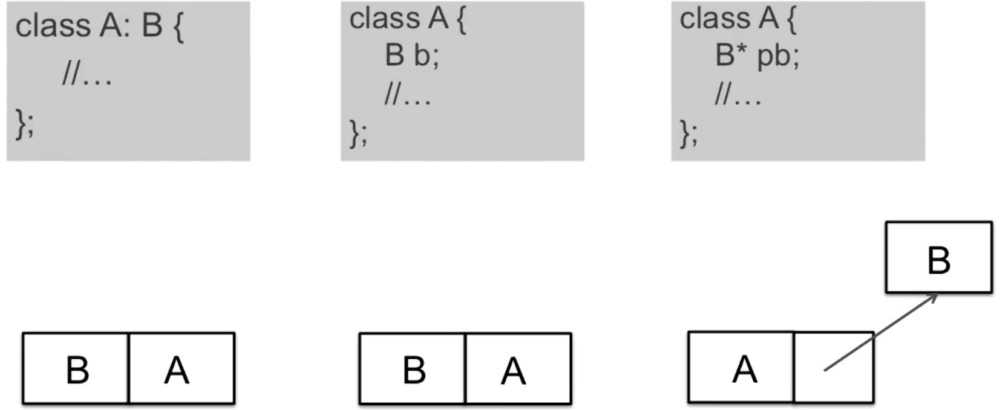

几乎所有的设计模式都采用类内部组合一个对象指针的形式（指针指向多态对象以解耦合）

#### 什么时候不用设计模式

- 代码可读性差
- 需求理解很浅
- 变化尚未显现
- 不是系统关键依赖点
- 项目无复用价值
- 项目将要发布

#### 经验之谈

- 不要为了模式而模式
- 关注抽象类和接口
- 理清变化点和稳定点
- 审视依赖关系
- 要有框架和应用的区隔思维
- 良好的设计是演化的结果

#### 设计模式成长之路

1. 「手中无剑，心中无剑」  ---  见模式而不知
2. 「手中有剑，心中无剑」  ---  可以识别模式，作为应用开发人员使用模式
3. 「手中有剑，心中有剑」  ---  作为框架开发人员为应用设计模式
4. 「手中无剑，心中有剑」  ---  忘掉模式，只有原则

### 面向对象设计原则

面向对象设计最大优势  ---  **抵御变化**

#### 面向对象

- 隔离变化  ---  面向对象构建方式更能适应软件变化，能将变化带来的影响降到最小（宏观）
- 各司其职  ---  需求变化导致的新增类型，不影响原来类型的实现（微观）

#### 对象

- 语言层面  ---  对象封装了代码和数据
- 规格层面  ---  对象定义了一系列接口
- 概念层面  ---  对象是拥有某种责任的抽象

#### 设计原则

1. 依赖倒置原则(DIP)

   - 高层模块（稳定）不应该依赖于低层模块（变化），二者均依赖于抽象（稳定）。

   - 抽象（稳定）不应该依赖于实现细节（变化），实现细节应该依赖于抽象（稳定）。

2. 开放封闭原则(OCP)

   - 对扩展开放，对更改封闭

   - 类模块应该是可扩展的，但不可修改。

3. 单一职责原则(SRP)
   - 一个类应该仅有一个引起变化的原因
   - 变化的方向隐含类的责任
4. Liskov替换原则(LSP)
   - 子类必须能够替换基类（子类能调用父类方法）
   - 继承表达类型抽象
5. 接口隔离原则(ISP)
   - 不应该强迫客户程序（使用者）依赖不用的方法
   - 接口应该小而完备
6. 优先使用对象组合，而不是类继承
   - 类继承通常为「白盒复用」，对象组合通常为「黑盒复用」
   - 继承在某种程度上破坏了封装性，耦合度高。而对象组合则要求被组合的对象具有良好定义的接口，耦合度低。
7. 封装变化点
   - 使用封装创建对象之间的分界层，让设计者可以在其一侧修改，不会对另一侧产生不良影响。实现层次间的松耦合
8. 针对接口编程，而非针对实现。
   - 不将变量类型声明为具体类，而是声明为接口。
   - 客户程序无需知晓对象的具体类型，只需要知道所具有的接口。

产业强盛标志  ---  **接口标准化**

#### 设计经验

由设计原则归纳、总结出的点

1. 设计习语(Design Idioms)  ---  与特定编程语言相关的底层模式、技巧惯用法

2. 设计模式(Design Patterns)  ---  类与对象之间的组织关系，包括角色、职责、协作方式

3. 架构模式(Architectural Patterns)  ---  系统中与组织结构关系密切的高层模式，包括子系统划分、职责、组织关系。

   

### 设计模式分类

23个设计模式的分类原则

- 目的

  - 创建型  ---  对象创建

  - 结构型  ---  对象需求变化对结构造成的冲击

  - 行为型  ---  多个类交互

- 范围

  - 类模式  ---  处理类与子类的静态关系（继承）
  - 对象模式  ---  对象间的动态关系（组合）

- 封装变化

  - 组件协作  ---  `Template Method、Strategy、Observer/Event`
  - 单一职责  ---  `Decorator、Bridge`
  - 对象创建  ---  `Factory Method、Abstract Factory、Prototype、Builder`
  - 对象性能  ---  `Singleton、Flyweight`
  - 接口隔离  ---  `Facade、Proxy、Mediator、Adapter`
  - 状态变化  ---  `Memento、State`
  - 数据结构  ---  `Composite、Iterator、Chain of Resposibility`
  - 行为变化  ---  `Command、Visitor`
  - 领域问题  ---  `Interpreter`

> 由于时代的发展，一些设计模式已不常用：`Builder、Mediator、Memento、Iterator、Chain of Resposibility、Command、Interpreter、Visitor`

#### Refactoring to Patterns

`重构获得模式`是普遍认为最好的使用设计模式方法

- 面向对象设计模式可以应对变化、提高复用。
- 现代软件设计特征  ---  需求频繁变化。
- 设计模式的要点  ---  寻找变化点（将稳定部分和变化不分分离开），变化点处使用设计模式来应对变化
- 设计模式的应用不该先入为主（防止误用）。没有一步到位的设计模式。（故，要`Refactoring to Patterns`）

##### 步骤

1. 自主增加相应的模块
2. 思考违背哪些设计原则
3. 重构代码

##### 重构

- 静态绑定$\to$动态绑定
- 早绑定$\to$晚绑定
- 继承$\to$组合
- 编译时依赖$\to$运行时依赖
- 紧耦合$\to$松耦合

## GoF23

### 组件协作

通过晚期绑定，实现**框架与应用程序**之间的松耦合。实现「框架与应用程序之间的划分」

#### Template  Method

模板方法。定义一个操作中的算法的骨架（稳定），将一些步骤延迟（变化）到子类。使得子类可以不改变一个算法的结构（复用），同时重定义该算法的某些特定步骤。

##### 动机

软件构造过程中，对于某项任务，有**稳定**的整体操作**结构**，但各个子步骤却有很多**改变**的需求；或者由于固有原因而无法和任务整体结构同时实现。

模板方法能够在**稳定操作**的前提下，灵活应对各个**子步骤的变化**及晚期实现需求。

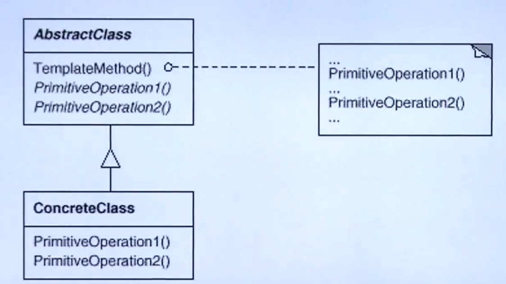

- `AbstractClass`  ---  稳定的流程
- `ConcreteClass`  ---  实现时会变化的步骤

##### 要点

- `Template  Method`是非常常用的基础设计模式，面向对象系统中大量使用。
- `Template  Method`机制简洁(虚函数的重载)，为许多应用程序架构提供了灵活扩展点，是代码复用层面的基本实现结构。
- `Template  Method`内含反向控制结构(`App`调用`Lib`中的方法 $\to$ `Lib`调用`App`**重写**的方法)
- `Template  Method`调用的虚方法可以不做实现，但一般设计为`protected`方法。(流程中的一部分，不供外界调用)

##### 样例

基类（Lib）实现执行流程，关于具体细节部分（步骤的详情），通过相应的派生类（App）去重写。

> 步骤的具体功能改变，不需要重写框架中的执行流程

```cpp
//库
class Library{
public:
    //具体执行流程（定）
    void Run() {
        Step1();
        if(Step2()) {
            Step3();
        }
    }
    virtual ~Library() {...}
protected:
    // 定
    void Step1() {...}
    void Step3() {...}
    // 变
    virtual bool Step2() = 0;
 };
//使用
class Application : public Library {
protected:
    virtual bool Step2() {...}
};
int main() {
    Library* pLib = new Application();
    pLib->Run();
    delete pLib;
}
```

#### Strategy

策略模式。定义一系列算法，分别封装，并且使他们可以相互替换(**变化**)。该模式使得算法「独立」于使用他的客户程序(稳定)而变化。

##### 动机

软件构造过程中，某些对象使用的**算法多种多样**，经常改变。如果将算法都编码到对象中，会使得对象异常复杂且冗余。

策略模式能够在运行时根据需求透明的更改对象的算法，将算法与对象解耦合。

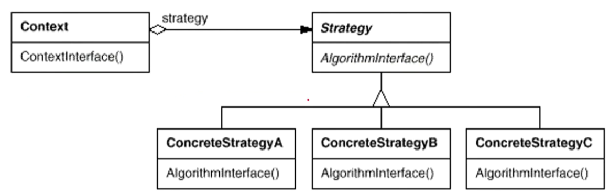

- `Context`与`Strategy`  ---  稳定的共有算法(都需要计算某个项)
- `ConcreteStrategy`  ---  具体的算法细节(计算的方式可能不同)

##### 样例

银行支持多个国家税额的计算。具体的支持国家会根据银行的发展改变。

> 增加新的国家税额计算方式时（具体实现细节、客户程序），无需改变框架（算法）。

```cpp
//计算策略 定
class TaxStrategy{
    TaxBase tax;
public:
    virtual double CalculateTax(...) = 0;
    virtual ~CalculateTax();
};
//具体国家的计算式 变
class CNTax : public TaxStrategy {
    virtual double CalculateTax(...) {
        ...
    }
};
//订单类 需要计算的值
class SalesOrder{
private:
    TaxStrategy* strategy;
public:
    //传入国家，新增
    SalesOrder(...) {
        this->strategy = new ...;
    }
}
```

##### 要点

- `Strategy`及其子类为组件提供一系列可重用算法，使得运行时方便切换。
- `Strategy`提供了条件判断语句以外的选择，消除判断本身以解耦合。
- 如果`Strategy`对象不实例化，那么 各个上下文共享一个Strategy对象以节省开销。

#### Observer/Event

观察者模式。定义一种对象间的**一对多**（变化）的依赖关系，以便当一个对象(Subject)的状态发生改变时，所有**依赖它的对象**都得到通知并**自动更新**。

##### 动机

软件构造过程中，需要为某些对象创建一种“通知依赖关系”  ---  一个对象（目标对象）的状态发生改变，所有的依赖对象（观察者对象）随之改变。若此依赖关系过于紧密，则软件不能很好的抵御变化。

观察者模式能够弱化这种依赖关系，形成稳定依赖关系、解耦合。

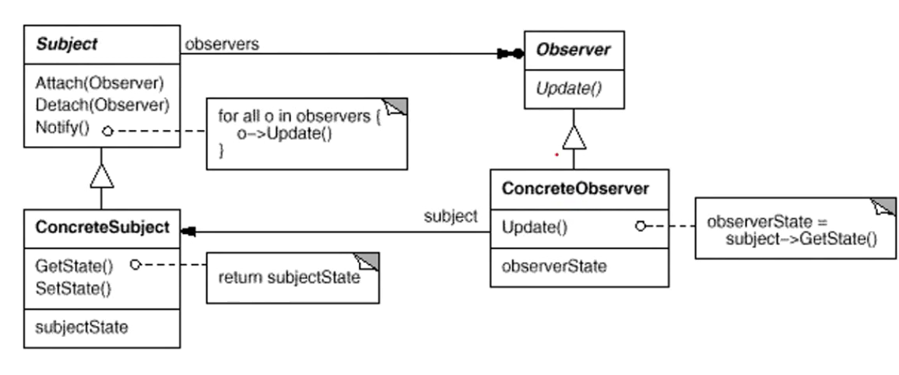

- `Subject  Observer`为稳定的框架部分
- `ConcreteObserver ConcreteSubject   `为具体观察者/主体对象的实现。主体对象`ConcreteSubject`改变会引发观察者`ConcreteObserver`的改变

##### 样例

文件分割器（U盘、移动硬盘太小装不下整个文件，要将文件划分为多个模块）中增加进度显示（变化，可能有多个细节方式实现。如：进度条、百分比）。

> 分割的进度（主体对象）变化会引发进度显示（进度条、百分比）等观察者的变化。

进度显示为一个用户反馈控件，抽象出相应的类。

```c++
//框架--用户反馈机制
class IProgress{  //用户反馈
public:
	virtual void DoProgress(float value)=0;
	virtual ~IProgress(){}
};
class FileSplitter
{
	string m_filePath;
	int m_fileNumber;
	List<IProgress*>  m_iprogressList; // 抽象反馈机制，支持多个观察者
public:
	FileSplitter(const string& filePath, int fileNumber) :
		m_filePath(filePath), 
		m_fileNumber(fileNumber){
	}
	void split(){
		//1.读取大文件
		//2.分批次向小文件中写入
		for (int i = 0; i < m_fileNumber; i++){
			//...
			float progressValue = m_fileNumber;
			progressValue = (i + 1) / progressValue;
			onProgress(progressValue);//反馈
		}
	}
    //增加/减少 反馈（观察者个数）
	void addIProgress(IProgress* iprogress){
		m_iprogressList.push_back(iprogress);
	}
	void removeIProgress(IProgress* iprogress){
		m_iprogressList.remove(iprogress);
	}
protected:
	virtual void onProgress(float value){ //反馈内容
		List<IProgress*>::iterator iter=m_iprogressList.begin();
		while (iter != m_iprogressList.end() )
			(*iter)->DoProgress(value); //更新进度条
			iter++;
		}
	}
};

//使用框架
class MainForm : public Form, public IProgress
{
	TextBox* txtFilePath;
	TextBox* txtFileNumber;
	ProgressBar* progressBar;
public:
	void Button1_Click(){
		string filePath = txtFilePath->getText();
		int number = atoi(txtFileNumber->getText().c_str());
		ConsoleNotifier cn;
		FileSplitter splitter(filePath, number);
		splitter.addIProgress(this); //增加反馈 （观察者个数）
		splitter.addIProgress(&cn); //增加反馈 （观察者个数）
		splitter.split();
		splitter.removeIProgress(this);

	}
	virtual void DoProgress(float value){
		progressBar->setValue(value);
	}
};
class ConsoleNotifier : public IProgress {
public:
	virtual void DoProgress(float value){
		cout << "....";
	}
};
```

##### 要点

+ `Observer`使得我们可以**独立地改变**目标与观察者，从而使二者之间的依赖关系达致松耦合。
+ 目标发送通知时，无需指定观察者，通知（可以携带通知信息作为参数）会**自动传播**。
+ 观察者自己决定是否需要订阅通知，目标对象对此一无所知。
+ `Observer`是基于事件的UI框架中非常常用的设计模式，也是MVC模式的一个重要组成部分。

### 单一职责

如果责任划分不清晰，使用继承得到的结果往往是随着需求的变化，子类急剧膨胀，同时充斥着重复代码，这时往往需要划清责任。

#### Decorator

装饰模式。动态（**组合**）地给一个对象增加一些额外的职责。就增加功能而言，Decorator模式比生成子类（**继承**）更为灵活（消除重复代码、减少子类个数）

##### 动机

在某些情况下我们可能会“过度地使用继承来扩展对象的功能”，由于继承为类型引入的静态特质，使得这种扩展方式缺乏灵活性；并且随着子类的增多（扩展功能的增多），各种子类的组合（扩展功能的组合）会导致更多子类的膨胀。

装饰模式能够使“对象功能的扩展”根据需要来动态实现，避免子类膨胀，从而使得任何“功能扩展变化”所导致的影响降为最低。

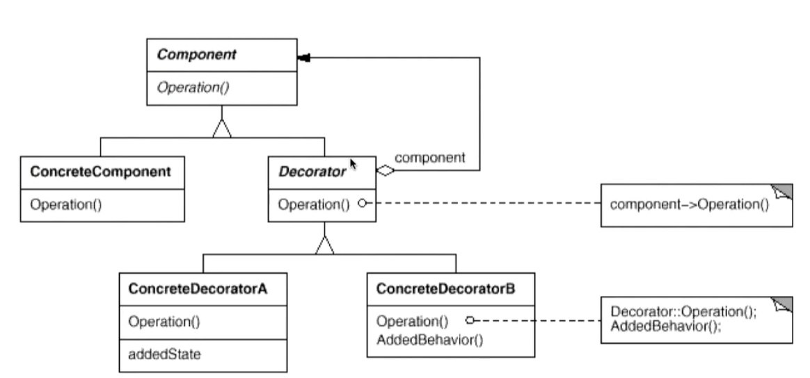

-  `Compoent`  ---  稳定的基本业务框架
-  `ConcreteCompoent  Decorator`  ---  稳定的使用 基础部分/可扩展部分（扩展复合一个`Compoent`对象以增加功能）
-  `ConcreteDecorator`  ---  具体的扩展实现

##### 样例

各个流(文件流、网络流、内存流)的库中存在着很多功能相同的模块。模块各自继承自相应的流，而功能相同。现，给各模块增加加密功能。

`Crypto[File,Network,Memory]Stream::read/seek/write`$ \to $`CryptoStream::read/seek/write`

- `Crypto[File,Network,Memory]Stream::read/seek/write`  ---  每个流中相应功能各自实现加密
- `CryptoStream`  ---  脱离开具体流（避免了多次拷贝）

> 不同流中增加同一类似功能无需每个流均**继承**一份，单独封装后每个流在使用时，通过组合引入即可。 

```c++
//业务操作
class Stream{
public:
    virtual char Read(int number) = 0;
    virtual void Seek(int position) = 0;
    virtual void Write(char data) = 0;
    virtual ~Stream(){}
};

//主体类
class FileStream: public Stream{
public:
    virtual char Read(int number){...}
    virtual void Seek(int position){...}
    virtual void Write(char data){...}
};
class NetworkStream :public Stream{
public:
    virtual char Read(int number){...}
    virtual void Seek(int position){...}
    virtual void Write(char data){...}    
};
class MemoryStream :public Stream{
public:
    virtual char Read(int number){...}
    virtual void Seek(int position){...}
    virtual void Write(char data){...}
};

//扩展操作
// 由于两个子类有相同的成员Stream*，所以这个成员要往上提
DecoratorStream: public Stream{
protected:
    Stream* stream;//复合
    DecoratorStream(Stream * stm):stream(stm){
    }
};

class CryptoStream: public DecoratorStream {
public:
    CryptoStream(Stream* stm):DecoratorStream(stm){...}
    virtual char Read(int number){
        //额外的加密操作...
        stream->Read(number);//读XX流  XX为文件 | 网络 | 内存
    }
    virtual void Seek(int position){
        //额外的加密操作...
        stream::Seek(position);//定位XX流
        //额外的加密操作...
    }
    virtual void Write(byte data){
        //额外的加密操作...
        stream::Write(data);//写XX流
        //额外的加密操作...
    }
};
void Process(){
    //运行时装配
    FileStream* s1=new FileStream();
    CryptoStream* s2=new CryptoStream(s1); //CryptoFileStream
}
```


##### 要点

+ 通过采用组合而非继承的手法， `Decorator`实现了在**运行时**动态扩展对象功能的能力，而且可以根据需要扩展多个功能。
  避免了使用继承带来的“灵活性差”和“多子类衍生问题”。

+ Decorator类在**接口上表现为is-a** Component的继承关系（Decorator类继承了Component类所具有的接口），但在**实现上又表现为has-a** Component的组合关系（Decorator类又使用了一个Component类）

  > 继承  ---  完善接口的规范
  >
  > 组合  ---  支撑具体实现类

+ Decorator模式的目的并非解决“多子类衍生的多继承”问题，Decorator模式应用的**要点**在于解决<strong style="color:#c04851;">「主体类在多个方向上的扩展功能」</strong>——是为“装饰”的含义。

#### Bridge

桥模式。将抽象部分(**业务功能**)与实现部分(**平台实现**)**分离**，使它们都可以独立地变化。

##### 动机

某些类型的固有的实现逻辑，使得它们具有两个变化的维度，乃至多个纬度的变化。

桥模式能够应对这种「多维度的变化」，轻松地沿着两个乃至多个方向变化，而不引入额外的复杂度。

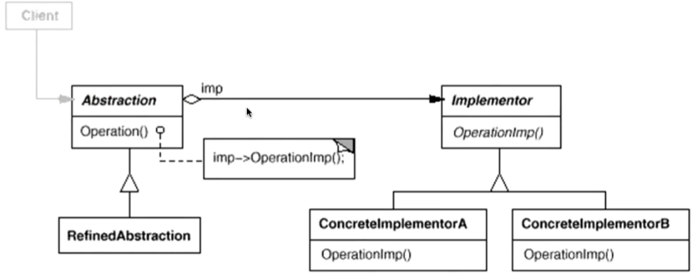

- `Abstraction  Implementor`为稳定的基础功能（根据维度划分为多个模块，维度影响的部分独立封装）
- `RefinedAbstractionw`为第一个变化维度（`Abstraction`中的成员）
- `ConcreteImplementor`为第二个变化维度（`Implementor`中的成员）

##### 样例

通信模块中，`Login  SendMessage  SendPicture  PlaySound  DrawShape  WriteText  Connect`等功能跨平台实现不太一样。平台中分为精简版、完美版。不同版本基本功能的实现是相似。

> 原本这些功能存在平台、版本等多个维度的变化，实现时针对特定平台特定版本创建类`IOSLiteXXX`，导致代码过度冗余。<br>桥模式将平台、版本问题剥离（单一职责原则）。

 ```mermaid
classDiagram
      Messager "1"-- "m" Platform
      Platform "1"-- "n" Release 
 ```
> 原来需要实现`1+m+m*n`个类（1通信模块+扩展m个平台+每个平台n个发布版本）
>
> 桥模式无需根据相应的平台推出对应版本(`1+m+n`个类)。

```c++
class Messager{
protected:
     MessagerImp* messagerImp;//平台
public:
    virtual void Login(string username, string password)=0;
    virtual void SendMessage(string message)=0;
    virtual void SendPicture(Image image)=0;
    virtual ~Messager(){}
};
// 不同的变化方向(业务和平台)，所以分为两个类
class MessagerImp{
public:
    virtual void PlaySound()=0;
    virtual void DrawShape()=0;
    virtual void WriteText()=0;
    virtual void Connect()=0;
    virtual MessagerImp(){}
};
//平台实现 n
class PCMessagerImp : public MessagerImp{
public:
    
    virtual void PlaySound(){...}
    virtual void DrawShape(){...}
    virtual void WriteText(){...}
    virtual void Connect(){...}
};
class MobileMessagerImp : public MessagerImp{
public:
    //具体实现
    virtual void PlaySound(){...}
    virtual void DrawShape(){...}
    virtual void WriteText(){...}
    virtual void Connect(){...}
};
//业务抽象 m
class MessagerLite :public Messager {
public:
    virtual void Login(string username, string password){
        messagerImp->Connect();
        //........
    }
    virtual void SendMessage(string message){
        messagerImp->WriteText();
        //........
    }
    virtual void SendPicture(Image image){
        messagerImp->DrawShape();
        //........
    }
};
class MessagerPerfect  :public Messager { 
public:  
    virtual void Login(string username, string password){
        messagerImp->PlaySound();
        //********
        messagerImp->Connect();
        //........
    }
    virtual void SendMessage(string message){
        messagerImp->PlaySound();
        //********
        messagerImp->WriteText();
        //........
    }
    virtual void SendPicture(Image image){
        messagerImp->PlaySound();
        //********
        messagerImp->DrawShape();
        //........
    }
};
void Process(){
    //运行时装配
    MessagerImp* mImp=new PCMessagerImp();
    Messager *m =new Messager(mImp);
}
```

##### 要点

+ `Bridge`使用「**对象间的组合关系**」解耦了抽象和实现之间固有的绑定关系，使得抽象和实现可以沿着各自的维度来变化。所谓抽象和实现沿着各自纬度的变化，即“子类化”它们。
+ `Bridge`有时候类似于多继承方案，但是多继承方案往往违背单一职责原则（即一个类只有一个变化的原因），复用性比较差。Bridge模式是比多继承方案更好的解决方法。
+ `Bridge`的应用一般在「两个非常强的变化维度」，有时一个类也有多于两个的变化维度，这时可以使用Bridge的扩展模式。

### 对象创建

通过「对象创建」，绕开`new`以避免`new`过程所导致的紧耦合（依赖于具体类），从而支持对象创建的稳定。「对象创建」是接口抽象后的第一步工作。

#### Factory Method

工厂方法。定义一个用于创建对象的接口，让子类决定实例化哪一个类。`Factory Method`使得一个类的实例化延迟到子类。（目的  ---  解耦合，手段  ---  虚函数）

##### 动机

在软件系统中，经常面临着创建对象的工作；由于需求的变化，需要创建的对象的具体类型经常变化。

工厂方法能够**绕过**new创建对象（**具体实现类**），提供一种“封装机制”来避免客户程序和“具体对象创建工作”的紧耦合。

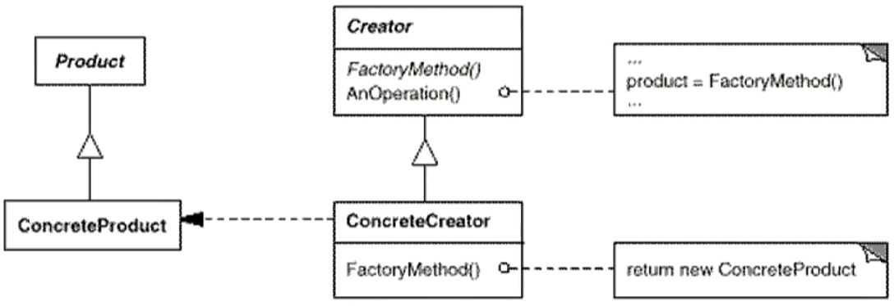

-  `Product  Creator`  ---  稳定的产品、工厂类
- `ConcreteProduct ConcreteCreator   `  ---  变化的 具体类、具体工厂

##### 样例

分割器不局限于文本分割器，还包括图片、视频、文本等多个分割器。实例化对象创建时不受限于具体某种分割器（具体工厂）。

> 工厂模式提供了基类使得多个具体类的实例化代码统一。

```c++
//抽象类
class ISplitter{
public:
    virtual void split()=0;
    virtual ~ISplitter(){}
};
//工厂基类
class SplitterFactory{
public:
    virtual ISplitter* CreateSplitter()=0;
    virtual ~SplitterFactory(){}
};


//具体类
class BinarySplitter : public ISplitter{...
};
class TxtSplitter: public ISplitter{...
};
class PictureSplitter: public ISplitter{...
};
class VideoSplitter: public ISplitter{...
};

//具体工厂
class BinarySplitterFactory: public SplitterFactory{
public:
    virtual ISplitter* CreateSplitter(){
        return new BinarySplitter();
    }
};
class TxtSplitterFactory: public SplitterFactory{
public:
    virtual ISplitter* CreateSplitter(){
        return new TxtSplitter();
    }
};
class PictureSplitterFactory: public SplitterFactory{
public:
    virtual ISplitter* CreateSplitter(){
        return new PictureSplitter();
    }
};
class VideoSplitterFactory: public SplitterFactory{
public:
    virtual ISplitter* CreateSplitter(){
        return new VideoSplitter();
    }
};


//使用者
class MainForm : public Form
{
    SplitterFactory*  factory;//工厂
public:
    MainForm(SplitterFactory*  factory){
        this->factory=factory;
    }
	void Button1_Click(){
		ISplitter * splitter = factory->CreateSplitter(); //多态new
        splitter->split();

	}
};
```

##### 要点

+ `Factory Method`用于**隔离**类对象的**使用者**和**具体类型**之间的耦合关系。面对一个经常变化的具体类型，紧耦合关系(new)会导致软件的脆弱。
+ `Factory Method`通过**面向对象的手法**(多态)，将所要创建的具体对象工作<strong style="color:red;">延迟</strong>到子类，从而实现一种**扩展**（<strong style="color:red;">而非更改</strong>）的策略，较好地解决了这种紧耦合关系。
+ `Factory Method`解决「单个对象」的需求变化。缺点在于要求创建方法/参数相同。

#### Abstract Factory

抽象工厂。提供一个接口，让该接口负责创建一系列「相关或者相互依赖的对象」，无需指定它们具体的类。

##### 动机

在软件系统中，经常面临着「一系列相互依赖的对象工作」；同时，由于需求的变化，往往存在更多系列对象的创建工作。

抽象工厂能够绕过new创建对象，提供一种“封装机制”来避免**客户程序**和这种「**多系列具体对象创建工作**」的紧耦合。


- `AbstractFactory`稳定的基础工厂
- `AbstractProduct`稳定的基础产品
- `Product`变化的具体产品
- `ConcreteFactory`变化的具体工厂
- $ConcreteFactory_i$会影响到其对应的$ProductM_i$(M为所有产品)

##### 样例

数据库模块，支持多种数据库的`Connection  Command`等操作。区别于`Bridge`，该处的侧重点不在于`操作  数据库类型`这多维度的变化，而是侧重于「每个数据库类型的Command会调用同类型数据的Connection」（多系列对象）

> 由于`XXXCommand`调用的`Connection`一定是`XXXConnection`，存在系列对象的相互依赖、相互作用。
>
> 抽象工厂模式将系列操作封装为一个工厂，保证多系列对象创建之间的相互依赖的同时，摆脱具体实现类。

```c++

//数据库访问有关的基类 产品基类
class IDBConnection{...};
class IDBCommand{...};
class IDataReader{...};

//抽象工厂 统一系列化对象（相互作用）  工厂基类
class IDBFactory{
public:
    virtual IDBConnection* CreateDBConnection()=0;
    virtual IDBCommand* CreateDBCommand()=0;
    virtual IDataReader* CreateDataReader()=0;
    
};


//支持SQL Server 具体产品实现
class SqlConnection: public IDBConnection{...};
class SqlCommand: public IDBCommand{...};
class SqlDataReader: public IDataReader{...};

//具体工厂实现
class SqlDBFactory:public IDBFactory{
public:
    virtual IDBConnection* CreateDBConnection()=0;
    virtual IDBCommand* CreateDBCommand()=0;
    virtual IDataReader* CreateDataReader()=0;
};
class EmployeeDAO{
    IDBFactory* dbFactory;    
public:
    vector<EmployeeDO> GetEmployees(){
        IDBConnection* connection = dbFactory->CreateDBConnection();
        connection->ConnectionString("...");
        IDBCommand* command =dbFactory->CreateDBCommand();
        command->CommandText("...");
        command->SetConnection(connection); //关联性
        IDBDataReader* reader = command->ExecuteReader(); //关联性
        while (reader->Read()){
            ...
        }
    }
};
```

##### 要点

+ 如果没有应对”多**系列对象**创建“的需求变化，则没有必要使用Abstract Factory模式，这时候使用简单的工厂即可。
+ **「系列对象」**指的是在某一个特定系列的对象之间有**相互依赖、相互作用**的关系。不同系列的对象之间不能相互依赖。
+ `Abstract Factory`模式主要在于应用「新系列」的需求变动(增加其他系列操作)。其缺点在与**难以应对新对象**的需求变动（在系列操作中更改）。

#### Prototype

原型模式。使用原型实例（仅供克隆）指定创建对象的种类，然后通过拷贝这些原型来创建新的对象。

##### 动机

在软件系统中，经常面临这“某些结构复杂的对象”的创建工作；由于需求的变化，这些对象**经常面临着剧烈的变化**，但是它们却拥有比较稳定一致的接口。

原型模式能够向客户程序(使用者)隔离出「易变对象」，从而使得依赖这些易变对象的客户程序不随着需求改变而改变。

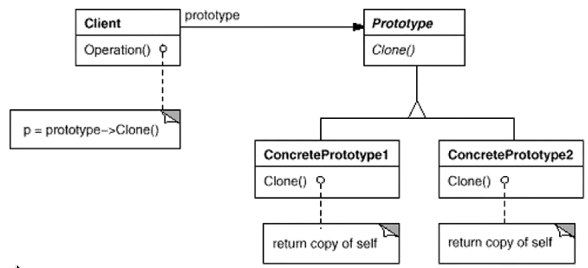

-  `Prototype`  ---   稳定的供克隆使用的原型实例。
- `Client`  ---  客户程序（不会因被克隆对象的变化而改变）
- `ConcretePrototype`  ---  实现自身的克隆方式的某个类

##### 样例

同工厂方法的背景

> 对象比较复杂时，利用工厂方法初始化的对象不便于使用。借助已经处于某种状态的原型，克隆出处于理想状态（避免状态条件苛刻带来不必要的资源浪费）的对象。

```c++
//客户
class MainForm : public Form
{
    ISplitter*  prototype;//原型对象
public:
    MainForm(ISplitter*  prototype){
        this->prototype=prototype;
    }
	void Button1_Click(){
		ISplitter * splitter=
            prototype->clone(); //克隆原型
        splitter->split();
	}
};


//抽象类 	原型
class ISplitter{
public:
    virtual void split()=0;
    virtual ISplitter* clone()=0; //通过克隆自己来创建对象
    virtual ~ISplitter(){}
};


//具体类
class BinarySplitter : public ISplitter{
public:
    virtual ISplitter* clone(){
        return new BinarySplitter(*this);
    }
};
class VideoSplitter: public ISplitter{
public:
    virtual ISplitter* clone(){
        return new VideoSplitter(*this);
    }
};


```

##### 要点

+ `Prototype`模式同样用于**隔离**对象的**使用者和具体类型**(易变类)之间的耦合关系，它同样要求这些“易变类”拥有**稳定的接口**。(和工厂方法一样)
+ `Prototype`模式对于“如何创建易变类的实体对象“采用**「原型克隆」**的方法来做，它使得我们可以非常灵活地动态创建「拥有某些稳定接口」的新对象——所需工作仅仅是注册一个新类的对象(即原型)，然后在任何需要的地方clone。
+ `Prototype`模式中的Clone方法可以利用某些框架中的序列化来实现深拷贝。(c++用拷贝构造函数即可)

#### Builder

构建器。将一个复杂对象的**构建**与其表示相分离，使得**同样的构建过程**(稳定)可以**创建不同的表示**(变化)。

##### 动机

在软件系统中，有时候面临着“一个**复杂对象**”的创建工作，其通常**由各个部分的子对象**用一定的算法**构成**；由于需求的变化，这个复杂对象的**各个部分**经常面临着剧烈的**变化**，但是将它们组合在一起的**算法却相对稳定**。

构建器提供一种**封装机制**来隔离出「复杂对象的各个部分」的变化，从而保持系统中的「稳定构建算法」不随着需求改变而改变。

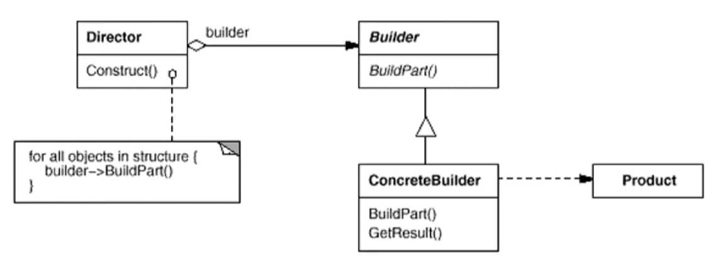

- `Director  Builder`   稳定的流程、稳定虚基类
- `ConcreteBuilder`具体的细节实现
- `Product` 使用

> `Builder`用于解决**对象创建**时的算法恒定，细节各异的问题。(构造函数调用虚函数不能实现多态)<br>
> `Template Method`用于解决**函数应用**时的算法恒定，细节各异的问题。（成员函数可以调用虚函数实现多态）

为什么构造函数调用虚函数不能实现多态？

> 子类构造函数要先调用父类构造函数，虚函数实现重载靠的是动态绑定。<br>如果构造函数中的虚函数为动态绑定(多态)，则子类在构造时，子类的构造函数先调用父类构造函数，而此时父类构造函数不能调用子类的重载函数（子类还未创建，没有虚表。）

##### 样例

游戏里建房子，使用的材料各异，但构建的流程不变。

> 由于构造函数的特殊性质，不能直接借助虚函数在构造函数中实现上述功能。

```c++
class House{
    //...
};
//抽象基类 需要的几个构造部分 (门、窗、桌子)
class HouseBuilder {
public:
    House* GetResult(){
        return pHouse;//构造完返回
    }
    virtual ~HouseBuilder(){}
protected:
    House* pHouse;
	virtual void BuildPart1()=0;
    virtual void BuildPart2()=0;
    virtual void BuildPart3()=0;
    virtual void BuildPart4()=0;
    virtual void BuildPart5()=0;
};
class StoneHouse: public House{...};

class StoneHouseBuilder: public HouseBuilder{
protected:
    //每部分构造的具体实现
    virtual void BuildPart1(){...}
    virtual void BuildPart2(){...}
    virtual void BuildPart3(){...}
    virtual void BuildPart4(){...}
    virtual void BuildPart5(){...}
};
//造房子
class HouseDirector{   
public:
    HouseBuilder* pHouseBuilder;
    HouseDirector(HouseBuilder* pHouseBuilder){
        this->pHouseBuilder=pHouseBuilder;
    }
    House* Construct(){//分别构造每一部分
        pHouseBuilder->BuildPart1();
        for (int i = 0; i < 4; i++){
            pHouseBuilder->BuildPart2();
        }
        bool flag=pHouseBuilder->BuildPart3();
        if(flag){
            pHouseBuilder->BuildPart4();
        }
        pHouseBuilder->BuildPart5();
        return pHouseBuilder->GetResult();
    }
};
```

##### 要点

+ `Builder `模式主要用于“**分步骤构建**一个复杂的对象”。在这其中“分步骤”是一个**稳定的算法**，而复杂对象的**各个部分**则经常**变化**。
+ 变化点在哪里，封装哪里—— `Builder`模式主要在于应对“复杂对象各个部分”的频繁需求变动。其缺点在于难以应对“分步骤构建算法”的需求变动。
+ 在`Builder`模式中，要注意不同语言中构造器内**调用虚函数的差别**。

### 对象性能

面向对象很好地解决了“抽象”的问题，但是必不可免地要付出一定的代价。对于通常情况来讲，面向对象的成本大都可以忽略不计。但是**某些情况，面向对象所带来的成本必须谨慎处理**。

#### Singleton

单件模式。保证一个**类仅有一个实例**，并**提供**一个该实例的**全局访问点**。

##### 动机

在软件系统中，经常有这样一些**特殊的类**，必须保证它们在系统中**只存在一个实例**，才能确保它们的逻辑正确性、以及良好的效率。这应该是类设计者的责任，而不是使用者的责任。

单件模式可以绕过常规的构造器，提供一种机制来保证一个类只有一个实例。

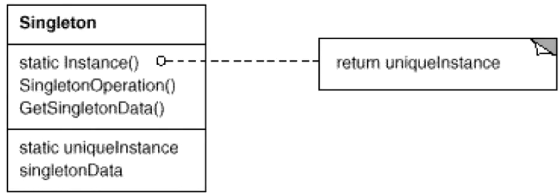

##### 样例

具体的单件创建方案的演变见代码

```c++
//单例
class Singleton{
private://默认构造、拷贝构造不声明会自动生成
    Singleton();
    Singleton(const Singleton& other);
public:
    static Singleton* getInstance();
    static Singleton* m_instance;
};
Singleton* Singleton::m_instance=nullptr;


//线程非安全版本（多线程不可用）
Singleton* Singleton::getInstance() {
    //线程A判为true，但并未new，在等待执行
	//此时线程B如果调用，则仍可以判为true
    if (m_instance == nullptr) {
        m_instance = new Singleton();
    }
    return m_instance;
}


//线程安全版本，但锁的代价过高
Singleton* Singleton::getInstance() {
    Lock lock;
    //某线程判true则加锁
    //但，只有第一次创建时是写操作，大部分为读操作。
    //此后的多线程读时，浪费时间。
    if (m_instance == nullptr) {
        m_instance = new Singleton();
    }
    return m_instance;
}


//双检查锁，但由于内存读写reorder不安全
Singleton* Singleton::getInstance() {
    //锁前检查，读操作可直接跳进锁流程
    //内存读写reorder会导致双检察锁失效
    //创建单例过程 1.分配内存2.调用构造器3.返回赋值
    //编译器针对对象创建优化时会打乱上述流程（跳过2进入3）
    //如果此时再来一个线程能读取到单例已创建并得到指针
    //但此时单例还未调用构造器，未初始化。调用会出错。
    if(m_instance==nullptr){
        Lock lock;
        if (m_instance == nullptr) {
            m_instance = new Singleton();
        }
    }
    return m_instance;
}

//C++ 11版本之后的跨平台实现 (volatile)
std::atomic<Singleton*> Singleton::m_instance;
std::mutex Singleton::m_mutex;
Singleton* Singleton::getInstance() {
    Singleton* tmp = m_instance.load(std::memory_order_relaxed);
    std::atomic_thread_fence(std::memory_order_acquire);//获取内存fence
    if (tmp == nullptr) {
        std::lock_guard<std::mutex> lock(m_mutex);//锁
        tmp = m_instance.load(std::memory_order_relaxed);
        if (tmp == nullptr) {
            tmp = new Singleton;
            std::atomic_thread_fence(std::memory_order_release);//释放内存fence
            m_instance.store(tmp, std::memory_order_relaxed);
        }
    }
    return tmp;
}
```

##### 要点

+ `Singleton`模式中的实例构造器可以设置为protected以允许子类派生。
+ `Singleton`模式一般**不支持拷贝构造函数和clone接口**，因为这有可能导致多个对象实例，与Singleton模式的初衷违背。
+ 实现**多线程**环境下安全的`Singleton`,需要注意对**双检查锁**的正确实现。

#### FlyWeight

享元模式。运行**共享**技术有效地支持大量细粒度的对象。

##### 动机

在软件系统采用纯粹对象方案的问题在于大量细粒度的对象会很快充斥在系统中，从而带来很高的运行时代价——主要指内存需求方面的代价。

享元模式能够避免大量细粒度对象问题的同时，让外部客户程序仍然能够透明地使用面向对象的方式来进行操作。

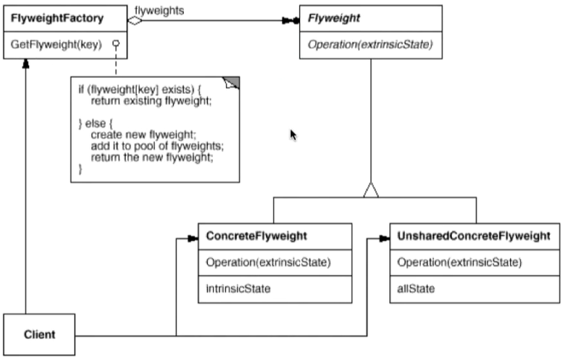

##### 样例

创建一个对象池来支持共享。

```c++
class Font {
private:
    //unique object key
    string key;    
    //object state
    //....    
public:
    Font(const string& key){...}
};
class FontFactory{
private:
    map<string,Font* > fontPool;    
public:
    Font* GetFont(const string& key){
        map<string,Font*>::iterator item=fontPool.find(key);
        if(item!=footPool.end()){ //池中存在则共享
            return fontPool[key];
        } else{//没有则创建
            Font* font = new Font(key);
            fontPool[key]= font;
            return font;
        }
    }
    void clear(){...}
};
```

##### 要点

+ 面向对象很好地解决了抽象性的问题，但是作为一个运行在机器中的程序实体，我们需要考虑**对象的代价问题**。Flyweight主要解决面向对象的代价问题，一般不触及面向对象的抽象性问题。 
+ Flyweight采用**对象共享**的做法来降低系统中对象的**个数**，从而降低细粒度对象给系统带来的压力。在具体实现方面，要注意对象状态的处理（只读）。
+ 对象的数量太大从而导致对象内存开销加大  ---  数量大小需要根据具体应用情况进行评估，而不能凭空臆断。

### 接口隔离

在组件构建过程中，某些**接口之间直接的依赖常常会带来很多问题、甚至根本无法实现**。采用**添加一层间接（稳定）接口**，来**隔离本来互相紧密关联的接口**是一种常见的解决方案。

> Facade 系统内外隔离（外对内，单向依赖）
>
> Proxy 一些特殊原因，隔离实际对象，间接访问
>
> Adapter 旧接口与需求不太匹配，用旧接口生成新接口
>
> Mediator 隔离多个对象间的相互交互

#### Façade

门面模式。为子系统中的一组接口提供一个一致(稳定)的界面，Façade模式定义了一个高层接口，这个接口使得这一子系统更加容易使用(复用)。

##### 动机

组件的客户和组件中各种复杂的子系统有了过多的耦合，随着外部客户程序和各子系统的演化，这种过多的耦合面临很多变化的挑战。

门面模式能够简化外部客户程序和系统间的交互接口，解耦合。

由于门面模式是用于边界划分，用稳定的接口隔离变化体。内外情况多变，无特定类图。

##### 样例

将多个对外接口封装在Facade中(稳定的提供接口的间接层)，将客户和子系统解耦合。

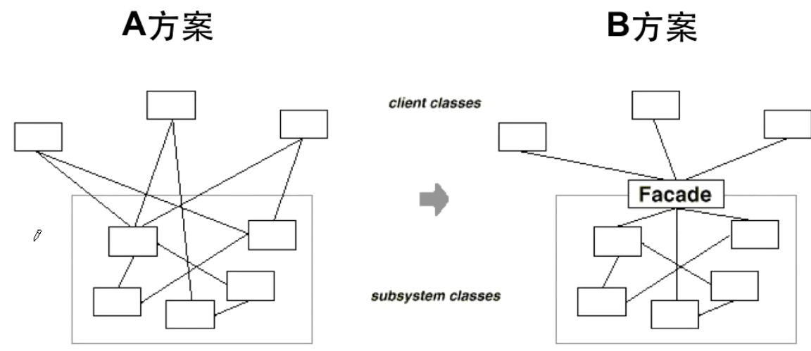

##### 要点

+ 从客户程序角度来看，`Façade`模式**简化**了整个组件**系统的接口**
+ 对于组件内部与外部的客户程序来说，达到了一种”解耦“的效果  ---  内部子系统的任何变化不会影响到`Façade`接口的变化。
+ `Façade`设计模式更注重**架构**的层次去看整个系统，而不是单个类的层次。`Façade`很多时候是一种架构设计模式。
+ `Façade`设计模式并非一个集装箱，不可以任意地放进任何多个对象。`Façade`模式组件中的内部应该是”相互耦合关系比较大的一系列组件“，而不是一个简单的功能集合。
+ `Façade`实现松耦合，高内聚。(内部高内聚，对外松耦合)

#### Proxy

代理模式。为其他对象提供一种代理以控制(**隔离，使用接口**)对这对象的访问。（核心在增加**间接层**）

##### 动机

在面向对象系统中，有些对象由于某种原因(比如对象创建的开销很大，或者某些操作需要安全控制，或者需要进程外的访问等)，直接访问会给使用者、或者系统结构带来很多麻烦。

代理模式提供一个间接层在不失去透明操作对象(一致性)的同时来管理/控制这些对象特有的复杂性。

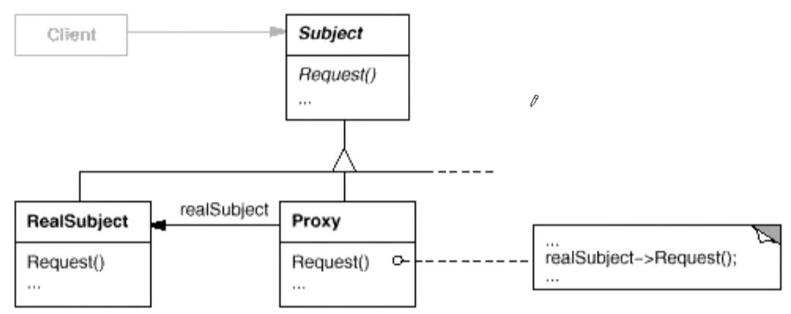

- 实际对象`RealSubject`由于一系列原因禁止访问，`Client`客户借助`Proxy`间接控制`RealSubject`
- `Proxy`和`RealSubject`使用的是同一接口，给`Client`感觉上体验是一致的。

##### 样例

```c++
class ISubject{
public:
    virtual void process();
};
//实际对象
class RealSubject: public ISubject{
public:
    virtual void process(){
        //....
    }
};
//Proxy的设计
class SubjectProxy: public ISubject{
public:
    virtual void process(){
        //对RealSubject的一种间接访问
        //....
    }
};

//客户
class ClientApp{
    ISubject* subject;
public:
    ClientApp(){
        subject=new SubjectProxy();
    }
    void DoTask(){
        //...
        subject->process();
        //....
    }
};
```

##### 要点

- 「增加一层间接层」是软件系统中对许多复杂问题的一种常见解决方法。
- 在面向对象系统中，直接使用某些对象会带来很多问题，作为**间接层的proxy对象**便是解决这一问题的常用手段。
- 具体proxy设计模式的实现方法、实现粒度都相差很大。有些可能对单个对象做细粒度的控制（copy-on-write技术），有些可能对组件模块提供抽象代理层（在架构层次对对象做proxy）

- Proxy并不一定要求保持接口完整的一致性，只要能够实现间接控制，有时候**损及一些透明性是可以接受的**。

#### Adapter

适配器。将一个类的接口转换成客户希望的另一个接口。Adapter模式使得原本由于接口不兼容而不能一起工作的那些类可以一起工作。

##### 动机

由于应用环境的变化，常常需要将「一些现存的对象」放在新的环境中应用，但是新环境要求的接口是这些现存对象所不满足。

适配器能够应对这种「迁移的变化」，既能利用现有对象的良好实现，同时又能满足新的应用环境所要求的接口。


- `Adaptee`历史遗留的接口，`Target`新环境中使用的目标接口。

##### 样例

```c++
//目标接口（新接口）
class ITarget{
public:
    virtual void process()=0;
};
//遗留接口（老接口）
class IAdaptee{
public:
    virtual void foo(int data)=0;
    virtual int bar()=0;
};
//遗留类型
class OldClass: public IAdaptee{
    //....
};
//对象适配器
class Adapter: public ITarget{ //继承
protected:
    IAdaptee* pAdaptee;//组合
public:
    Adapter(IAdaptee* pAdaptee){
        this->pAdaptee=pAdaptee;
    }
    virtual void process(){
        int data=pAdaptee->bar();
        pAdaptee->foo(data);
    }
};

//类适配器
class Adapter: public ITarget,
               protected OldClass{ //多继承
}

int main(){
    IAdaptee* pAdaptee=new OldClass();
    ITarget* pTarget=new Adapter(pAdaptee);
    pTarget->process();
}

class stack{
    deqeue container;
};
class queue{
    deqeue container;
};
```

##### 要点

- Adapter模式主要应用于「希望复用一些现存的类，但是接口又与复用环境要求不一致的情况」，在遗留代码复用、类库迁移等方面非常有用。
- `GoF23`定义了两种Adapter模式的实现结构：对象适配器和类适配器。但**类适配器**采用“**多继承**”的实现方式，一般**不推荐**使用。对象适配器采用“对象组合”的方式，更符合松耦合精神。
- Adapter模式可以实现的非常灵活，不必拘泥于`GoF23`中定义的两种结构。例如，完全可以将Adapter模式中的“现存对象”作为新的接口方法参数，来达到适配的目的。

#### Mediator

中介者。用一个中介对象来封装(封装变化)**一系列的对象交互**。中介者使各对象不需要显式的相互引用(编译时依赖->运行时依赖)，从而使其耦合松散(管理变化)，并且可以独立地改变它们之间的交互。（多对象间的依赖倒置原则）

##### 动机

**多个对象相互关联**的情况，对象之间常常会维持一种**复杂的引用关系**，如果遇到一些需求的更改，这种直接的引用关系将面临不断的变化。

中介者在这种情况下，可以使用一种”**中介对象**“来**管理对象间的关联关系**，避免相互交互的对象之间的紧耦合引用关系，从而更好地抵御变化。

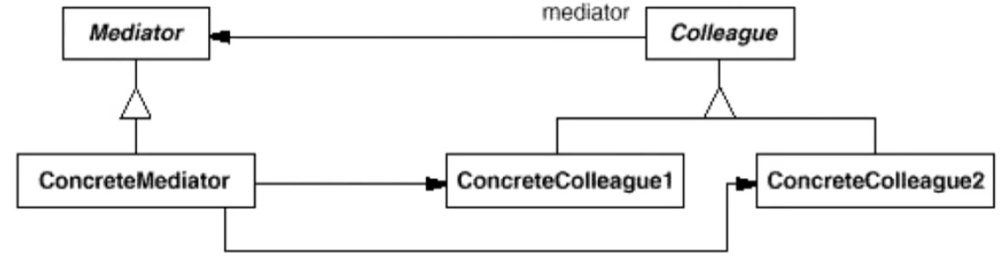

- 本来是多个`ConcreteColleague`相互交互，现在是多个`ConcreteColleague`之间借助`ConcreteMediator`交互

##### 样例

相互间存在依赖的五个对象`1  2  3  4  5`增加中介层`Mediator`从而使得对象间解耦合。

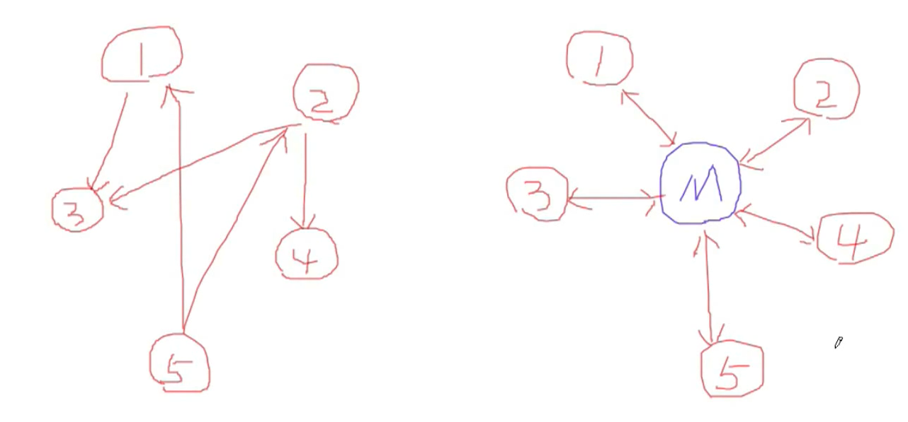

##### 要点

+ 将多个对象间发杂的关联关系解耦。Mediator模式将多个对象间的控制逻辑进行集中管理，变「多个对象互相关联」为「多个对象和一个中介者关联」，简化了系统的维护，抵御了可能的变化。
+ 随着控制逻辑的复杂化，Mediator具体对象的实现可能相当复杂。这时候可以对Mediator对象进行分解处理。
+ Facade模式是解耦**系统间(单向)的对象**关联关系；Mediator模式是解耦系统内**各个对象之间(双向)**的关联关系。

### 状态变化

在组件构建过程中，某些对象的状态经常面临变化，如何对这些变化进行有效的管理？同时又维持高层模块的稳定？“状态变化”模式为这一问题提供了一种解决方案。

#### State

状态模式。允许一个对象在其内部状态改变时改变它的行为。从而使对象看起来似乎修改了其行为。

##### 动机

软件构建过程中，对象**状态如果改变**，其**行为也会随之而发生变化**，比如文档处于只读状态，其支持的行为和读写状态支持的行为就可能完全不同。

状态模式可以在运行时根据对象的状态来透明地改变对象的行为。

> Strategy与State可以理解为多种类型的if-else操作，如果用`枚举 + if-else`增加新的类型会更改源码，使用这两种模式可以在增加新类型时，仅在客户程序中增加相应的类重写相应的函数，而无需去更改流程操作。

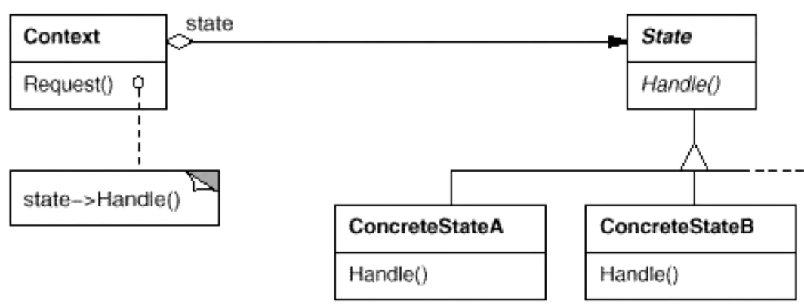

##### 样例

```c++
class NetworkState{

public:
    NetworkState* pNext;
    virtual void Operation1()=0;
    virtual void Operation2()=0;
    virtual void Operation3()=0;

    virtual ~NetworkState(){}
};

class OpenState :public NetworkState{
    static NetworkState* m_instance;
public:
    static NetworkState* getInstance(){
        if (m_instance == nullptr) {
            m_instance = new OpenState();
        }
        return m_instance;
    }
    void Operation1(){
        //**********
        pNext = CloseState::getInstance();
    }
    void Operation2(){
        //..........
        pNext = ConnectState::getInstance();
    }
    void Operation3(){
        //$$$$$$$$$$
        pNext = OpenState::getInstance();
    }
};

class CloseState:public NetworkState{ }
//...
class NetworkProcessor{
    NetworkState* pState;
public:
    NetworkProcessor(NetworkState* pState){
        this->pState = pState;
    }
    void Operation1(){
        //...
        pState->Operation1();
        pState = pState->pNext;
        //...
    }
    void Operation2(){
        //...
        pState->Operation2();
        pState = pState->pNext;
        //...
    }
    void Operation3(){
        //...
        pState->Operation3();
        pState = pState->pNext;
        //...
    }
};
```

##### 要点

+ State模式将所有与一个特定状态相关的行为都放入一个State的子对象中，在对象状态切换时，切换相应的对象；但同时维持State的接口，这样实现了具体操作与状态转换之间的解耦。
+ 为不同的状态引入不同的对象使得状态转换变得更加明确，而且可以保证不会出现状态不一致的情况。转换是原子性的(要么彻底转换过来，要么不转换。)
+ 与Strategy模式类似，如果State对象没有实例变量，那么各个上下文可以共享同一个State对象，从而节省对象开销。（Singleton）

#### Memento

备忘录。在不破坏封装性的前提下，捕获一个对象的内部状态，并在该**对象之外保存这个状态**。这样以后就可以将该对象恢复到原先保存的状态。

##### 动机

某些对象的状态转换过程中，可能由于某中需要，要求程序能够回溯到对象之前处于某个点的状态。如果使用一些公开接口来让其他对象得到对象的状态，便会暴露对象的细节实现。

备忘录能够实现对象状态的良好保存与恢复，同时又不会因此而破坏对象本身的封装性。

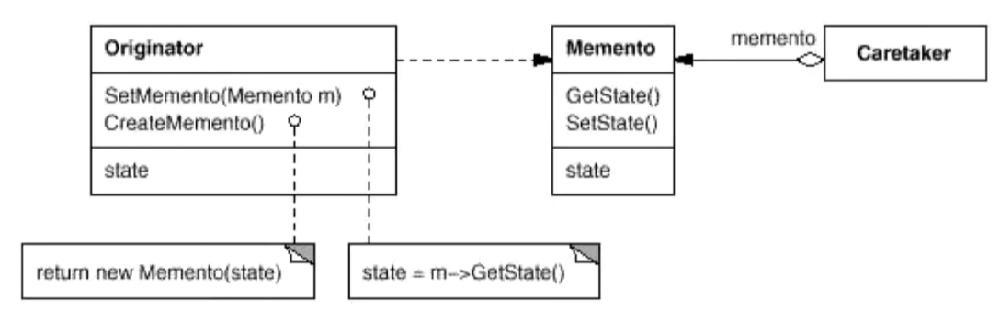

##### 样例

```c++
//备忘录
class Memento
{
    string state;
    //..
public:
    Memento(const string & s) : state(s) {}
    string getState() const { return state; }
    void setState(const string & s) { state = s; }
};
//使用备忘录的类
class Originator
{
    string state;
    //....
public:
    Originator() {}
    Memento createMomento() {
        Memento m(state);
        return m;
    }
    void setMomento(const Memento & m) {
        state = m.getState();
    }
};
int main()
{
    Originator orginator;
    //捕获对象状态，存储到备忘录
    Memento mem = orginator.createMomento();
    //... 改变orginator状态
    //从备忘录中恢复
    orginator.setMomento(memento);
}
```

##### 要点

+ 备忘录存储原发器对象的内部状态，在需要时恢复原发器状态。
+ Memento模式的核心是**信息隐藏**，即原发器需要向外接隐藏信息，保持其封装性，但同时又需要将状态保持到外界。
+ 由于现代语言运行时(如C#、Java等)都具有相当的对象序列化支持，因此往往采用效率较高、又较容易正确实现的序列化方案来实现Memento模式。

### 数据结构

常常有一些组件在内部具有特定的数据结构，如果让客户程序依赖这些特定的数据结构，将极大地破坏组件的复用。

这时候，将这些特定数据结构封装在内部，在外部提供统一的接口，来实现与特定数据结构无关的访问，是一种行之有效的解决方案。

> Composite 树形结构
>
> Iterator 在内部不可见的情况下，处理内部数据
>
> Chain of Responsibility 链表结构

#### Composite

组合模式。将**对象组合成树形结构**以表示「部分-整体」的层次结构。

Composite使得用户对单个对象和组合对象的使用具有**一致性**(稳定)。

##### 动机

客户代码过多地依赖于对象容器复杂的内部实现结构，对象容器内部实现结构(而非抽象结构)的变化引起客户代码的频繁变化，带来了代码的维护性、扩展性等弊端。

组合模式将「客户代码与复杂的对象容器结构」解耦，让对象容器自己来实现自身的复杂结构，从而使得客户代码就像处理简单对象一样来处理复杂的对象容器。

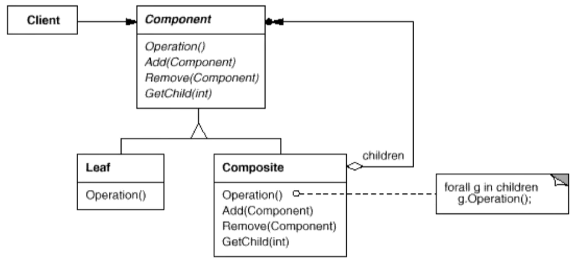

##### 样例

```c++
class Component
{
public:
    virtual void process() = 0;
    virtual ~Component(){}
};

//树节点
class Composite : public Component{
    string name;
    list<Component*> elements;
public:
    Composite(const string & s) : name(s) {}
    void add(Component* element) {
        elements.push_back(element);
    }
    void remove(Component* element){
        elements.remove(element);
    }
    void process(){
        //1. process current node
        //2. process leaf nodes
        for (auto &e : elements)
            e->process(); //多态调用
         
    }
};
//叶子节点
class Leaf : public Component{
    string name;
public:
    Leaf(string s) : name(s) {}
    void process(){
        //process current node
    }
};
void Invoke(Component & c){
    //...
    c.process();
    //...
}
int main()
{
    Composite root("root");
    Composite treeNode1("treeNode1");
    Composite treeNode2("treeNode2");
    Composite treeNode3("treeNode3");
    Composite treeNode4("treeNode4");
    Leaf leat1("left1");
    Leaf leat2("left2");
    root.add(&treeNode1);
    treeNode1.add(&treeNode2);
    treeNode2.add(&leaf1);
    root.add(&treeNode3);
    treeNode3.add(&treeNode4);
    treeNode4.add(&leaf2);
    process(root);
    process(leaf2);
    process(treeNode3);
  
}
```

##### 要点

+ Composite模式采用**树性结构**来实现普遍存在的对象容器，从而**将”一对多“的关系转化为”一对一“的关系**（递归调用所有子节点），使得客户代码可以**一致地**(复用)**处理对象和对象容器**，无需关心处理的是单个的对象，还是组合的对象容器。
+  将「客户代码与复杂的对象容器结构」解耦是`Composite`的核心思想。
+ 客户代码与纯粹的抽象接口（而非对象容器的内部实现结构）发生依赖，从而更能”应对变化“。
+ Composite模式在具体实现中，可以让父对象中的子对象反向追溯；如果父对象有频繁的遍历需求，可使用缓存技术来改善效率。

#### Iterator

迭代器。提供一种方法顺序访问一个聚合对象中的各个元素，而又不暴露(稳定)该对象的内部表示。

##### 动机

集合对象内部结构常常变化异常。但对于这些集合对象，我们希望**不暴露其内部结构**的同时，可以让**外部客户代码透明地访问其中包含的元素**；
同时这种”透明遍历“也为”同一种算法在多种集合对象上进行操作“提供了可能。

使用面向对象技术将这种遍历机制抽象为”迭代器对象“为”应对变化中的集合对象“提供了一种优雅的方式。

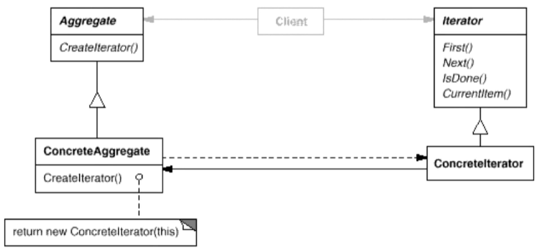

##### 样例

```c++
template<typename T>
class Iterator
{
public:
    virtual void first() = 0;
    virtual void next() = 0;
    virtual bool isDone() const = 0;
    virtual T& current() = 0;
};
template<typename T>
class MyCollection{
public:
    Iterator<T> GetIterator(){
        //...
    }
};
template<typename T>
class CollectionIterator : public Iterator<T>{
    MyCollection<T> mc;
public:
    CollectionIterator(const MyCollection<T> & c): mc(c){ }
    //虚函数根据具体类型去重载
    void first() override {...}
    void next() override {...}
    bool isDone() const override{...}
    T& current() override{...}
};

void MyAlgorithm()
{
    MyCollection<int> mc;
    Iterator<int> iter= mc.GetIterator();
    for (iter.first(); !iter.isDone(); iter.next()){
        cout << iter.current() << endl;
    }
}
```

##### 要点

+ 迭代抽象：访问一个聚合对象的内容而无需暴露它的内部表示。
+ 迭代多态：为遍历不同的集合对象提供一个统一的接口，从而支持同样的算法在不同的集合结构上进行操作。。
+ 迭代器的健壮性考虑：遍历的同时更改迭代器所在的集合结构，会导致问题。

+ 对C++来说是过时的，面向对象的方式性能低，现在迭代器用模板。

#### Chain of Resposibility

职责链。使**多个对象都有机会处理请求**，从而避免请求的发送者和接收者之间的耦合关系。将这些对象**连成一条链**，并**沿着这条链传递请求**，直到有一个对象处理它为止。

##### 动机

一个请求可能被多个对象处理，但是每个请求在运行时只能有一个接收者，如果显式指定，将必不可少地带来请求发送者与接收者的紧耦合。

职责链使请求的发送者**不需要指定具体的接收者**，让请求的接收者自己在运行时决定来处理请求，从而使两者解耦。

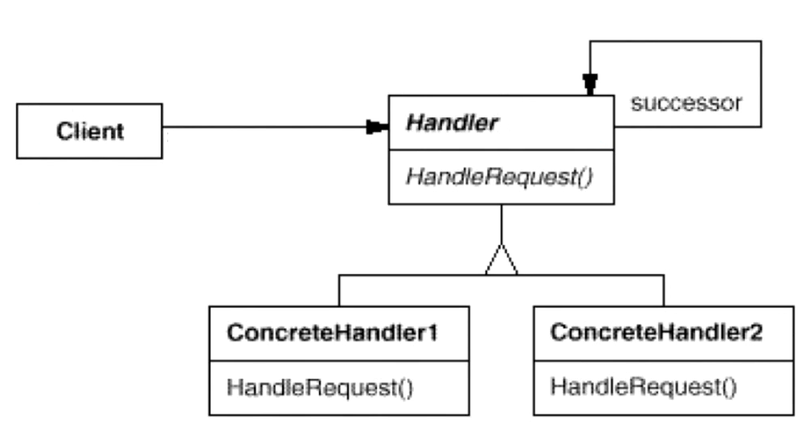

##### 样例

```c++
enum class RequestType
{
    REQ_HANDLER1,
    REQ_HANDLER2,
    REQ_HANDLER3
};
//请求
class Reqest
{
    string description;
    RequestType reqType;
public:
    Reqest(const string & desc, RequestType type) : description(desc), reqType(type) {}
    RequestType getReqType() const { return reqType; }
    const string& getDescription() const { return description; }
};
//接收者 基类
class ChainHandler{
    //成链，多个对象接收。
    ChainHandler *nextChain;
    void sendReqestToNextHandler(const Reqest & req)
    {
        if (nextChain != nullptr)
            nextChain->handle(req);//传递给下一个节点
    }
protected:
    virtual bool canHandleRequest(const Reqest & req) = 0;
    virtual void processRequest(const Reqest & req) = 0;
public:
    ChainHandler() { nextChain = nullptr; }
    void setNextChain(ChainHandler *next) { nextChain = next; }
    //处理请求链
    void handle(const Reqest & req)
    {
        if (canHandleRequest(req))
            processRequest(req);
        else
            sendReqestToNextHandler(req);
    }
};

//具体实现
class Handler1 : public ChainHandler{
protected:
    bool canHandleRequest(const Reqest & req) override
    {
        return req.getReqType() == RequestType::REQ_HANDLER1;
    }
    void processRequest(const Reqest & req) override
    {
        cout << "Handler1 is handle reqest: " << req.getDescription() << endl;
    }
};
        
class Handler2 : public ChainHandler{
protected:
    bool canHandleRequest(const Reqest & req) override
    {
        return req.getReqType() == RequestType::REQ_HANDLER2;
    }
    void processRequest(const Reqest & req) override
    {
        cout << "Handler2 is handle reqest: " << req.getDescription() << endl;
    }
};

class Handler3 : public ChainHandler{
protected:
    bool canHandleRequest(const Reqest & req) override
    {
        return req.getReqType() == RequestType::REQ_HANDLER3;
    }
    void processRequest(const Reqest & req) override
    {
        cout << "Handler3 is handle reqest: " << req.getDescription() << endl;
    }
};

int main(){
    Handler1 h1;
    Handler2 h2;
    Handler3 h3;
    h1.setNextChain(&h2);
    h2.setNextChain(&h3);
    
    Reqest req("process task ... ", RequestType::REQ_HANDLER3);
    h1.handle(req);
    return 0;
}
```

##### 要点

- `Chain of Responsibility`模式的应用场合在于「一个请求**可能有多个接受者**，但是最后**真正的接受者只有一个**」，这时候请求发送者与接受者的耦合有可能出现“变化脆弱”的症状，职责链的目的就是将二者解耦，从而更好地应对变化。
- 应用了`Chain of Responsibility`模式后，对象的**职责分派将更具灵活性**。我们可以在**运行时动态**添加/修改请求的处理职责。
- 如果请求传递到职责链的末尾仍得不到处理，应该有一个合理的缺省机制。这也是每一个接受对象的责任，而不是发出请求的对象的责任。

### 行为变化

在组件的构建过程中，组件行为的变化经常导致组件本身剧烈的变化。“行为变化”模式将**组件的行为和组件本身进行解耦**，从而支持组件行为的变化，实现两者之间的松耦合。

#### Command

命令模式。**将**一个**请求(行为)封装成**一个**对象**，从而使你可用不同的请求对客户进行参数化；对请求排队或记录请求日志，以及支持可撤销的操作。

##### 动机

”行为请求者“与”行为实现者“通常呈现一种”紧耦合“。但在某些场合（对行为进行”记录、撤销、事务“等处理）无法抵御变化的紧耦合是不合适的。

命令模式将”行为请求者“与”行为实现者“解耦。将一组行为抽象为对象，实现二者之间的松耦合。

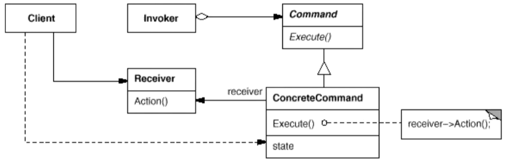

##### 样例

```c++
class Command
{
public:
    virtual void execute() = 0;
};
//行为对象
class ConcreteCommand1 : public Command
{
    string arg;
public:
    ConcreteCommand1(const string & a) : arg(a) {}
    void execute() override
    {
        cout<< "#1 process..."<<arg<<endl;
    }
};
class ConcreteCommand2 : public Command
{
    string arg;
public:
    ConcreteCommand2(const string & a) : arg(a) {}
    void execute() override
    {
        cout<< "#2 process..."<<arg<<endl;
    }
};

class MacroCommand : public Command
{
    vector<Command*> commands;
public:
    void addCommand(Command *c) { commands.push_back(c); }
    void execute() override
    {
        for (auto &c : commands)
        {
            c->execute();
        }
    }
};
int main()
{	
    ConcreteCommand1 command1(receiver, "Arg ###");
    ConcreteCommand2 command2(receiver, "Arg $$$");
    MacroCommand macro;
    macro.addCommand(&command1);
    macro.addCommand(&command2);
    //macro命令包含多个子命令
    //指令以对象的形式存在具备灵活性
    macro.execute();

}
```

##### 要点

+ Command模式的根本目的在于将”行为请求者“与”行为实现者“解耦，在面向对象语言中，常见的实现手段是”将行为抽象为对象“。
+ 实现Command接口的具体命令对象有时候根据需要可能会保存一些额外的状态信息。
+ 通过使用Composite模式可以「将多个命令封装为一个复合命令」。
+ Command模式与C++中的函数对象(`functor`)类似，Command以面向对象中的“接口-实现”来定义行为接口规范，更严格，但有性能损失；C++函数对象以函数签名来定义行为接口规范，更灵活性能更高。

> `GoF-23`设计模式出现时，C++泛型编程还没有普及。因而，出现了Command、Iterator等用面向对象实现的（相比于泛型编程）性能较差的版本。

#### Visitor

访问器。表示一个作用于某对象结构中的各元素的操作。使得可以在不改变(稳定)各元素的类的前提下定义(扩展)作用于这些元素的新操作(变化)。

##### 动机

由于**需求的变化**，某些类层次结构中常常**需要增加新的行为**(方法)，如果直接在基类中做这样的更改，将会给子类带来很繁重的变更负担，甚至破坏原有设计。

访问器能够在不更改类层次结构的前提下，运行时根据需要透明地为类层次结构上的各个类动态添加新的操作。

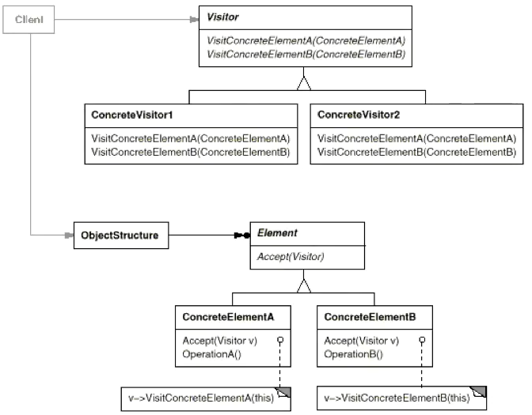

- `Visitor  Element ConcreteElement`都是稳定的。
- `Element`的子类`ConcreteElement`个数要确定，从而确定Visitor的接口数量

##### 样例

```c++
class Visitor;
class Element
{
public:
    virtual void accept(Visitor& visitor) = 0; //第一次多态辨析
    virtual ~Element(){}
};
class ElementA : public Element
{
public:
    void accept(Visitor &visitor) override {
        visitor.visitElementA(*this);
    }
};
class ElementB : public Element
{
public:
    void accept(Visitor &visitor) override {
        visitor.visitElementB(*this); //第二次多态辨析
    }
};
class Visitor{
public:
    virtual void visitElementA(ElementA& element) = 0;
    virtual void visitElementB(ElementB& element) = 0;
    virtual ~Visitor(){}
};
//==================================
//扩展
class Visitor1 : public Visitor{
public:
    void visitElementA(ElementA& element) override{
        cout << "Visitor1 is processing ElementA" << endl;
    }
        
    void visitElementB(ElementB& element) override{
        cout << "Visitor1 is processing ElementB" << endl;
    }
};         
int main()
{
    Visitor1 visitor;
    ElementB elementB;
    elementB.accept(visitor);// double dispatch
    
    ElementA elementA;
    elementA.accept(visitor);

    return 0;
}
```

##### 要点

+ Visitor模式通过所谓的双重分发来实现在不更改(编译时)Element类层次结构的前提下，在运行时透明地为类层次结构上的各个类动态添加新的操作(支持变化)。
+ 所谓双重分发Visitor模式中间包括了两个多态分发：第一个为accept方法的多态辨析；第二个为visitElement方法的多态辨析。
+ Visitor模式的最大缺点在于扩展类层次结构(添加新的Element子类)，会导致Visitor类的改变，因此Visitor模式**适用于“Element类层次结构稳定**，而其中的**操作却经常面临频繁改动**”。

### 领域规则

在特定领域中，某些变化虽然频繁，但可以抽象为某种规则。这时候，结合特定领域，将问题抽象为语法规则，从而给出在该领域下的一般性解决方案。

#### Interpreter

解析器。给定一个语言，定义它的文法的一种表示，并定义一种解释器，这个解释器使用该表示来解释语言中的句子。

##### 动机

如果某一特定领域的问题比较复杂，类似的结构不断重复出现，如果使用普通的编程方式来实现将面临非常频繁的变化。

在这种情况下，将特定领域的问题表达为某种语法规则下的句子，然后构建一个解释器来解释这样的句子，从而达到解决问题的目的。

##### 样例

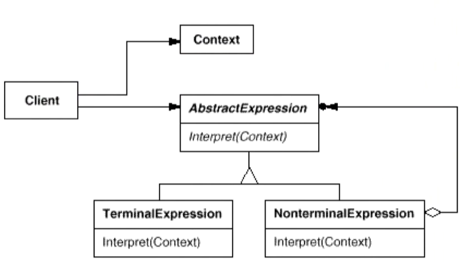

加减运算解释器。

```c++
class Expression {
public:
    virtual int interpreter(map<char, int> var)=0;
    virtual ~Expression(){}
};
//变量表达式
class VarExpression: public Expression {
    char key;
public:
    VarExpression(const char& key)
    {
        this->key = key;
    }
    int interpreter(map<char, int> var) override {
        return var[key];
    }
};

//符号表达式
class SymbolExpression : public Expression {
    // 运算符左右两个参数
protected:
    Expression* left;
    Expression* right;
public:
    SymbolExpression( Expression* left,  Expression* right):
        left(left),right(right){}
};

//加法运算
class AddExpression : public SymbolExpression {
public:
    AddExpression(Expression* left, Expression* right):
        SymbolExpression(left,right){}
    int interpreter(map<char, int> var) override {
        return left->interpreter(var) + right->interpreter(var);
    }
};

//减法运算
class SubExpression : public SymbolExpression {
    
public:
    SubExpression(Expression* left, Expression* right):
        SymbolExpression(left,right){}
    int interpreter(map<char, int> var) override {
        return left->interpreter(var) - right->interpreter(var);
    }
};
Expression*  analyse(string expStr) {
    
    stack<Expression*> expStack;
    Expression* left = nullptr;
    Expression* right = nullptr;
    for(int i=0; i<expStr.size(); i++)
    {
        switch(expStr[i])
        {
            case '+':
                // 加法运算
                left = expStack.top();
                right = new VarExpression(expStr[++i]);
                expStack.push(new AddExpression(left, right));
                break;
            case '-':
                // 减法运算
                left = expStack.top();
                right = new VarExpression(expStr[++i]);
                expStack.push(new SubExpression(left, right));
                break;
            default:
                // 变量表达式
                expStack.push(new VarExpression(expStr[i]));
        }
    }
    Expression* expression = expStack.top();
    return expression;
}
void release(Expression* expression){
    //释放表达式树的节点内存...
}

//使用
int main(int argc, const char * argv[]) {
    
    string expStr = "a+b-c+d-e";
    map<char, int> var;
    var.insert(make_pair('a',5));
    var.insert(make_pair('b',2));
    var.insert(make_pair('c',1));
    var.insert(make_pair('d',6));
    var.insert(make_pair('e',10));
    Expression* expression= analyse(expStr);
    int result=expression->interpreter(var);
    cout<<result<<endl;
    release(expression);
    return 0;
}
```

##### 要点

+ Interpreter模式的**应用场合**是Interpreter模式应用中的难点，只有满足「业务规则频繁变化，且类似的结构不断重复出现，
  并且容易抽象为语法规则的问题」才适合使用Interpreter模式。
+ 使用Interpreter模式来表示文法规则，从而可以使用面向对象技巧来方便地“扩展”文法。
+ Interpreter模式适合简单的文法表示，对于复杂的文法表示需要求助语法分析器标准工具。
